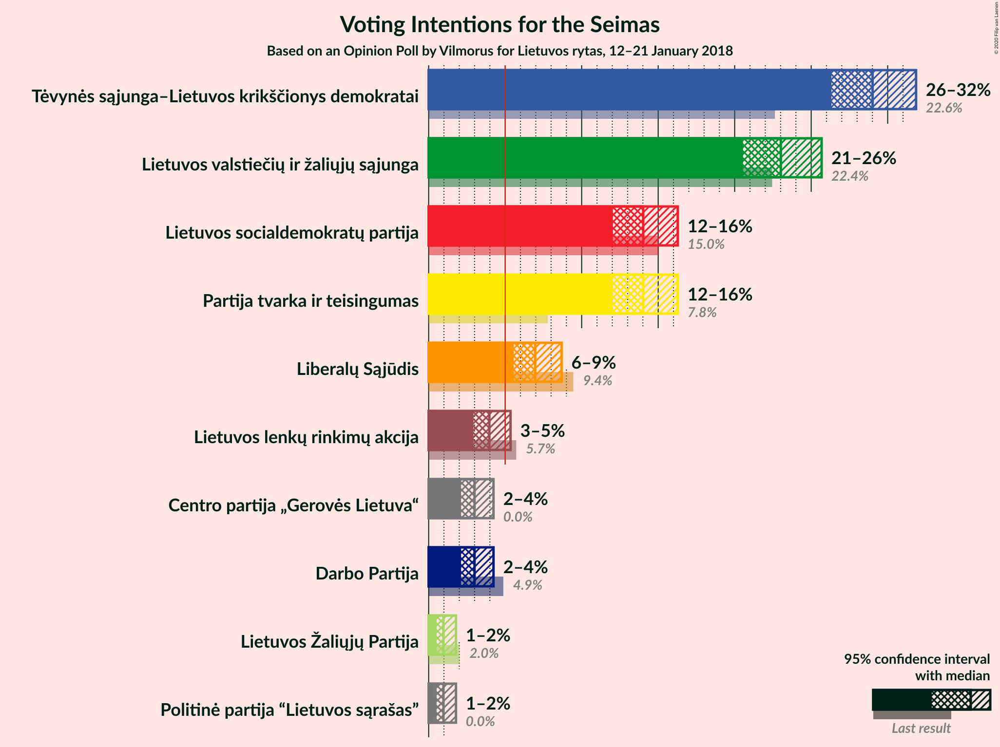
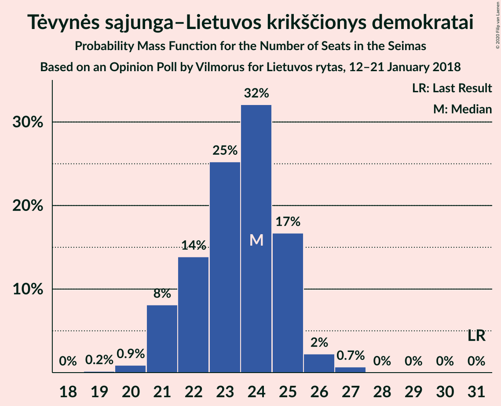
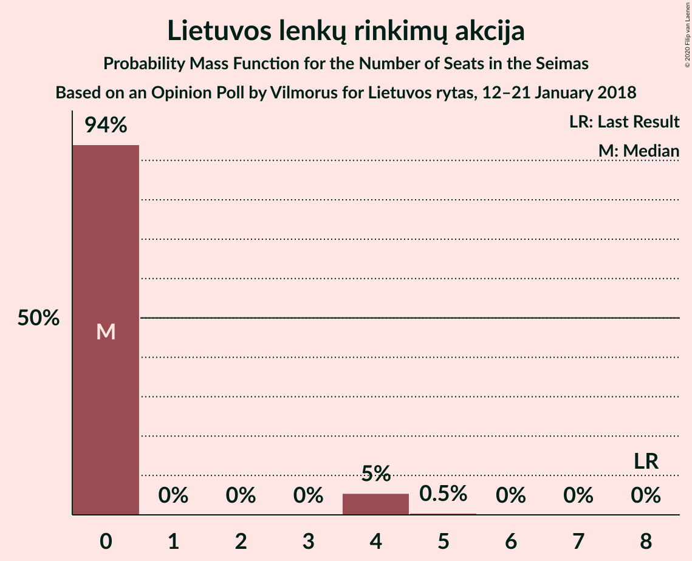
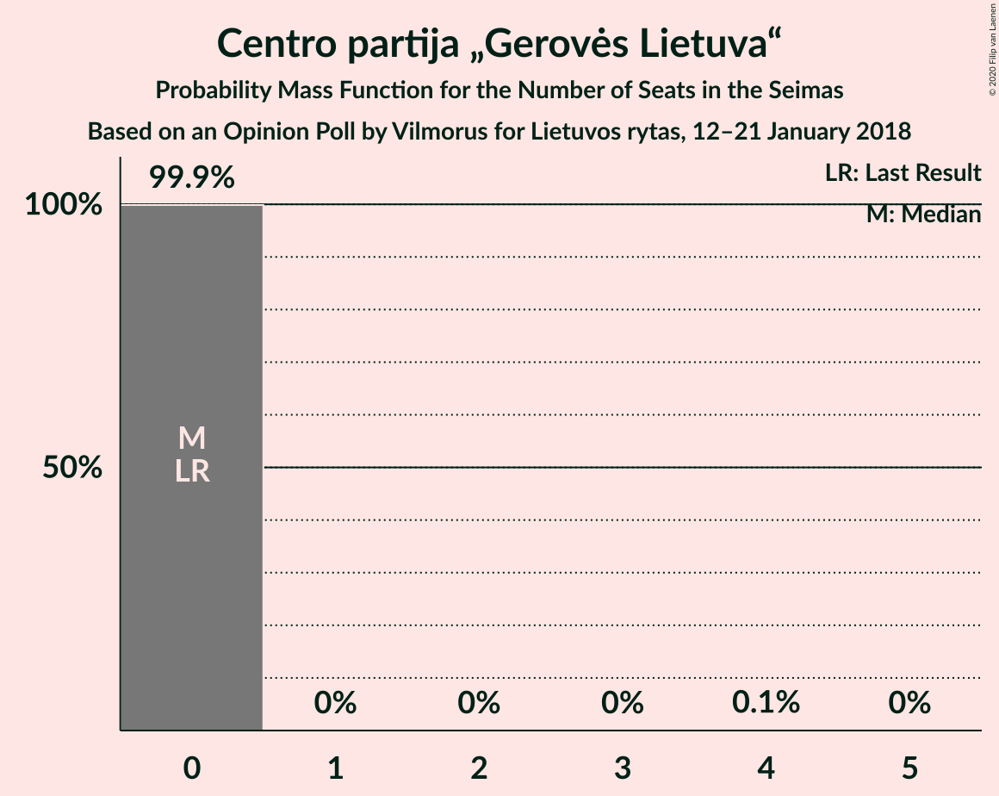
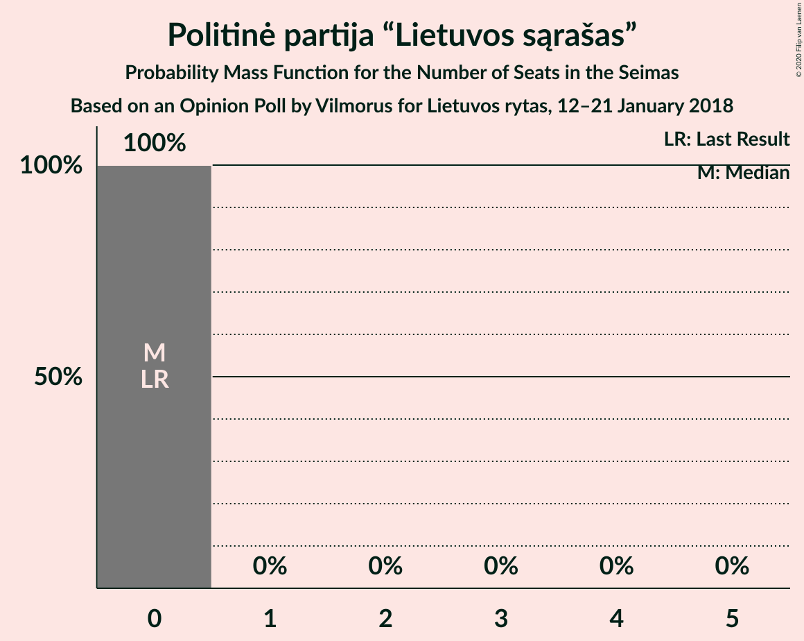
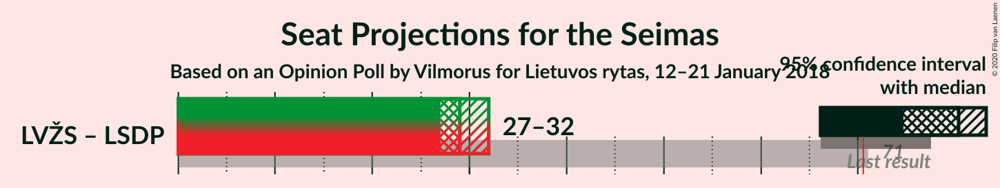
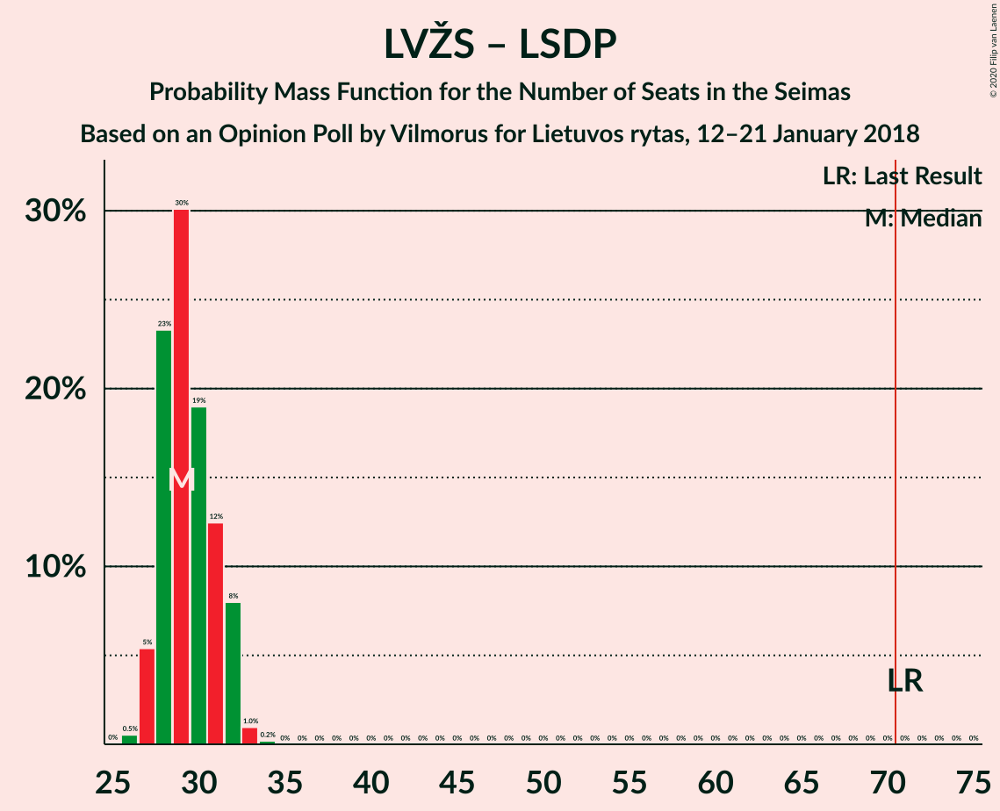

# Opinion Poll by Vilmorus for Lietuvos rytas, 12–21 January 2018

<a href="#voting-intentions">Voting Intentions</a> | <a href="#seats">Seats</a> | <a href="#coalitions">Coalitions</a> | <a href="#technical-information">Technical Information</a>

## Voting Intentions

### Confidence Intervals

| Party | Last Result | Poll Result | 80% Confidence Interval | 90% Confidence Interval | 95% Confidence Interval | 99% Confidence Interval |
|:-----:|:-----------:|:-----------:|:-----------------------:|:-----------------------:|:-----------------------:|:-----------------------:|
| Tėvynės sąjunga–Lietuvos krikščionys demokratai | 22.6% | 29.0% | 27.3–30.9% |26.7–31.4% |26.3–31.9% |25.5–32.8% |
| Lietuvos valstiečių ir žaliųjų sąjunga | 22.4% | 23.0% | 21.4–24.8% |20.9–25.3% |20.5–25.7% |19.8–26.5% |
| Partija tvarka ir teisingumas | 7.8% | 14.0% | 12.7–15.5% |12.3–15.9% |12.0–16.3% |11.4–17.0% |
| Lietuvos socialdemokratų partija | 15.0% | 14.0% | 12.7–15.5% |12.3–15.9% |12.0–16.3% |11.4–17.0% |
| Liberalų Sąjūdis | 9.4% | 7.0% | 6.0–8.1% |5.8–8.4% |5.6–8.7% |5.2–9.3% |
| Lietuvos lenkų rinkimų akcija | 5.7% | 4.0% | 3.3–4.9% |3.1–5.1% |2.9–5.3% |2.6–5.8% |
| Centro partija „Gerovės Lietuva“ | 0.0% | 3.0% | 2.4–3.8% |2.3–4.0% |2.1–4.2% |1.9–4.6% |
| Darbo Partija | 4.9% | 3.0% | 2.4–3.8% |2.3–4.0% |2.1–4.2% |1.9–4.6% |
| Lietuvos Žaliųjų Partija | 2.0% | 1.0% | 0.7–1.5% |0.6–1.6% |0.5–1.8% |0.4–2.1% |
| Politinė partija “Lietuvos sąrašas” | 0.0% | 1.0% | 0.7–1.5% |0.6–1.6% |0.5–1.8% |0.4–2.1% |

*Note:* The poll result column reflects the actual value used in the calculations. Published results may vary slightly, and in addition be rounded to fewer digits.

## Seats

### Confidence Intervals

| Party | Last Result | Median | 80% Confidence Interval | 90% Confidence Interval | 95% Confidence Interval | 99% Confidence Interval |
|:-----:|:-----------:|:------:|:-----------------------:|:-----------------------:|:-----------------------:|:-----------------------:|
| <a href="#tėvynės-sąjunga–lietuvos-krikščionys-demokratai">Tėvynės sąjunga–Lietuvos krikščionys demokratai</a> | 31 | 24 | 22–25 |21–25 |21–26 |20–27 |
| <a href="#lietuvos-valstiečių-ir-žaliųjų-sąjunga">Lietuvos valstiečių ir žaliųjų sąjunga</a> | 54 | 19 | 17–19 |17–21 |16–21 |16–21 |
| <a href="#partija-tvarka-ir-teisingumas">Partija tvarka ir teisingumas</a> | 8 | 11 | 10–12 |10–13 |10–13 |9–14 |
| <a href="#lietuvos-socialdemokratų-partija">Lietuvos socialdemokratų partija</a> | 17 | 11 | 10–12 |10–13 |10–13 |9–14 |
| <a href="#liberalų-sąjūdis">Liberalų Sąjūdis</a> | 14 | 6 | 5–6 |5–7 |4–7 |4–7 |
| <a href="#lietuvos-lenkų-rinkimų-akcija">Lietuvos lenkų rinkimų akcija</a> | 8 | 0 | 0 |0–4 |0–4 |0–4 |
| <a href="#centro-partija-„gerovės-lietuva“">Centro partija „Gerovės Lietuva“</a> | 0 | 0 | 0 |0 |0 |0 |
| <a href="#darbo-partija">Darbo Partija</a> | 2 | 0 | 0 |0 |0 |0 |
| <a href="#lietuvos-žaliųjų-partija">Lietuvos Žaliųjų Partija</a> | 0 | 0 | 0 |0 |0 |0 |
| <a href="#politinė-partija-“lietuvos-sąrašas”">Politinė partija “Lietuvos sąrašas”</a> | 0 | 0 | 0 |0 |0 |0 |

### Tėvynės sąjunga–Lietuvos krikščionys demokratai

*For a full overview of the results for this party, see the [Tėvynės sąjunga–Lietuvos krikščionys demokratai](party-tėvynėssąjunga–lietuvoskrikščionysdemokratai.html) page.*

| Number of Seats | Probability | Accumulated | Special Marks |
|:---------------:|:-----------:|:-----------:|:-------------:|
| 19 | 0.2% | 100% |  |
| 20 | 0.9% | 99.8% |  |
| 21 | 8% | 98.9% |  |
| 22 | 14% | 91% |  |
| 23 | 25% | 77% |  |
| 24 | 32% | 52% | Median |
| 25 | 17% | 20% |  |
| 26 | 2% | 3% |  |
| 27 | 0.7% | 0.7% |  |
| 28 | 0% | 0% |  |
| 29 | 0% | 0% |  |
| 30 | 0% | 0% |  |
| 31 | 0% | 0% | Last Result |

### Lietuvos valstiečių ir žaliųjų sąjunga

*For a full overview of the results for this party, see the [Lietuvos valstiečių ir žaliųjų sąjunga](party-lietuvosvalstiečiųiržaliųjųsąjunga.html) page.*

| Number of Seats | Probability | Accumulated | Special Marks |
|:---------------:|:-----------:|:-----------:|:-------------:|
| 15 | 0.3% | 100% |  |
| 16 | 3% | 99.7% |  |
| 17 | 29% | 96% |  |
| 18 | 13% | 67% |  |
| 19 | 45% | 54% | Median |
| 20 | 3% | 9% |  |
| 21 | 6% | 6% |  |
| 22 | 0.2% | 0.2% |  |
| 23 | 0% | 0% |  |
| 24 | 0% | 0% |  |
| 25 | 0% | 0% |  |
| 26 | 0% | 0% |  |
| 27 | 0% | 0% |  |
| 28 | 0% | 0% |  |
| 29 | 0% | 0% |  |
| 30 | 0% | 0% |  |
| 31 | 0% | 0% |  |
| 32 | 0% | 0% |  |
| 33 | 0% | 0% |  |
| 34 | 0% | 0% |  |
| 35 | 0% | 0% |  |
| 36 | 0% | 0% |  |
| 37 | 0% | 0% |  |
| 38 | 0% | 0% |  |
| 39 | 0% | 0% |  |
| 40 | 0% | 0% |  |
| 41 | 0% | 0% |  |
| 42 | 0% | 0% |  |
| 43 | 0% | 0% |  |
| 44 | 0% | 0% |  |
| 45 | 0% | 0% |  |
| 46 | 0% | 0% |  |
| 47 | 0% | 0% |  |
| 48 | 0% | 0% |  |
| 49 | 0% | 0% |  |
| 50 | 0% | 0% |  |
| 51 | 0% | 0% |  |
| 52 | 0% | 0% |  |
| 53 | 0% | 0% |  |
| 54 | 0% | 0% | Last Result |

### Partija tvarka ir teisingumas

*For a full overview of the results for this party, see the [Partija tvarka ir teisingumas](party-partijatvarkairteisingumas.html) page.*

| Number of Seats | Probability | Accumulated | Special Marks |
|:---------------:|:-----------:|:-----------:|:-------------:|
| 8 | 0% | 100% | Last Result |
| 9 | 2% | 100% |  |
| 10 | 15% | 98% |  |
| 11 | 43% | 83% | Median |
| 12 | 34% | 40% |  |
| 13 | 5% | 6% |  |
| 14 | 0.9% | 0.9% |  |
| 15 | 0% | 0% |  |

### Lietuvos socialdemokratų partija

*For a full overview of the results for this party, see the [Lietuvos socialdemokratų partija](party-lietuvossocialdemokratųpartija.html) page.*

| Number of Seats | Probability | Accumulated | Special Marks |
|:---------------:|:-----------:|:-----------:|:-------------:|
| 8 | 0.1% | 100% |  |
| 9 | 2% | 99.9% |  |
| 10 | 34% | 98% |  |
| 11 | 31% | 65% | Median |
| 12 | 26% | 34% |  |
| 13 | 8% | 8% |  |
| 14 | 0.4% | 0.5% |  |
| 15 | 0.1% | 0.1% |  |
| 16 | 0% | 0% |  |
| 17 | 0% | 0% | Last Result |

### Liberalų Sąjūdis

*For a full overview of the results for this party, see the [Liberalų Sąjūdis](party-liberalųsąjūdis.html) page.*

| Number of Seats | Probability | Accumulated | Special Marks |
|:---------------:|:-----------:|:-----------:|:-------------:|
| 0 | 0.3% | 100% |  |
| 1 | 0% | 99.7% |  |
| 2 | 0% | 99.7% |  |
| 3 | 0% | 99.7% |  |
| 4 | 3% | 99.7% |  |
| 5 | 31% | 97% |  |
| 6 | 58% | 66% | Median |
| 7 | 7% | 8% |  |
| 8 | 0.3% | 0.3% |  |
| 9 | 0% | 0% |  |
| 10 | 0% | 0% |  |
| 11 | 0% | 0% |  |
| 12 | 0% | 0% |  |
| 13 | 0% | 0% |  |
| 14 | 0% | 0% | Last Result |

### Lietuvos lenkų rinkimų akcija

*For a full overview of the results for this party, see the [Lietuvos lenkų rinkimų akcija](party-lietuvoslenkųrinkimųakcija.html) page.*

| Number of Seats | Probability | Accumulated | Special Marks |
|:---------------:|:-----------:|:-----------:|:-------------:|
| 0 | 94% | 100% | Median |
| 1 | 0% | 6% |  |
| 2 | 0% | 6% |  |
| 3 | 0% | 6% |  |
| 4 | 5% | 6% |  |
| 5 | 0.5% | 0.5% |  |
| 6 | 0% | 0% |  |
| 7 | 0% | 0% |  |
| 8 | 0% | 0% | Last Result |

### Centro partija „Gerovės Lietuva“

*For a full overview of the results for this party, see the [Centro partija „Gerovės Lietuva“](party-centropartija„gerovėslietuva“.html) page.*

| Number of Seats | Probability | Accumulated | Special Marks |
|:---------------:|:-----------:|:-----------:|:-------------:|
| 0 | 99.9% | 100% | Last Result, Median |
| 1 | 0% | 0.1% |  |
| 2 | 0% | 0.1% |  |
| 3 | 0% | 0.1% |  |
| 4 | 0.1% | 0.1% |  |
| 5 | 0% | 0% |  |

### Darbo Partija

*For a full overview of the results for this party, see the [Darbo Partija](party-darbopartija.html) page.*

| Number of Seats | Probability | Accumulated | Special Marks |
|:---------------:|:-----------:|:-----------:|:-------------:|
| 0 | 99.9% | 100% | Median |
| 1 | 0% | 0.1% |  |
| 2 | 0% | 0.1% | Last Result |
| 3 | 0% | 0.1% |  |
| 4 | 0.1% | 0.1% |  |
| 5 | 0% | 0% |  |

### Lietuvos Žaliųjų Partija

*For a full overview of the results for this party, see the [Lietuvos Žaliųjų Partija](party-lietuvosžaliųjųpartija.html) page.*

| Number of Seats | Probability | Accumulated | Special Marks |
|:---------------:|:-----------:|:-----------:|:-------------:|
| 0 | 100% | 100% | Last Result, Median |

### Politinė partija “Lietuvos sąrašas”

*For a full overview of the results for this party, see the [Politinė partija “Lietuvos sąrašas”](party-politinėpartija“lietuvossąrašas”.html) page.*

| Number of Seats | Probability | Accumulated | Special Marks |
|:---------------:|:-----------:|:-----------:|:-------------:|
| 0 | 100% | 100% | Last Result, Median |

## Coalitions

### Confidence Intervals

| Coalition | Last Result | Median | Majority? | 80% Confidence Interval | 90% Confidence Interval | 95% Confidence Interval | 99% Confidence Interval |
|:---------:|:-----------:|:------:|:---------:|:-----------------------:|:-----------------------:|:-----------------------:|:-----------------------:|
| Lietuvos valstiečių ir žaliųjų sąjunga – Lietuvos socialdemokratų partija | 71 | 29 | 0% | 28–31 | 27–32 | 27–32 | 26–33 |

### Lietuvos valstiečių ir žaliųjų sąjunga – Lietuvos socialdemokratų partija

| Number of Seats | Probability | Accumulated | Special Marks |
|:---------------:|:-----------:|:-----------:|:-------------:|
| 25 | 0% | 100% |  |
| 26 | 0.5% | 99.9% |  |
| 27 | 5% | 99.4% |  |
| 28 | 23% | 94% |  |
| 29 | 30% | 71% |  |
| 30 | 19% | 41% | Median |
| 31 | 12% | 22% |  |
| 32 | 8% | 9% |  |
| 33 | 1.0% | 1.2% |  |
| 34 | 0.2% | 0.2% |  |
| 35 | 0% | 0% |  |
| 36 | 0% | 0% |  |
| 37 | 0% | 0% |  |
| 38 | 0% | 0% |  |
| 39 | 0% | 0% |  |
| 40 | 0% | 0% |  |
| 41 | 0% | 0% |  |
| 42 | 0% | 0% |  |
| 43 | 0% | 0% |  |
| 44 | 0% | 0% |  |
| 45 | 0% | 0% |  |
| 46 | 0% | 0% |  |
| 47 | 0% | 0% |  |
| 48 | 0% | 0% |  |
| 49 | 0% | 0% |  |
| 50 | 0% | 0% |  |
| 51 | 0% | 0% |  |
| 52 | 0% | 0% |  |
| 53 | 0% | 0% |  |
| 54 | 0% | 0% |  |
| 55 | 0% | 0% |  |
| 56 | 0% | 0% |  |
| 57 | 0% | 0% |  |
| 58 | 0% | 0% |  |
| 59 | 0% | 0% |  |
| 60 | 0% | 0% |  |
| 61 | 0% | 0% |  |
| 62 | 0% | 0% |  |
| 63 | 0% | 0% |  |
| 64 | 0% | 0% |  |
| 65 | 0% | 0% |  |
| 66 | 0% | 0% |  |
| 67 | 0% | 0% |  |
| 68 | 0% | 0% |  |
| 69 | 0% | 0% |  |
| 70 | 0% | 0% |  |
| 71 | 0% | 0% | Last Result, Majority |

## Technical Information

### Opinion Poll

+ **Polling firm:** Vilmorus
+ **Commissioner(s):** Lietuvos rytas
+ **Fieldwork period:** 12–21 January 2018

### Calculations

+ **Sample size:** 1034
+ **Simulations done:** 1,048,576
+ **Error estimate:** 2.47%

