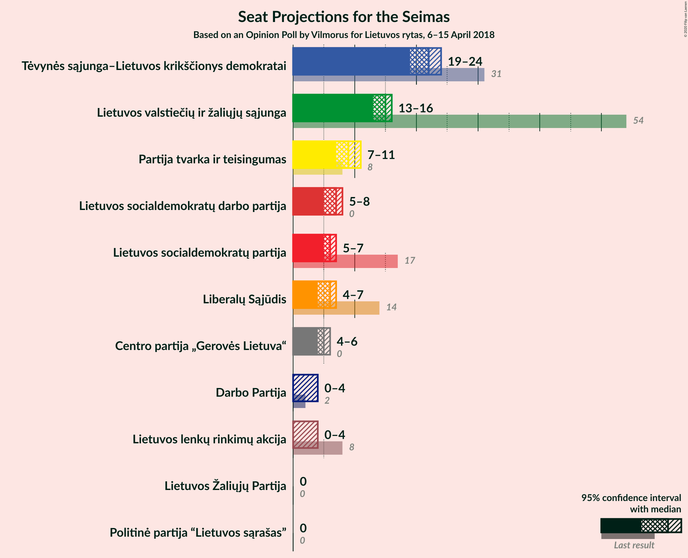
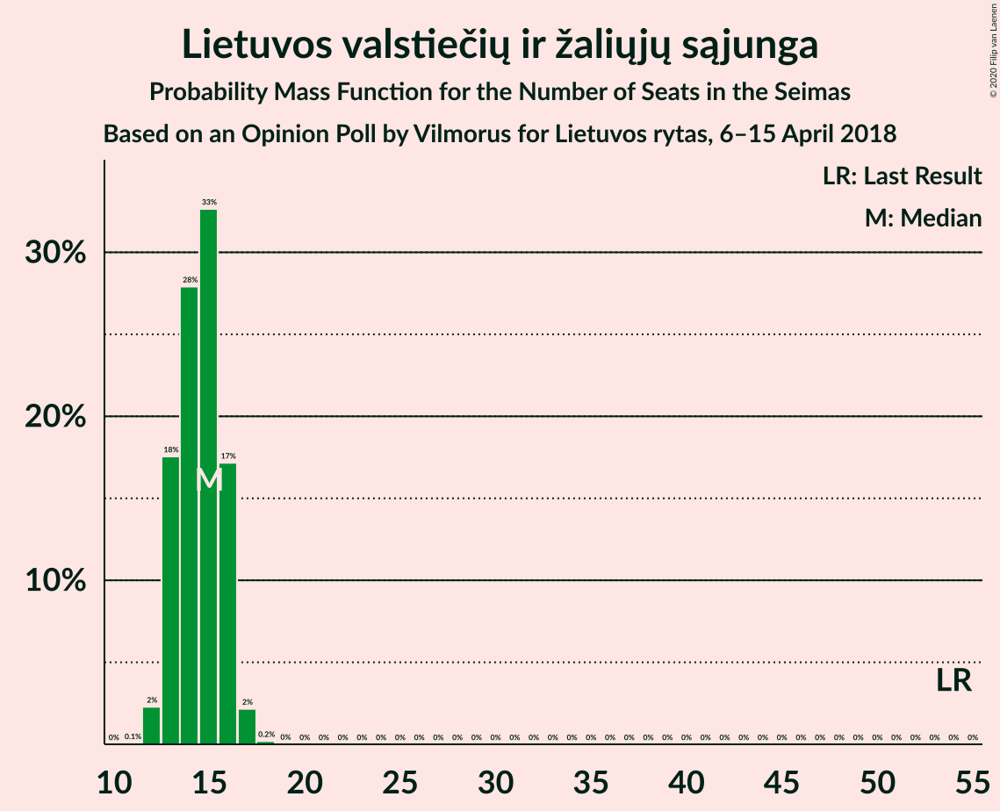
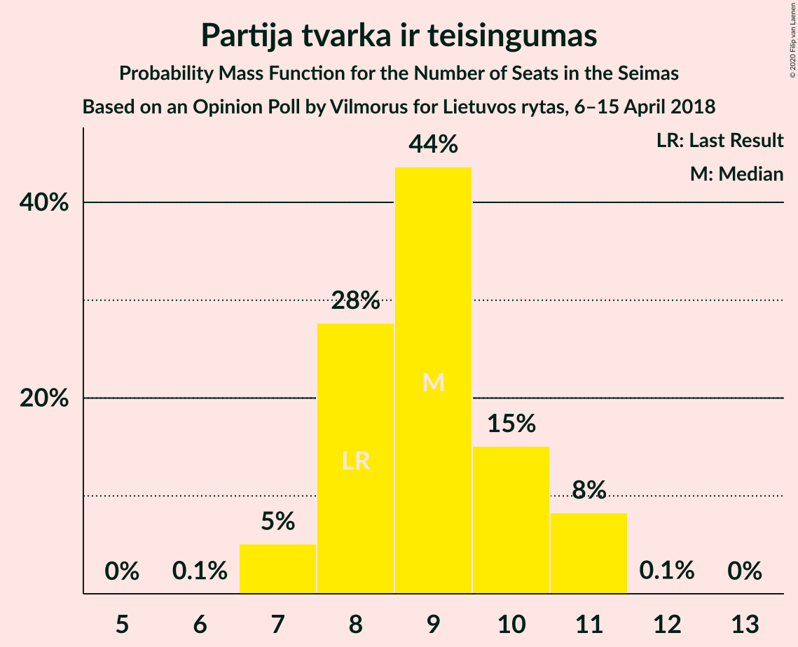
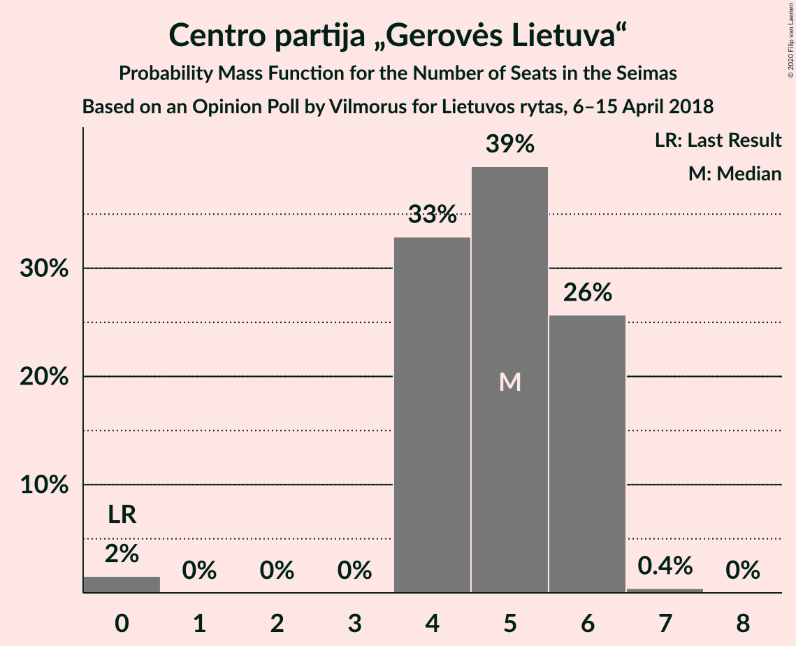
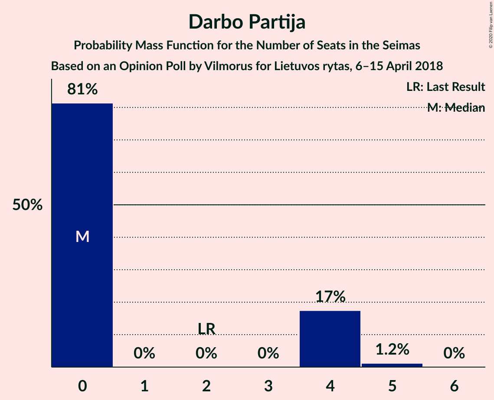
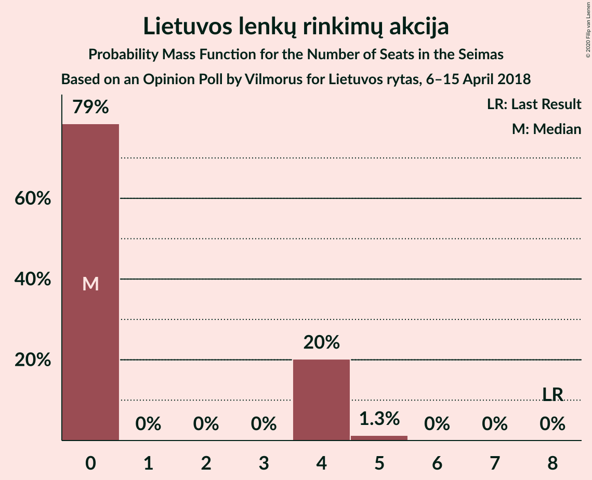
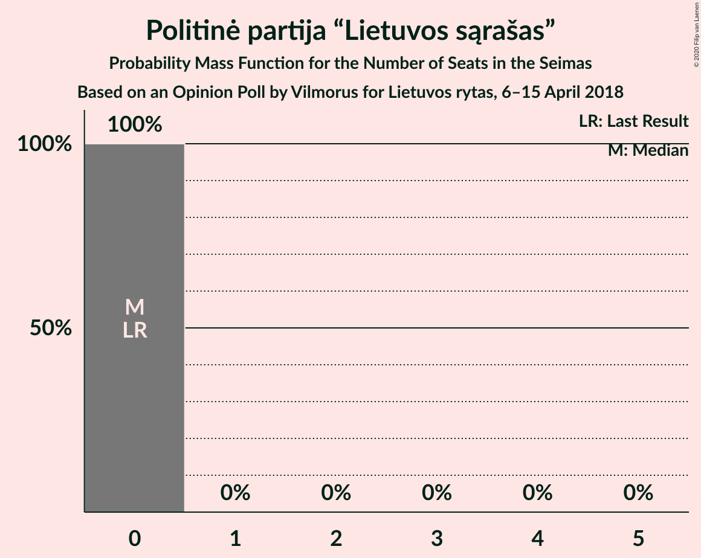
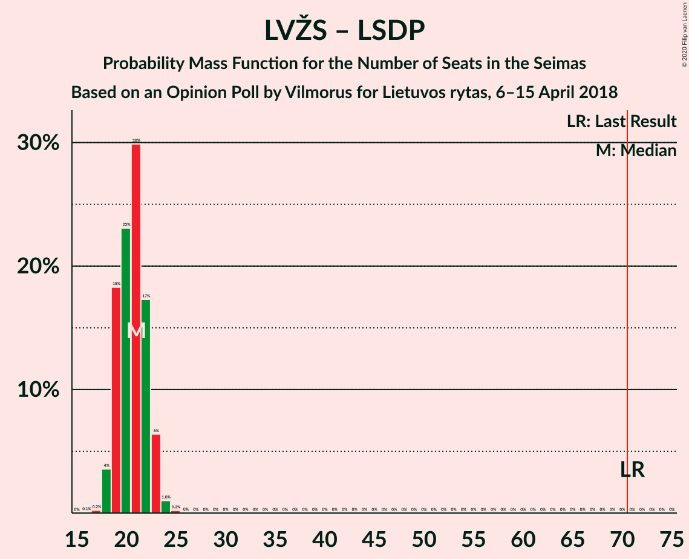

# Opinion Poll by Vilmorus for Lietuvos rytas, 6–15 April 2018

<a href="#voting-intentions">Voting Intentions</a> | <a href="#seats">Seats</a> | <a href="#coalitions">Coalitions</a> | <a href="#technical-information">Technical Information</a>

## Voting Intentions

### Confidence Intervals

| Party | Last Result | Poll Result | 80% Confidence Interval | 90% Confidence Interval | 95% Confidence Interval | 99% Confidence Interval |
|:-----:|:-----------:|:-----------:|:-----------------------:|:-----------------------:|:-----------------------:|:-----------------------:|
| Tėvynės sąjunga–Lietuvos krikščionys demokratai | 22.6% | 27.9% | 26.2–29.8% |25.7–30.3% |25.2–30.8% |24.4–31.7% |
| Lietuvos valstiečių ir žaliųjų sąjunga | 22.4% | 18.9% | 17.4–20.6% |17.0–21.0% |16.6–21.4% |15.9–22.3% |
| Partija tvarka ir teisingumas | 7.8% | 11.4% | 10.2–12.8% |9.8–13.2% |9.6–13.5% |9.0–14.2% |
| Lietuvos socialdemokratų darbo partija | 0.0% | 7.9% | 6.9–9.1% |6.6–9.5% |6.4–9.8% |6.0–10.4% |
| Lietuvos socialdemokratų partija | 15.0% | 7.8% | 6.8–9.0% |6.6–9.4% |6.3–9.6% |5.9–10.2% |
| Liberalų Sąjūdis | 9.4% | 7.5% | 6.6–8.7% |6.3–9.0% |6.1–9.3% |5.6–9.9% |
| Centro partija „Gerovės Lietuva“ | 0.0% | 6.3% | 5.4–7.4% |5.2–7.7% |5.0–8.0% |4.6–8.6% |
| Darbo Partija | 4.9% | 4.6% | 3.8–5.5% |3.6–5.8% |3.4–6.0% |3.1–6.5% |
| Lietuvos lenkų rinkimų akcija | 5.7% | 4.3% | 3.5–5.2% |3.3–5.5% |3.2–5.7% |2.9–6.2% |
| Politinė partija “Lietuvos sąrašas” | 0.0% | 2.1% | 1.6–2.8% |1.5–3.0% |1.4–3.2% |1.2–3.5% |
| Lietuvos Žaliųjų Partija | 2.0% | 0.8% | 0.5–1.3% |0.5–1.4% |0.4–1.6% |0.3–1.8% |

*Note:* The poll result column reflects the actual value used in the calculations. Published results may vary slightly, and in addition be rounded to fewer digits.

## Seats

### Confidence Intervals

| Party | Last Result | Median | 80% Confidence Interval | 90% Confidence Interval | 95% Confidence Interval | 99% Confidence Interval |
|:-----:|:-----------:|:------:|:-----------------------:|:-----------------------:|:-----------------------:|:-----------------------:|
| <a href="#tėvynės-sąjunga–lietuvos-krikščionys-demokratai">Tėvynės sąjunga–Lietuvos krikščionys demokratai</a> | 31 | 21 | 20–23 |19–24 |19–24 |19–25 |
| <a href="#lietuvos-valstiečių-ir-žaliųjų-sąjunga">Lietuvos valstiečių ir žaliųjų sąjunga</a> | 54 | 15 | 13–16 |13–17 |13–17 |12–17 |
| <a href="#partija-tvarka-ir-teisingumas">Partija tvarka ir teisingumas</a> | 8 | 8 | 8–10 |8–10 |8–10 |7–12 |
| <a href="#lietuvos-socialdemokratų-darbo-partija">Lietuvos socialdemokratų darbo partija</a> | 0 | 6 | 6–8 |5–8 |5–8 |4–8 |
| <a href="#lietuvos-socialdemokratų-partija">Lietuvos socialdemokratų partija</a> | 17 | 7 | 6–8 |5–8 |5–8 |5–8 |
| <a href="#liberalų-sąjūdis">Liberalų Sąjūdis</a> | 14 | 5 | 4–7 |4–7 |4–7 |4–8 |
| <a href="#centro-partija-„gerovės-lietuva“">Centro partija „Gerovės Lietuva“</a> | 0 | 5 | 4–5 |4–6 |4–6 |0–7 |
| <a href="#darbo-partija">Darbo Partija</a> | 2 | 0 | 0–4 |0–4 |0–4 |0–5 |
| <a href="#lietuvos-lenkų-rinkimų-akcija">Lietuvos lenkų rinkimų akcija</a> | 8 | 0 | 0 |0–4 |0–4 |0–5 |
| <a href="#politinė-partija-“lietuvos-sąrašas”">Politinė partija “Lietuvos sąrašas”</a> | 0 | 0 | 0 |0 |0 |0 |
| <a href="#lietuvos-žaliųjų-partija">Lietuvos Žaliųjų Partija</a> | 0 | 0 | 0 |0 |0 |0 |

### Tėvynės sąjunga–Lietuvos krikščionys demokratai

*For a full overview of the results for this party, see the [Tėvynės sąjunga–Lietuvos krikščionys demokratai](party-tėvynėssąjunga–lietuvoskrikščionysdemokratai.html) page.*

| Number of Seats | Probability | Accumulated | Special Marks |
|:---------------:|:-----------:|:-----------:|:-------------:|
| 17 | 0.1% | 100% |  |
| 18 | 0.3% | 99.9% |  |
| 19 | 7% | 99.5% |  |
| 20 | 3% | 93% |  |
| 21 | 44% | 90% | Median |
| 22 | 18% | 45% |  |
| 23 | 19% | 27% |  |
| 24 | 5% | 8% |  |
| 25 | 2% | 2% |  |
| 26 | 0% | 0% |  |
| 27 | 0% | 0% |  |
| 28 | 0% | 0% |  |
| 29 | 0% | 0% |  |
| 30 | 0% | 0% |  |
| 31 | 0% | 0% | Last Result |

### Lietuvos valstiečių ir žaliųjų sąjunga

*For a full overview of the results for this party, see the [Lietuvos valstiečių ir žaliųjų sąjunga](party-lietuvosvalstiečiųiržaliųjųsąjunga.html) page.*

| Number of Seats | Probability | Accumulated | Special Marks |
|:---------------:|:-----------:|:-----------:|:-------------:|
| 11 | 0.3% | 100% |  |
| 12 | 2% | 99.7% |  |
| 13 | 16% | 98% |  |
| 14 | 13% | 82% |  |
| 15 | 52% | 69% | Median |
| 16 | 11% | 17% |  |
| 17 | 6% | 6% |  |
| 18 | 0.4% | 0.5% |  |
| 19 | 0.1% | 0.1% |  |
| 20 | 0% | 0% |  |
| 21 | 0% | 0% |  |
| 22 | 0% | 0% |  |
| 23 | 0% | 0% |  |
| 24 | 0% | 0% |  |
| 25 | 0% | 0% |  |
| 26 | 0% | 0% |  |
| 27 | 0% | 0% |  |
| 28 | 0% | 0% |  |
| 29 | 0% | 0% |  |
| 30 | 0% | 0% |  |
| 31 | 0% | 0% |  |
| 32 | 0% | 0% |  |
| 33 | 0% | 0% |  |
| 34 | 0% | 0% |  |
| 35 | 0% | 0% |  |
| 36 | 0% | 0% |  |
| 37 | 0% | 0% |  |
| 38 | 0% | 0% |  |
| 39 | 0% | 0% |  |
| 40 | 0% | 0% |  |
| 41 | 0% | 0% |  |
| 42 | 0% | 0% |  |
| 43 | 0% | 0% |  |
| 44 | 0% | 0% |  |
| 45 | 0% | 0% |  |
| 46 | 0% | 0% |  |
| 47 | 0% | 0% |  |
| 48 | 0% | 0% |  |
| 49 | 0% | 0% |  |
| 50 | 0% | 0% |  |
| 51 | 0% | 0% |  |
| 52 | 0% | 0% |  |
| 53 | 0% | 0% |  |
| 54 | 0% | 0% | Last Result |

### Partija tvarka ir teisingumas

*For a full overview of the results for this party, see the [Partija tvarka ir teisingumas](party-partijatvarkairteisingumas.html) page.*

| Number of Seats | Probability | Accumulated | Special Marks |
|:---------------:|:-----------:|:-----------:|:-------------:|
| 7 | 0.7% | 100% |  |
| 8 | 71% | 99.3% | Last Result, Median |
| 9 | 18% | 28% |  |
| 10 | 9% | 11% |  |
| 11 | 1.1% | 2% |  |
| 12 | 0.4% | 0.6% |  |
| 13 | 0.2% | 0.2% |  |
| 14 | 0% | 0% |  |

### Lietuvos socialdemokratų darbo partija

*For a full overview of the results for this party, see the [Lietuvos socialdemokratų darbo partija](party-lietuvossocialdemokratųdarbopartija.html) page.*

| Number of Seats | Probability | Accumulated | Special Marks |
|:---------------:|:-----------:|:-----------:|:-------------:|
| 0 | 0% | 100% | Last Result |
| 1 | 0% | 100% |  |
| 2 | 0% | 100% |  |
| 3 | 0% | 100% |  |
| 4 | 2% | 100% |  |
| 5 | 5% | 98% |  |
| 6 | 56% | 93% | Median |
| 7 | 26% | 37% |  |
| 8 | 11% | 11% |  |
| 9 | 0.3% | 0.3% |  |
| 10 | 0% | 0% |  |

### Lietuvos socialdemokratų partija

*For a full overview of the results for this party, see the [Lietuvos socialdemokratų partija](party-lietuvossocialdemokratųpartija.html) page.*

| Number of Seats | Probability | Accumulated | Special Marks |
|:---------------:|:-----------:|:-----------:|:-------------:|
| 4 | 0.3% | 100% |  |
| 5 | 9% | 99.7% |  |
| 6 | 37% | 90% |  |
| 7 | 42% | 54% | Median |
| 8 | 11% | 11% |  |
| 9 | 0.1% | 0.1% |  |
| 10 | 0% | 0% |  |
| 11 | 0% | 0% |  |
| 12 | 0% | 0% |  |
| 13 | 0% | 0% |  |
| 14 | 0% | 0% |  |
| 15 | 0% | 0% |  |
| 16 | 0% | 0% |  |
| 17 | 0% | 0% | Last Result |

### Liberalų Sąjūdis

*For a full overview of the results for this party, see the [Liberalų Sąjūdis](party-liberalųsąjūdis.html) page.*

| Number of Seats | Probability | Accumulated | Special Marks |
|:---------------:|:-----------:|:-----------:|:-------------:|
| 4 | 33% | 100% |  |
| 5 | 26% | 67% | Median |
| 6 | 30% | 40% |  |
| 7 | 9% | 11% |  |
| 8 | 1.4% | 2% |  |
| 9 | 0.4% | 0.4% |  |
| 10 | 0% | 0% |  |
| 11 | 0% | 0% |  |
| 12 | 0% | 0% |  |
| 13 | 0% | 0% |  |
| 14 | 0% | 0% | Last Result |

### Centro partija „Gerovės Lietuva“

*For a full overview of the results for this party, see the [Centro partija „Gerovės Lietuva“](party-centropartija„gerovėslietuva“.html) page.*

| Number of Seats | Probability | Accumulated | Special Marks |
|:---------------:|:-----------:|:-----------:|:-------------:|
| 0 | 1.5% | 100% | Last Result |
| 1 | 0% | 98.5% |  |
| 2 | 0% | 98.5% |  |
| 3 | 0% | 98.5% |  |
| 4 | 22% | 98.5% |  |
| 5 | 68% | 76% | Median |
| 6 | 7% | 8% |  |
| 7 | 0.8% | 0.8% |  |
| 8 | 0% | 0% |  |

### Darbo Partija

*For a full overview of the results for this party, see the [Darbo Partija](party-darbopartija.html) page.*

| Number of Seats | Probability | Accumulated | Special Marks |
|:---------------:|:-----------:|:-----------:|:-------------:|
| 0 | 53% | 100% | Median |
| 1 | 0% | 47% |  |
| 2 | 0% | 47% | Last Result |
| 3 | 0% | 47% |  |
| 4 | 47% | 47% |  |
| 5 | 0.7% | 0.7% |  |
| 6 | 0% | 0% |  |

### Lietuvos lenkų rinkimų akcija

*For a full overview of the results for this party, see the [Lietuvos lenkų rinkimų akcija](party-lietuvoslenkųrinkimųakcija.html) page.*

| Number of Seats | Probability | Accumulated | Special Marks |
|:---------------:|:-----------:|:-----------:|:-------------:|
| 0 | 90% | 100% | Median |
| 1 | 0% | 10% |  |
| 2 | 0% | 10% |  |
| 3 | 0% | 10% |  |
| 4 | 9% | 10% |  |
| 5 | 1.0% | 1.0% |  |
| 6 | 0% | 0% |  |
| 7 | 0% | 0% |  |
| 8 | 0% | 0% | Last Result |

### Politinė partija “Lietuvos sąrašas”

*For a full overview of the results for this party, see the [Politinė partija “Lietuvos sąrašas”](party-politinėpartija“lietuvossąrašas”.html) page.*

| Number of Seats | Probability | Accumulated | Special Marks |
|:---------------:|:-----------:|:-----------:|:-------------:|
| 0 | 100% | 100% | Last Result, Median |

### Lietuvos Žaliųjų Partija

*For a full overview of the results for this party, see the [Lietuvos Žaliųjų Partija](party-lietuvosžaliųjųpartija.html) page.*

| Number of Seats | Probability | Accumulated | Special Marks |
|:---------------:|:-----------:|:-----------:|:-------------:|
| 0 | 100% | 100% | Last Result, Median |

## Coalitions

### Confidence Intervals

| Coalition | Last Result | Median | Majority? | 80% Confidence Interval | 90% Confidence Interval | 95% Confidence Interval | 99% Confidence Interval |
|:---------:|:-----------:|:------:|:---------:|:-----------------------:|:-----------------------:|:-----------------------:|:-----------------------:|
| Lietuvos valstiečių ir žaliųjų sąjunga – Lietuvos socialdemokratų partija | 71 | 22 | 0% | 19–22 | 19–23 | 18–23 | 17–24 |

### Lietuvos valstiečių ir žaliųjų sąjunga – Lietuvos socialdemokratų partija

| Number of Seats | Probability | Accumulated | Special Marks |
|:---------------:|:-----------:|:-----------:|:-------------:|
| 16 | 0.4% | 100% |  |
| 17 | 0.4% | 99.6% |  |
| 18 | 4% | 99.2% |  |
| 19 | 10% | 95% |  |
| 20 | 9% | 86% |  |
| 21 | 17% | 77% |  |
| 22 | 51% | 60% | Median |
| 23 | 8% | 9% |  |
| 24 | 0.5% | 0.7% |  |
| 25 | 0.1% | 0.2% |  |
| 26 | 0% | 0.1% |  |
| 27 | 0% | 0% |  |
| 28 | 0% | 0% |  |
| 29 | 0% | 0% |  |
| 30 | 0% | 0% |  |
| 31 | 0% | 0% |  |
| 32 | 0% | 0% |  |
| 33 | 0% | 0% |  |
| 34 | 0% | 0% |  |
| 35 | 0% | 0% |  |
| 36 | 0% | 0% |  |
| 37 | 0% | 0% |  |
| 38 | 0% | 0% |  |
| 39 | 0% | 0% |  |
| 40 | 0% | 0% |  |
| 41 | 0% | 0% |  |
| 42 | 0% | 0% |  |
| 43 | 0% | 0% |  |
| 44 | 0% | 0% |  |
| 45 | 0% | 0% |  |
| 46 | 0% | 0% |  |
| 47 | 0% | 0% |  |
| 48 | 0% | 0% |  |
| 49 | 0% | 0% |  |
| 50 | 0% | 0% |  |
| 51 | 0% | 0% |  |
| 52 | 0% | 0% |  |
| 53 | 0% | 0% |  |
| 54 | 0% | 0% |  |
| 55 | 0% | 0% |  |
| 56 | 0% | 0% |  |
| 57 | 0% | 0% |  |
| 58 | 0% | 0% |  |
| 59 | 0% | 0% |  |
| 60 | 0% | 0% |  |
| 61 | 0% | 0% |  |
| 62 | 0% | 0% |  |
| 63 | 0% | 0% |  |
| 64 | 0% | 0% |  |
| 65 | 0% | 0% |  |
| 66 | 0% | 0% |  |
| 67 | 0% | 0% |  |
| 68 | 0% | 0% |  |
| 69 | 0% | 0% |  |
| 70 | 0% | 0% |  |
| 71 | 0% | 0% | Last Result, Majority |

## Technical Information

### Opinion Poll

+ **Polling firm:** Vilmorus
+ **Commissioner(s):** Lietuvos rytas
+ **Fieldwork period:** 6–15 April 2018

### Calculations

+ **Sample size:** 1010
+ **Simulations done:** 131,072
+ **Error estimate:** 1.45%

