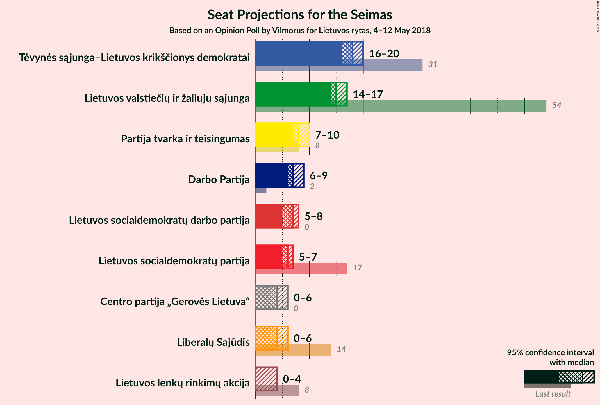
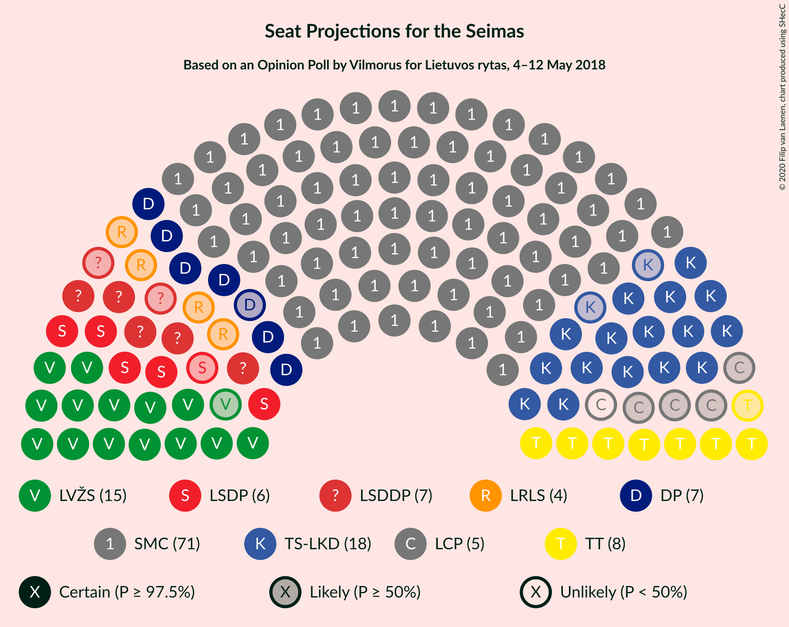
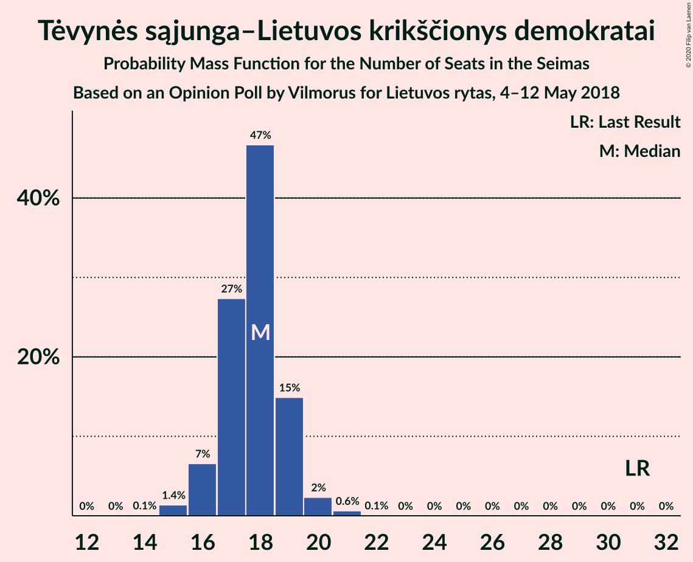
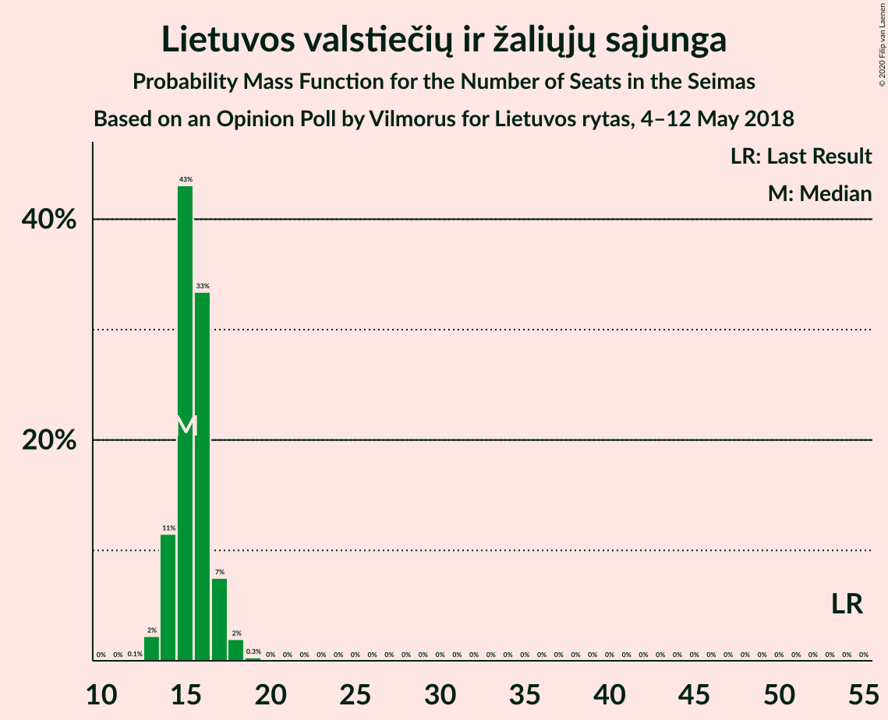
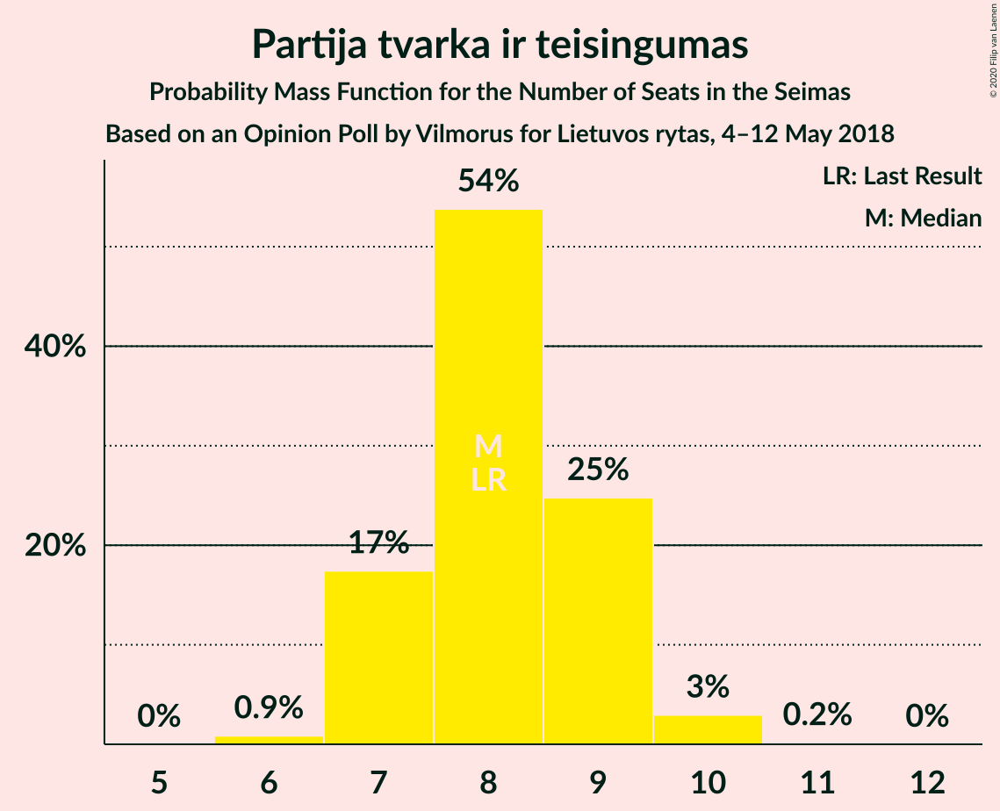
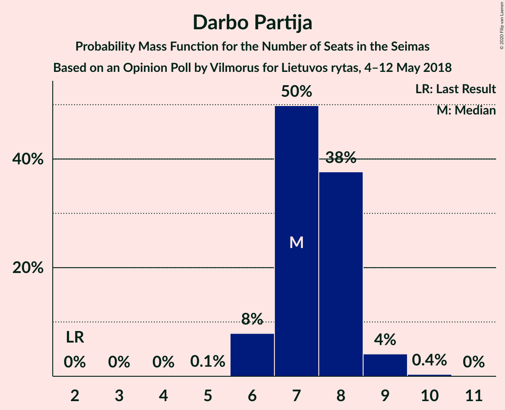
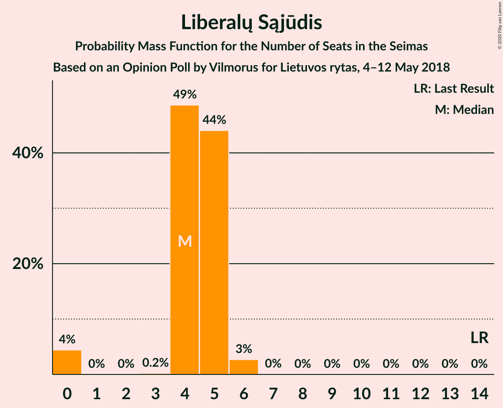
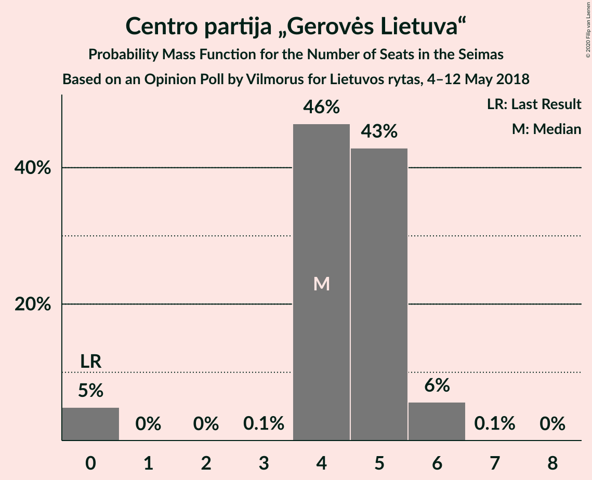
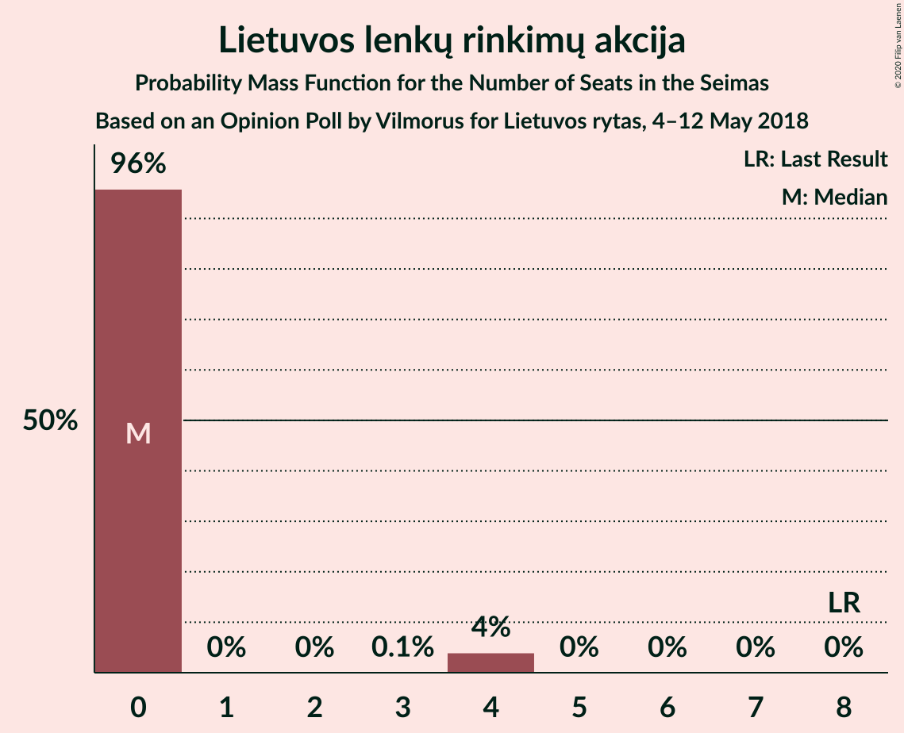

# Opinion Poll by Vilmorus for Lietuvos rytas, 4–12 May 2018

<a href="#voting-intentions">Voting Intentions</a> | <a href="#seats">Seats</a> | <a href="#coalitions">Coalitions</a> | <a href="#technical-information">Technical Information</a>

## Voting Intentions

### Confidence Intervals

| Party | Last Result | Poll Result | 80% Confidence Interval | 90% Confidence Interval | 95% Confidence Interval | 99% Confidence Interval |
|:-----:|:-----------:|:-----------:|:-----------------------:|:-----------------------:|:-----------------------:|:-----------------------:|
| Tėvynės sąjunga–Lietuvos krikščionys demokratai | 22.6% | 24.0% | 22.3–25.8% |21.9–26.2% |21.5–26.7% |20.7–27.6% |
| Lietuvos valstiečių ir žaliųjų sąjunga | 22.4% | 21.0% | 19.4–22.7% |19.0–23.2% |18.6–23.6% |17.9–24.4% |
| Partija tvarka ir teisingumas | 7.8% | 11.0% | 9.8–12.3% |9.5–12.7% |9.2–13.0% |8.7–13.7% |
| Darbo Partija | 4.9% | 10.0% | 8.9–11.3% |8.6–11.7% |8.3–12.0% |7.8–12.6% |
| Lietuvos socialdemokratų darbo partija | 0.0% | 9.0% | 8.0–10.3% |7.7–10.6% |7.4–10.9% |7.0–11.6% |
| Lietuvos socialdemokratų partija | 15.0% | 8.0% | 7.0–9.1% |6.7–9.5% |6.5–9.8% |6.0–10.4% |
| Liberalų Sąjūdis | 9.4% | 6.0% | 5.2–7.1% |4.9–7.4% |4.7–7.7% |4.3–8.2% |
| Centro partija „Gerovės Lietuva“ | 0.0% | 6.0% | 5.2–7.1% |4.9–7.4% |4.7–7.7% |4.3–8.2% |
| Lietuvos lenkų rinkimų akcija | 5.7% | 4.0% | 3.3–4.9% |3.1–5.1% |2.9–5.4% |2.7–5.8% |

*Note:* The poll result column reflects the actual value used in the calculations. Published results may vary slightly, and in addition be rounded to fewer digits.

## Seats

### Confidence Intervals

| Party | Last Result | Median | 80% Confidence Interval | 90% Confidence Interval | 95% Confidence Interval | 99% Confidence Interval |
|:-----:|:-----------:|:------:|:-----------------------:|:-----------------------:|:-----------------------:|:-----------------------:|
| <a href="#tėvynės-sąjunga–lietuvos-krikščionys-demokratai">Tėvynės sąjunga–Lietuvos krikščionys demokratai</a> | 31 | 18 | 17–19 |16–19 |16–20 |15–21 |
| <a href="#lietuvos-valstiečių-ir-žaliųjų-sąjunga">Lietuvos valstiečių ir žaliųjų sąjunga</a> | 54 | 15 | 14–16 |14–17 |14–17 |13–18 |
| <a href="#partija-tvarka-ir-teisingumas">Partija tvarka ir teisingumas</a> | 8 | 8 | 7–9 |7–9 |7–10 |6–10 |
| <a href="#darbo-partija">Darbo Partija</a> | 2 | 7 | 7–8 |6–8 |6–9 |6–9 |
| <a href="#lietuvos-socialdemokratų-darbo-partija">Lietuvos socialdemokratų darbo partija</a> | 0 | 7 | 6–7 |6–8 |5–8 |5–9 |
| <a href="#lietuvos-socialdemokratų-partija">Lietuvos socialdemokratų partija</a> | 17 | 6 | 5–7 |5–7 |5–7 |4–8 |
| <a href="#liberalų-sąjūdis">Liberalų Sąjūdis</a> | 14 | 4 | 4–5 |4–5 |0–6 |0–6 |
| <a href="#centro-partija-„gerovės-lietuva“">Centro partija „Gerovės Lietuva“</a> | 0 | 4 | 4–5 |4–6 |0–6 |0–6 |
| <a href="#lietuvos-lenkų-rinkimų-akcija">Lietuvos lenkų rinkimų akcija</a> | 8 | 0 | 0 |0 |0–4 |0–4 |

### Tėvynės sąjunga–Lietuvos krikščionys demokratai

*For a full overview of the results for this party, see the [Tėvynės sąjunga–Lietuvos krikščionys demokratai](party-tėvynėssąjunga–lietuvoskrikščionysdemokratai.html) page.*

| Number of Seats | Probability | Accumulated | Special Marks |
|:---------------:|:-----------:|:-----------:|:-------------:|
| 14 | 0.1% | 100% |  |
| 15 | 1.4% | 99.9% |  |
| 16 | 7% | 98.6% |  |
| 17 | 27% | 92% |  |
| 18 | 47% | 65% | Median |
| 19 | 15% | 18% |  |
| 20 | 2% | 3% |  |
| 21 | 0.6% | 0.7% |  |
| 22 | 0.1% | 0.1% |  |
| 23 | 0% | 0% |  |
| 24 | 0% | 0% |  |
| 25 | 0% | 0% |  |
| 26 | 0% | 0% |  |
| 27 | 0% | 0% |  |
| 28 | 0% | 0% |  |
| 29 | 0% | 0% |  |
| 30 | 0% | 0% |  |
| 31 | 0% | 0% | Last Result |

### Lietuvos valstiečių ir žaliųjų sąjunga

*For a full overview of the results for this party, see the [Lietuvos valstiečių ir žaliųjų sąjunga](party-lietuvosvalstiečiųiržaliųjųsąjunga.html) page.*

| Number of Seats | Probability | Accumulated | Special Marks |
|:---------------:|:-----------:|:-----------:|:-------------:|
| 12 | 0.1% | 100% |  |
| 13 | 2% | 99.9% |  |
| 14 | 11% | 98% |  |
| 15 | 43% | 86% | Median |
| 16 | 33% | 43% |  |
| 17 | 7% | 10% |  |
| 18 | 2% | 2% |  |
| 19 | 0.3% | 0.3% |  |
| 20 | 0% | 0% |  |
| 21 | 0% | 0% |  |
| 22 | 0% | 0% |  |
| 23 | 0% | 0% |  |
| 24 | 0% | 0% |  |
| 25 | 0% | 0% |  |
| 26 | 0% | 0% |  |
| 27 | 0% | 0% |  |
| 28 | 0% | 0% |  |
| 29 | 0% | 0% |  |
| 30 | 0% | 0% |  |
| 31 | 0% | 0% |  |
| 32 | 0% | 0% |  |
| 33 | 0% | 0% |  |
| 34 | 0% | 0% |  |
| 35 | 0% | 0% |  |
| 36 | 0% | 0% |  |
| 37 | 0% | 0% |  |
| 38 | 0% | 0% |  |
| 39 | 0% | 0% |  |
| 40 | 0% | 0% |  |
| 41 | 0% | 0% |  |
| 42 | 0% | 0% |  |
| 43 | 0% | 0% |  |
| 44 | 0% | 0% |  |
| 45 | 0% | 0% |  |
| 46 | 0% | 0% |  |
| 47 | 0% | 0% |  |
| 48 | 0% | 0% |  |
| 49 | 0% | 0% |  |
| 50 | 0% | 0% |  |
| 51 | 0% | 0% |  |
| 52 | 0% | 0% |  |
| 53 | 0% | 0% |  |
| 54 | 0% | 0% | Last Result |

### Partija tvarka ir teisingumas

*For a full overview of the results for this party, see the [Partija tvarka ir teisingumas](party-partijatvarkairteisingumas.html) page.*

| Number of Seats | Probability | Accumulated | Special Marks |
|:---------------:|:-----------:|:-----------:|:-------------:|
| 6 | 0.9% | 100% |  |
| 7 | 17% | 99.1% |  |
| 8 | 54% | 82% | Last Result, Median |
| 9 | 25% | 28% |  |
| 10 | 3% | 3% |  |
| 11 | 0.2% | 0.2% |  |
| 12 | 0% | 0% |  |

### Darbo Partija

*For a full overview of the results for this party, see the [Darbo Partija](party-darbopartija.html) page.*

| Number of Seats | Probability | Accumulated | Special Marks |
|:---------------:|:-----------:|:-----------:|:-------------:|
| 2 | 0% | 100% | Last Result |
| 3 | 0% | 100% |  |
| 4 | 0% | 100% |  |
| 5 | 0.1% | 100% |  |
| 6 | 8% | 99.9% |  |
| 7 | 50% | 92% | Median |
| 8 | 38% | 42% |  |
| 9 | 4% | 4% |  |
| 10 | 0.4% | 0.4% |  |
| 11 | 0% | 0% |  |

### Lietuvos socialdemokratų darbo partija

*For a full overview of the results for this party, see the [Lietuvos socialdemokratų darbo partija](party-lietuvossocialdemokratųdarbopartija.html) page.*

| Number of Seats | Probability | Accumulated | Special Marks |
|:---------------:|:-----------:|:-----------:|:-------------:|
| 0 | 0% | 100% | Last Result |
| 1 | 0% | 100% |  |
| 2 | 0% | 100% |  |
| 3 | 0% | 100% |  |
| 4 | 0% | 100% |  |
| 5 | 3% | 100% |  |
| 6 | 43% | 97% |  |
| 7 | 46% | 55% | Median |
| 8 | 7% | 8% |  |
| 9 | 0.9% | 0.9% |  |
| 10 | 0% | 0% |  |

### Lietuvos socialdemokratų partija

*For a full overview of the results for this party, see the [Lietuvos socialdemokratų partija](party-lietuvossocialdemokratųpartija.html) page.*

| Number of Seats | Probability | Accumulated | Special Marks |
|:---------------:|:-----------:|:-----------:|:-------------:|
| 4 | 0.9% | 100% |  |
| 5 | 26% | 99.1% |  |
| 6 | 57% | 73% | Median |
| 7 | 15% | 16% |  |
| 8 | 1.0% | 1.0% |  |
| 9 | 0% | 0% |  |
| 10 | 0% | 0% |  |
| 11 | 0% | 0% |  |
| 12 | 0% | 0% |  |
| 13 | 0% | 0% |  |
| 14 | 0% | 0% |  |
| 15 | 0% | 0% |  |
| 16 | 0% | 0% |  |
| 17 | 0% | 0% | Last Result |

### Liberalų Sąjūdis

*For a full overview of the results for this party, see the [Liberalų Sąjūdis](party-liberalųsąjūdis.html) page.*

| Number of Seats | Probability | Accumulated | Special Marks |
|:---------------:|:-----------:|:-----------:|:-------------:|
| 0 | 4% | 100% |  |
| 1 | 0% | 96% |  |
| 2 | 0% | 96% |  |
| 3 | 0.2% | 96% |  |
| 4 | 49% | 95% | Median |
| 5 | 44% | 47% |  |
| 6 | 3% | 3% |  |
| 7 | 0% | 0% |  |
| 8 | 0% | 0% |  |
| 9 | 0% | 0% |  |
| 10 | 0% | 0% |  |
| 11 | 0% | 0% |  |
| 12 | 0% | 0% |  |
| 13 | 0% | 0% |  |
| 14 | 0% | 0% | Last Result |

### Centro partija „Gerovės Lietuva“

*For a full overview of the results for this party, see the [Centro partija „Gerovės Lietuva“](party-centropartija„gerovėslietuva“.html) page.*

| Number of Seats | Probability | Accumulated | Special Marks |
|:---------------:|:-----------:|:-----------:|:-------------:|
| 0 | 5% | 100% | Last Result |
| 1 | 0% | 95% |  |
| 2 | 0% | 95% |  |
| 3 | 0.1% | 95% |  |
| 4 | 46% | 95% | Median |
| 5 | 43% | 49% |  |
| 6 | 6% | 6% |  |
| 7 | 0.1% | 0.1% |  |
| 8 | 0% | 0% |  |

### Lietuvos lenkų rinkimų akcija

*For a full overview of the results for this party, see the [Lietuvos lenkų rinkimų akcija](party-lietuvoslenkųrinkimųakcija.html) page.*

| Number of Seats | Probability | Accumulated | Special Marks |
|:---------------:|:-----------:|:-----------:|:-------------:|
| 0 | 96% | 100% | Median |
| 1 | 0% | 4% |  |
| 2 | 0% | 4% |  |
| 3 | 0.1% | 4% |  |
| 4 | 4% | 4% |  |
| 5 | 0% | 0% |  |
| 6 | 0% | 0% |  |
| 7 | 0% | 0% |  |
| 8 | 0% | 0% | Last Result |

## Coalitions

### Confidence Intervals

| Coalition | Last Result | Median | Majority? | 80% Confidence Interval | 90% Confidence Interval | 95% Confidence Interval | 99% Confidence Interval |
|:---------:|:-----------:|:------:|:---------:|:-----------------------:|:-----------------------:|:-----------------------:|:-----------------------:|
| Lietuvos valstiečių ir žaliųjų sąjunga – Lietuvos socialdemokratų partija | 71 | 21 | 0% | 20–23 | 20–23 | 19–24 | 18–25 |

### Lietuvos valstiečių ir žaliųjų sąjunga – Lietuvos socialdemokratų partija

| Number of Seats | Probability | Accumulated | Special Marks |
|:---------------:|:-----------:|:-----------:|:-------------:|
| 18 | 0.7% | 100% |  |
| 19 | 4% | 99.3% |  |
| 20 | 14% | 95% |  |
| 21 | 44% | 81% | Median |
| 22 | 25% | 37% |  |
| 23 | 9% | 12% |  |
| 24 | 2% | 3% |  |
| 25 | 0.5% | 0.6% |  |
| 26 | 0.1% | 0.1% |  |
| 27 | 0% | 0% |  |
| 28 | 0% | 0% |  |
| 29 | 0% | 0% |  |
| 30 | 0% | 0% |  |
| 31 | 0% | 0% |  |
| 32 | 0% | 0% |  |
| 33 | 0% | 0% |  |
| 34 | 0% | 0% |  |
| 35 | 0% | 0% |  |
| 36 | 0% | 0% |  |
| 37 | 0% | 0% |  |
| 38 | 0% | 0% |  |
| 39 | 0% | 0% |  |
| 40 | 0% | 0% |  |
| 41 | 0% | 0% |  |
| 42 | 0% | 0% |  |
| 43 | 0% | 0% |  |
| 44 | 0% | 0% |  |
| 45 | 0% | 0% |  |
| 46 | 0% | 0% |  |
| 47 | 0% | 0% |  |
| 48 | 0% | 0% |  |
| 49 | 0% | 0% |  |
| 50 | 0% | 0% |  |
| 51 | 0% | 0% |  |
| 52 | 0% | 0% |  |
| 53 | 0% | 0% |  |
| 54 | 0% | 0% |  |
| 55 | 0% | 0% |  |
| 56 | 0% | 0% |  |
| 57 | 0% | 0% |  |
| 58 | 0% | 0% |  |
| 59 | 0% | 0% |  |
| 60 | 0% | 0% |  |
| 61 | 0% | 0% |  |
| 62 | 0% | 0% |  |
| 63 | 0% | 0% |  |
| 64 | 0% | 0% |  |
| 65 | 0% | 0% |  |
| 66 | 0% | 0% |  |
| 67 | 0% | 0% |  |
| 68 | 0% | 0% |  |
| 69 | 0% | 0% |  |
| 70 | 0% | 0% |  |
| 71 | 0% | 0% | Last Result, Majority |

## Technical Information

### Opinion Poll

+ **Polling firm:** Vilmorus
+ **Commissioner(s):** Lietuvos rytas
+ **Fieldwork period:** 4–12 May 2018

### Calculations

+ **Sample size:** 1030
+ **Simulations done:** 1,048,576
+ **Error estimate:** 1.54%

