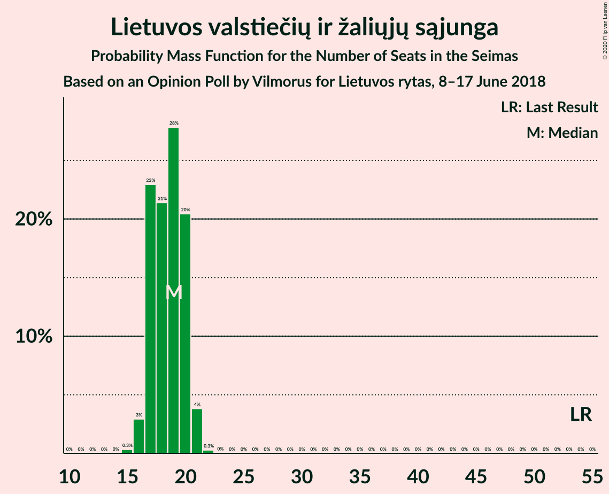
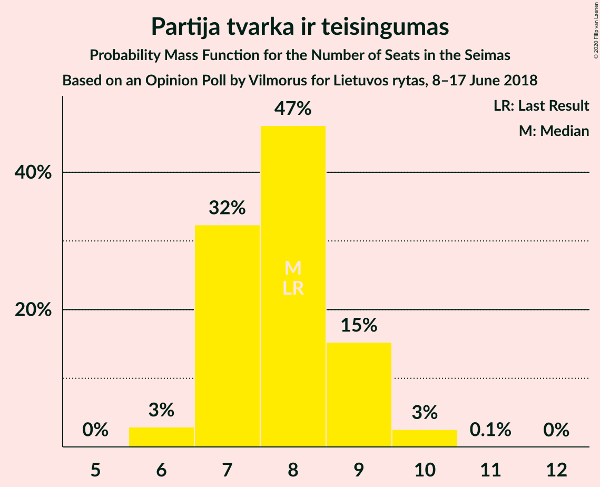
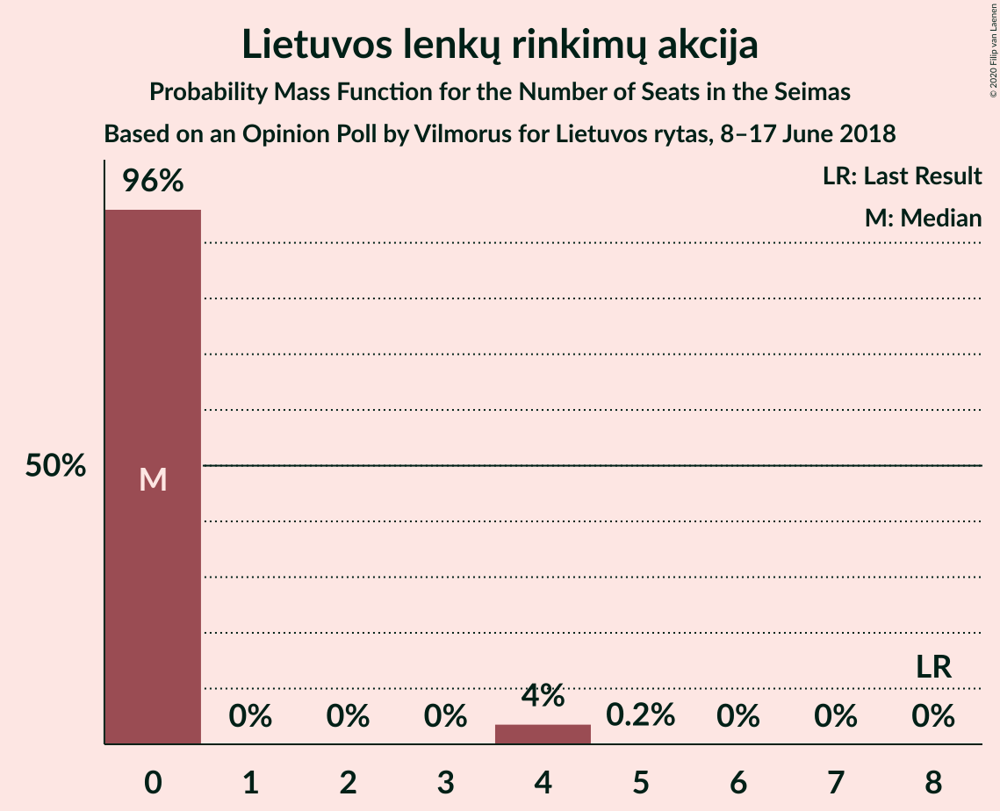
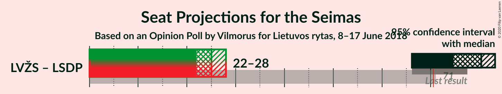
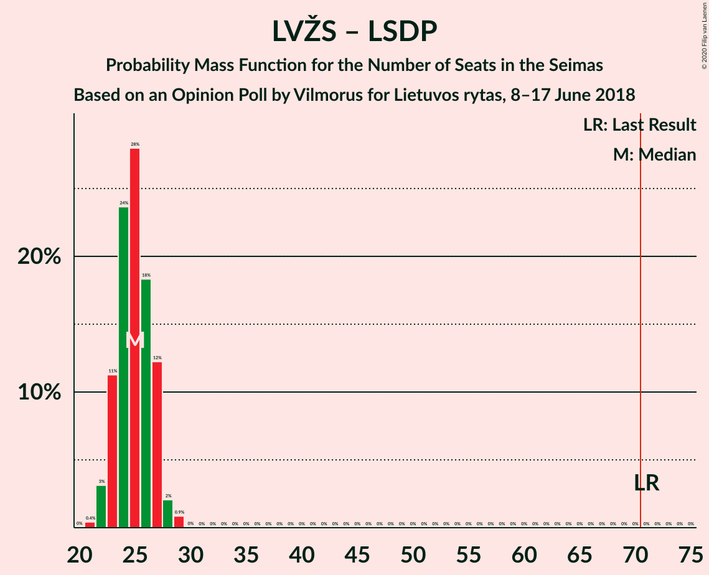

# Opinion Poll by Vilmorus for Lietuvos rytas, 8–17 June 2018

<a href="#voting-intentions">Voting Intentions</a> | <a href="#seats">Seats</a> | <a href="#coalitions">Coalitions</a> | <a href="#technical-information">Technical Information</a>

## Voting Intentions

### Confidence Intervals

| Party | Last Result | Poll Result | 80% Confidence Interval | 90% Confidence Interval | 95% Confidence Interval | 99% Confidence Interval |
|:-----:|:-----------:|:-----------:|:-----------------------:|:-----------------------:|:-----------------------:|:-----------------------:|
| Tėvynės sąjunga–Lietuvos krikščionys demokratai | 22.6% | 26.0% | 24.3–27.8% |23.8–28.3% |23.4–28.8% |22.6–29.7% |
| Lietuvos valstiečių ir žaliųjų sąjunga | 22.4% | 24.0% | 22.3–25.8% |21.9–26.2% |21.5–26.7% |20.7–27.6% |
| Darbo Partija | 4.9% | 11.0% | 9.9–12.4% |9.5–12.8% |9.3–13.1% |8.7–13.8% |
| Partija tvarka ir teisingumas | 7.8% | 10.0% | 8.9–11.3% |8.5–11.6% |8.3–11.9% |7.8–12.6% |
| Lietuvos socialdemokratų partija | 15.0% | 8.0% | 7.0–9.2% |6.8–9.6% |6.5–9.8% |6.1–10.4% |
| Lietuvos socialdemokratų darbo partija | 0.0% | 8.0% | 7.0–9.2% |6.8–9.6% |6.5–9.8% |6.1–10.4% |
| Centro partija „Gerovės Lietuva“ | 0.0% | 5.0% | 4.3–6.0% |4.0–6.3% |3.9–6.5% |3.5–7.0% |
| Lietuvos lenkų rinkimų akcija | 5.7% | 4.0% | 3.3–4.9% |3.1–5.1% |2.9–5.3% |2.6–5.8% |
| Liberalų Sąjūdis | 9.4% | 3.0% | 2.4–3.8% |2.3–4.0% |2.1–4.2% |1.9–4.6% |

*Note:* The poll result column reflects the actual value used in the calculations. Published results may vary slightly, and in addition be rounded to fewer digits.

## Seats

### Confidence Intervals

| Party | Last Result | Median | 80% Confidence Interval | 90% Confidence Interval | 95% Confidence Interval | 99% Confidence Interval |
|:-----:|:-----------:|:------:|:-----------------------:|:-----------------------:|:-----------------------:|:-----------------------:|
| <a href="#tėvynės-sąjunga–lietuvos-krikščionys-demokratai">Tėvynės sąjunga–Lietuvos krikščionys demokratai</a> | 31 | 21 | 18–23 |18–24 |18–24 |17–24 |
| <a href="#lietuvos-valstiečių-ir-žaliųjų-sąjunga">Lietuvos valstiečių ir žaliųjų sąjunga</a> | 54 | 18 | 17–20 |17–20 |17–20 |15–21 |
| <a href="#darbo-partija">Darbo Partija</a> | 2 | 8 | 8–9 |7–10 |7–10 |7–11 |
| <a href="#partija-tvarka-ir-teisingumas">Partija tvarka ir teisingumas</a> | 8 | 7 | 7–9 |6–9 |6–9 |6–10 |
| <a href="#lietuvos-socialdemokratų-partija">Lietuvos socialdemokratų partija</a> | 17 | 6 | 5–7 |5–8 |5–8 |5–8 |
| <a href="#lietuvos-socialdemokratų-darbo-partija">Lietuvos socialdemokratų darbo partija</a> | 0 | 6 | 5–7 |5–7 |5–8 |5–8 |
| <a href="#centro-partija-„gerovės-lietuva“">Centro partija „Gerovės Lietuva“</a> | 0 | 4 | 0–5 |0–5 |0–5 |0–5 |
| <a href="#lietuvos-lenkų-rinkimų-akcija">Lietuvos lenkų rinkimų akcija</a> | 8 | 0 | 0 |0–4 |0–4 |0–5 |
| <a href="#liberalų-sąjūdis">Liberalų Sąjūdis</a> | 14 | 0 | 0 |0 |0 |0 |

### Tėvynės sąjunga–Lietuvos krikščionys demokratai

*For a full overview of the results for this party, see the [Tėvynės sąjunga–Lietuvos krikščionys demokratai](party-tėvynėssąjunga–lietuvoskrikščionysdemokratai.html) page.*

| Number of Seats | Probability | Accumulated | Special Marks |
|:---------------:|:-----------:|:-----------:|:-------------:|
| 16 | 0.2% | 100% |  |
| 17 | 0.7% | 99.8% |  |
| 18 | 10% | 99.0% |  |
| 19 | 23% | 89% |  |
| 20 | 14% | 67% |  |
| 21 | 33% | 53% | Median |
| 22 | 3% | 20% |  |
| 23 | 11% | 17% |  |
| 24 | 5% | 6% |  |
| 25 | 0% | 0% |  |
| 26 | 0% | 0% |  |
| 27 | 0% | 0% |  |
| 28 | 0% | 0% |  |
| 29 | 0% | 0% |  |
| 30 | 0% | 0% |  |
| 31 | 0% | 0% | Last Result |

### Lietuvos valstiečių ir žaliųjų sąjunga

*For a full overview of the results for this party, see the [Lietuvos valstiečių ir žaliųjų sąjunga](party-lietuvosvalstiečiųiržaliųjųsąjunga.html) page.*

| Number of Seats | Probability | Accumulated | Special Marks |
|:---------------:|:-----------:|:-----------:|:-------------:|
| 15 | 0.8% | 100% |  |
| 16 | 0.9% | 99.2% |  |
| 17 | 33% | 98% |  |
| 18 | 35% | 65% | Median |
| 19 | 12% | 31% |  |
| 20 | 17% | 19% |  |
| 21 | 2% | 2% |  |
| 22 | 0.3% | 0.3% |  |
| 23 | 0% | 0% |  |
| 24 | 0% | 0% |  |
| 25 | 0% | 0% |  |
| 26 | 0% | 0% |  |
| 27 | 0% | 0% |  |
| 28 | 0% | 0% |  |
| 29 | 0% | 0% |  |
| 30 | 0% | 0% |  |
| 31 | 0% | 0% |  |
| 32 | 0% | 0% |  |
| 33 | 0% | 0% |  |
| 34 | 0% | 0% |  |
| 35 | 0% | 0% |  |
| 36 | 0% | 0% |  |
| 37 | 0% | 0% |  |
| 38 | 0% | 0% |  |
| 39 | 0% | 0% |  |
| 40 | 0% | 0% |  |
| 41 | 0% | 0% |  |
| 42 | 0% | 0% |  |
| 43 | 0% | 0% |  |
| 44 | 0% | 0% |  |
| 45 | 0% | 0% |  |
| 46 | 0% | 0% |  |
| 47 | 0% | 0% |  |
| 48 | 0% | 0% |  |
| 49 | 0% | 0% |  |
| 50 | 0% | 0% |  |
| 51 | 0% | 0% |  |
| 52 | 0% | 0% |  |
| 53 | 0% | 0% |  |
| 54 | 0% | 0% | Last Result |

### Darbo Partija

*For a full overview of the results for this party, see the [Darbo Partija](party-darbopartija.html) page.*

| Number of Seats | Probability | Accumulated | Special Marks |
|:---------------:|:-----------:|:-----------:|:-------------:|
| 2 | 0% | 100% | Last Result |
| 3 | 0% | 100% |  |
| 4 | 0% | 100% |  |
| 5 | 0% | 100% |  |
| 6 | 0.1% | 100% |  |
| 7 | 6% | 99.9% |  |
| 8 | 48% | 94% | Median |
| 9 | 39% | 45% |  |
| 10 | 5% | 7% |  |
| 11 | 1.2% | 1.2% |  |
| 12 | 0% | 0% |  |

### Partija tvarka ir teisingumas

*For a full overview of the results for this party, see the [Partija tvarka ir teisingumas](party-partijatvarkairteisingumas.html) page.*

| Number of Seats | Probability | Accumulated | Special Marks |
|:---------------:|:-----------:|:-----------:|:-------------:|
| 6 | 7% | 100% |  |
| 7 | 51% | 93% | Median |
| 8 | 25% | 42% | Last Result |
| 9 | 16% | 17% |  |
| 10 | 0.9% | 1.0% |  |
| 11 | 0% | 0% |  |

### Lietuvos socialdemokratų partija

*For a full overview of the results for this party, see the [Lietuvos socialdemokratų partija](party-lietuvossocialdemokratųpartija.html) page.*

| Number of Seats | Probability | Accumulated | Special Marks |
|:---------------:|:-----------:|:-----------:|:-------------:|
| 4 | 0.3% | 100% |  |
| 5 | 14% | 99.7% |  |
| 6 | 66% | 86% | Median |
| 7 | 13% | 21% |  |
| 8 | 7% | 7% |  |
| 9 | 0.2% | 0.2% |  |
| 10 | 0% | 0% |  |
| 11 | 0% | 0% |  |
| 12 | 0% | 0% |  |
| 13 | 0% | 0% |  |
| 14 | 0% | 0% |  |
| 15 | 0% | 0% |  |
| 16 | 0% | 0% |  |
| 17 | 0% | 0% | Last Result |

### Lietuvos socialdemokratų darbo partija

*For a full overview of the results for this party, see the [Lietuvos socialdemokratų darbo partija](party-lietuvossocialdemokratųdarbopartija.html) page.*

| Number of Seats | Probability | Accumulated | Special Marks |
|:---------------:|:-----------:|:-----------:|:-------------:|
| 0 | 0% | 100% | Last Result |
| 1 | 0% | 100% |  |
| 2 | 0% | 100% |  |
| 3 | 0% | 100% |  |
| 4 | 0.2% | 100% |  |
| 5 | 10% | 99.8% |  |
| 6 | 54% | 89% | Median |
| 7 | 32% | 36% |  |
| 8 | 4% | 4% |  |
| 9 | 0.1% | 0.1% |  |
| 10 | 0% | 0% |  |

### Centro partija „Gerovės Lietuva“

*For a full overview of the results for this party, see the [Centro partija „Gerovės Lietuva“](party-centropartija„gerovėslietuva“.html) page.*

| Number of Seats | Probability | Accumulated | Special Marks |
|:---------------:|:-----------:|:-----------:|:-------------:|
| 0 | 41% | 100% | Last Result |
| 1 | 0% | 59% |  |
| 2 | 0% | 59% |  |
| 3 | 0% | 59% |  |
| 4 | 33% | 59% | Median |
| 5 | 26% | 26% |  |
| 6 | 0.3% | 0.3% |  |
| 7 | 0% | 0% |  |

### Lietuvos lenkų rinkimų akcija

*For a full overview of the results for this party, see the [Lietuvos lenkų rinkimų akcija](party-lietuvoslenkųrinkimųakcija.html) page.*

| Number of Seats | Probability | Accumulated | Special Marks |
|:---------------:|:-----------:|:-----------:|:-------------:|
| 0 | 93% | 100% | Median |
| 1 | 0% | 7% |  |
| 2 | 0% | 7% |  |
| 3 | 0% | 7% |  |
| 4 | 7% | 7% |  |
| 5 | 0.6% | 0.6% |  |
| 6 | 0% | 0% |  |
| 7 | 0% | 0% |  |
| 8 | 0% | 0% | Last Result |

### Liberalų Sąjūdis

*For a full overview of the results for this party, see the [Liberalų Sąjūdis](party-liberalųsąjūdis.html) page.*

| Number of Seats | Probability | Accumulated | Special Marks |
|:---------------:|:-----------:|:-----------:|:-------------:|
| 0 | 99.9% | 100% | Median |
| 1 | 0% | 0.1% |  |
| 2 | 0% | 0.1% |  |
| 3 | 0% | 0.1% |  |
| 4 | 0.1% | 0.1% |  |
| 5 | 0% | 0% |  |
| 6 | 0% | 0% |  |
| 7 | 0% | 0% |  |
| 8 | 0% | 0% |  |
| 9 | 0% | 0% |  |
| 10 | 0% | 0% |  |
| 11 | 0% | 0% |  |
| 12 | 0% | 0% |  |
| 13 | 0% | 0% |  |
| 14 | 0% | 0% | Last Result |

## Coalitions

### Confidence Intervals

| Coalition | Last Result | Median | Majority? | 80% Confidence Interval | 90% Confidence Interval | 95% Confidence Interval | 99% Confidence Interval |
|:---------:|:-----------:|:------:|:---------:|:-----------------------:|:-----------------------:|:-----------------------:|:-----------------------:|
| Lietuvos valstiečių ir žaliųjų sąjunga – Lietuvos socialdemokratų partija | 71 | 24 | 0% | 23–26 | 23–26 | 22–27 | 22–28 |

### Lietuvos valstiečių ir žaliųjų sąjunga – Lietuvos socialdemokratų partija

| Number of Seats | Probability | Accumulated | Special Marks |
|:---------------:|:-----------:|:-----------:|:-------------:|
| 21 | 0.2% | 100% |  |
| 22 | 4% | 99.8% |  |
| 23 | 27% | 96% |  |
| 24 | 33% | 69% | Median |
| 25 | 13% | 36% |  |
| 26 | 19% | 23% |  |
| 27 | 3% | 4% |  |
| 28 | 0.8% | 1.0% |  |
| 29 | 0.2% | 0.2% |  |
| 30 | 0% | 0% |  |
| 31 | 0% | 0% |  |
| 32 | 0% | 0% |  |
| 33 | 0% | 0% |  |
| 34 | 0% | 0% |  |
| 35 | 0% | 0% |  |
| 36 | 0% | 0% |  |
| 37 | 0% | 0% |  |
| 38 | 0% | 0% |  |
| 39 | 0% | 0% |  |
| 40 | 0% | 0% |  |
| 41 | 0% | 0% |  |
| 42 | 0% | 0% |  |
| 43 | 0% | 0% |  |
| 44 | 0% | 0% |  |
| 45 | 0% | 0% |  |
| 46 | 0% | 0% |  |
| 47 | 0% | 0% |  |
| 48 | 0% | 0% |  |
| 49 | 0% | 0% |  |
| 50 | 0% | 0% |  |
| 51 | 0% | 0% |  |
| 52 | 0% | 0% |  |
| 53 | 0% | 0% |  |
| 54 | 0% | 0% |  |
| 55 | 0% | 0% |  |
| 56 | 0% | 0% |  |
| 57 | 0% | 0% |  |
| 58 | 0% | 0% |  |
| 59 | 0% | 0% |  |
| 60 | 0% | 0% |  |
| 61 | 0% | 0% |  |
| 62 | 0% | 0% |  |
| 63 | 0% | 0% |  |
| 64 | 0% | 0% |  |
| 65 | 0% | 0% |  |
| 66 | 0% | 0% |  |
| 67 | 0% | 0% |  |
| 68 | 0% | 0% |  |
| 69 | 0% | 0% |  |
| 70 | 0% | 0% |  |
| 71 | 0% | 0% | Last Result, Majority |

## Technical Information

### Opinion Poll

+ **Polling firm:** Vilmorus
+ **Commissioner(s):** Lietuvos rytas
+ **Fieldwork period:** 8–17 June 2018

### Calculations

+ **Sample size:** 1034
+ **Simulations done:** 131,072
+ **Error estimate:** 1.83%

