# Opinion Poll by Spinter tyrimai for Delfi, 19–27 June 2018

<a href="#voting-intentions">Voting Intentions</a> | <a href="#seats">Seats</a> | <a href="#coalitions">Coalitions</a> | <a href="#technical-information">Technical Information</a>

## Voting Intentions

### Confidence Intervals

| Party | Last Result | Poll Result | 80% Confidence Interval | 90% Confidence Interval | 95% Confidence Interval | 99% Confidence Interval |
|:-----:|:-----------:|:-----------:|:-----------------------:|:-----------------------:|:-----------------------:|:-----------------------:|
| Tėvynės sąjunga–Lietuvos krikščionys demokratai | 22.6% | 23.0% | 21.4–24.8% |20.9–25.3% |20.5–25.7% |19.8–26.6% |
| Lietuvos valstiečių ir žaliųjų sąjunga | 22.4% | 20.0% | 18.5–21.7% |18.0–22.2% |17.7–22.6% |16.9–23.5% |
| Partija tvarka ir teisingumas | 7.8% | 11.0% | 9.8–12.3% |9.4–12.7% |9.2–13.1% |8.6–13.7% |
| Lietuvos socialdemokratų partija | 15.0% | 10.0% | 8.8–11.3% |8.5–11.7% |8.3–12.0% |7.8–12.7% |
| Darbo Partija | 4.9% | 9.0% | 7.9–10.2% |7.6–10.6% |7.3–10.9% |6.9–11.5% |
| Liberalų Sąjūdis | 9.4% | 6.0% | 5.1–7.1% |4.9–7.4% |4.7–7.6% |4.3–8.2% |
| Lietuvos socialdemokratų darbo partija | 0.0% | 6.0% | 5.1–7.1% |4.9–7.4% |4.7–7.6% |4.3–8.2% |
| Lietuvos lenkų rinkimų akcija | 5.7% | 5.0% | 4.2–6.0% |4.0–6.3% |3.8–6.5% |3.5–7.0% |
| Centro partija „Gerovės Lietuva“ | 0.0% | 4.0% | 3.3–4.9% |3.1–5.2% |2.9–5.4% |2.6–5.9% |

*Note:* The poll result column reflects the actual value used in the calculations. Published results may vary slightly, and in addition be rounded to fewer digits.

## Seats

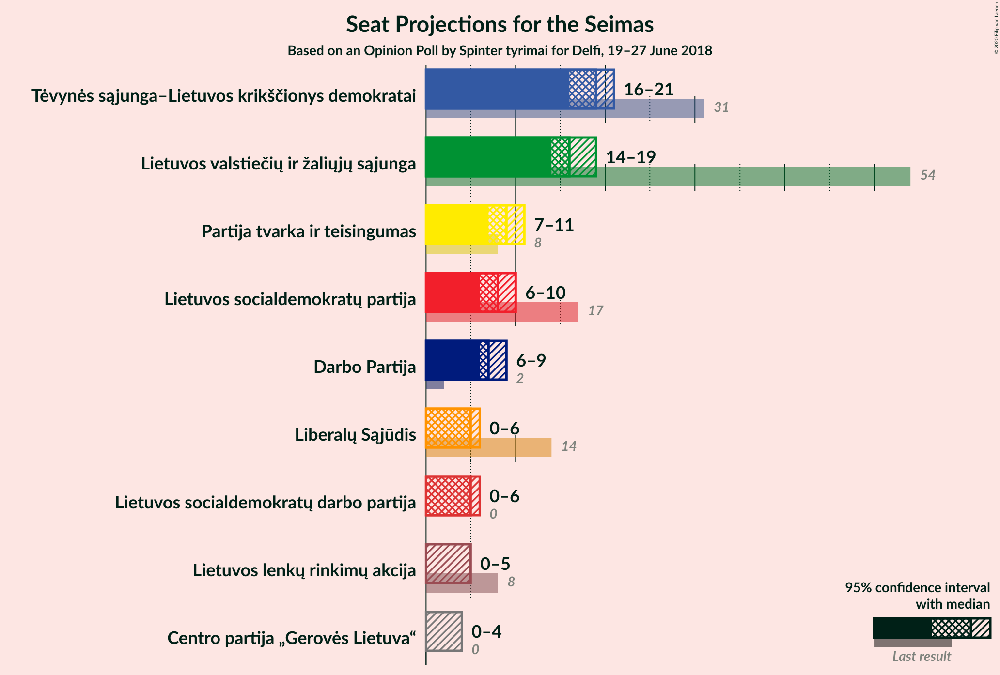

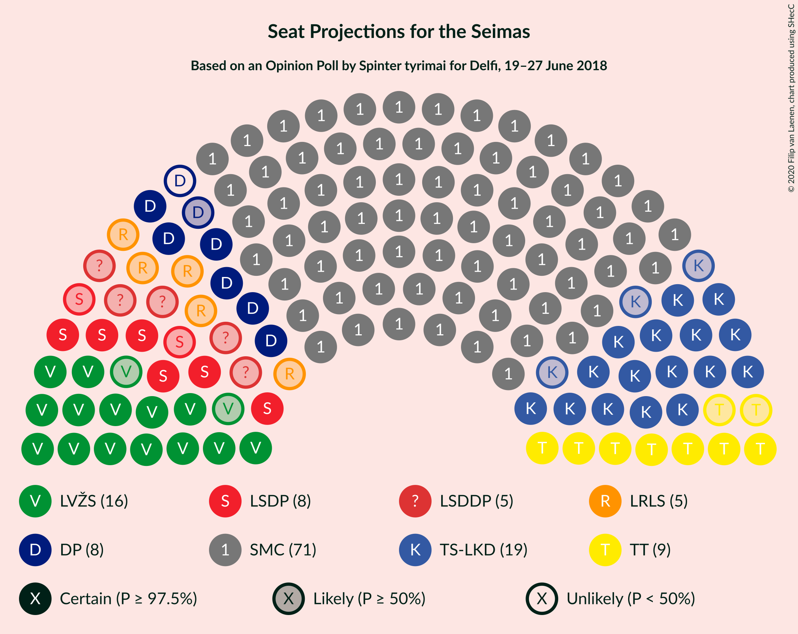

### Confidence Intervals

| Party | Last Result | Median | 80% Confidence Interval | 90% Confidence Interval | 95% Confidence Interval | 99% Confidence Interval |
|:-----:|:-----------:|:------:|:-----------------------:|:-----------------------:|:-----------------------:|:-----------------------:|
| <a href="#tėvynės-sąjunga–lietuvos-krikščionys-demokratai">Tėvynės sąjunga–Lietuvos krikščionys demokratai</a> | 31 | 18 | 17–21 |16–21 |16–21 |15–21 |
| <a href="#lietuvos-valstiečių-ir-žaliųjų-sąjunga">Lietuvos valstiečių ir žaliųjų sąjunga</a> | 54 | 16 | 15–18 |14–18 |14–18 |13–20 |
| <a href="#partija-tvarka-ir-teisingumas">Partija tvarka ir teisingumas</a> | 8 | 9 | 8–10 |8–10 |7–10 |7–11 |
| <a href="#lietuvos-socialdemokratų-partija">Lietuvos socialdemokratų partija</a> | 17 | 8 | 7–9 |7–9 |7–10 |6–11 |
| <a href="#darbo-partija">Darbo Partija</a> | 2 | 7 | 6–8 |6–8 |5–8 |5–9 |
| <a href="#liberalų-sąjūdis">Liberalų Sąjūdis</a> | 14 | 5 | 0–6 |0–6 |0–6 |0–7 |
| <a href="#lietuvos-socialdemokratų-darbo-partija">Lietuvos socialdemokratų darbo partija</a> | 0 | 5 | 0–6 |0–6 |0–6 |0–7 |
| <a href="#lietuvos-lenkų-rinkimų-akcija">Lietuvos lenkų rinkimų akcija</a> | 8 | 4 | 0–5 |0–5 |0–5 |0–5 |
| <a href="#centro-partija-„gerovės-lietuva“">Centro partija „Gerovės Lietuva“</a> | 0 | 0 | 0 |0–4 |0–4 |0–5 |

### Tėvynės sąjunga–Lietuvos krikščionys demokratai

*For a full overview of the results for this party, see the [Tėvynės sąjunga–Lietuvos krikščionys demokratai](party-tėvynėssąjunga–lietuvoskrikščionysdemokratai.html) page.*

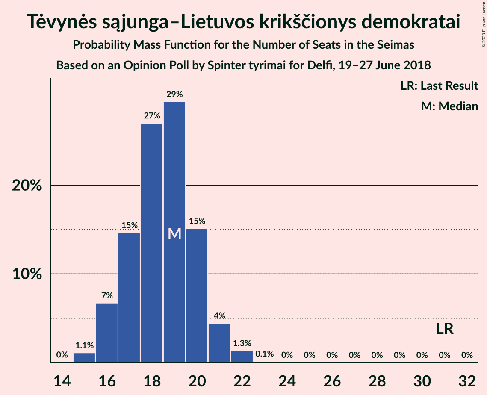

| Number of Seats | Probability | Accumulated | Special Marks |
|:---------------:|:-----------:|:-----------:|:-------------:|
| 14 | 0.1% | 100% |  |
| 15 | 1.0% | 99.9% |  |
| 16 | 5% | 98.9% |  |
| 17 | 15% | 94% |  |
| 18 | 31% | 79% | Median |
| 19 | 9% | 48% |  |
| 20 | 15% | 39% |  |
| 21 | 23% | 24% |  |
| 22 | 0.4% | 0.4% |  |
| 23 | 0.1% | 0.1% |  |
| 24 | 0% | 0% |  |
| 25 | 0% | 0% |  |
| 26 | 0% | 0% |  |
| 27 | 0% | 0% |  |
| 28 | 0% | 0% |  |
| 29 | 0% | 0% |  |
| 30 | 0% | 0% |  |
| 31 | 0% | 0% | Last Result |

### Lietuvos valstiečių ir žaliųjų sąjunga

*For a full overview of the results for this party, see the [Lietuvos valstiečių ir žaliųjų sąjunga](party-lietuvosvalstiečiųiržaliųjųsąjunga.html) page.*

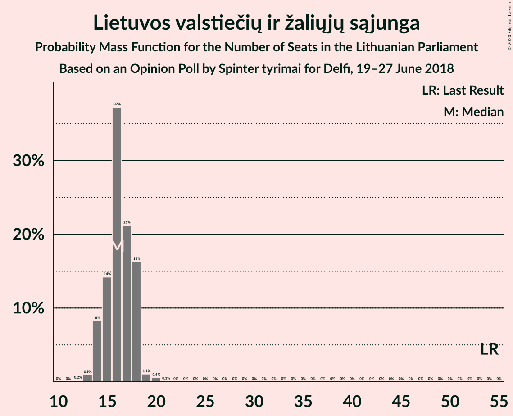

| Number of Seats | Probability | Accumulated | Special Marks |
|:---------------:|:-----------:|:-----------:|:-------------:|
| 12 | 0.2% | 100% |  |
| 13 | 0.9% | 99.8% |  |
| 14 | 8% | 98.9% |  |
| 15 | 14% | 91% |  |
| 16 | 37% | 76% | Median |
| 17 | 21% | 39% |  |
| 18 | 16% | 18% |  |
| 19 | 1.1% | 2% |  |
| 20 | 0.6% | 0.6% |  |
| 21 | 0.1% | 0.1% |  |
| 22 | 0% | 0% |  |
| 23 | 0% | 0% |  |
| 24 | 0% | 0% |  |
| 25 | 0% | 0% |  |
| 26 | 0% | 0% |  |
| 27 | 0% | 0% |  |
| 28 | 0% | 0% |  |
| 29 | 0% | 0% |  |
| 30 | 0% | 0% |  |
| 31 | 0% | 0% |  |
| 32 | 0% | 0% |  |
| 33 | 0% | 0% |  |
| 34 | 0% | 0% |  |
| 35 | 0% | 0% |  |
| 36 | 0% | 0% |  |
| 37 | 0% | 0% |  |
| 38 | 0% | 0% |  |
| 39 | 0% | 0% |  |
| 40 | 0% | 0% |  |
| 41 | 0% | 0% |  |
| 42 | 0% | 0% |  |
| 43 | 0% | 0% |  |
| 44 | 0% | 0% |  |
| 45 | 0% | 0% |  |
| 46 | 0% | 0% |  |
| 47 | 0% | 0% |  |
| 48 | 0% | 0% |  |
| 49 | 0% | 0% |  |
| 50 | 0% | 0% |  |
| 51 | 0% | 0% |  |
| 52 | 0% | 0% |  |
| 53 | 0% | 0% |  |
| 54 | 0% | 0% | Last Result |

### Partija tvarka ir teisingumas

*For a full overview of the results for this party, see the [Partija tvarka ir teisingumas](party-partijatvarkairteisingumas.html) page.*

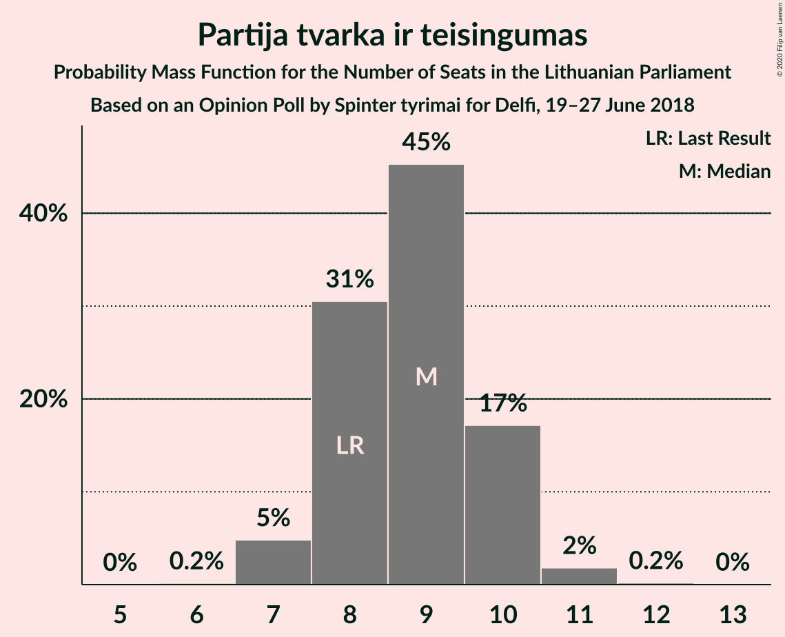

| Number of Seats | Probability | Accumulated | Special Marks |
|:---------------:|:-----------:|:-----------:|:-------------:|
| 6 | 0.2% | 100% |  |
| 7 | 5% | 99.8% |  |
| 8 | 31% | 95% | Last Result |
| 9 | 45% | 65% | Median |
| 10 | 17% | 19% |  |
| 11 | 2% | 2% |  |
| 12 | 0.2% | 0.2% |  |
| 13 | 0% | 0% |  |

### Lietuvos socialdemokratų partija

*For a full overview of the results for this party, see the [Lietuvos socialdemokratų partija](party-lietuvossocialdemokratųpartija.html) page.*

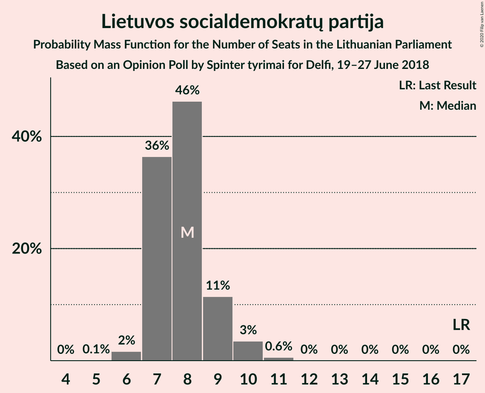

| Number of Seats | Probability | Accumulated | Special Marks |
|:---------------:|:-----------:|:-----------:|:-------------:|
| 5 | 0.1% | 100% |  |
| 6 | 2% | 99.9% |  |
| 7 | 36% | 98% |  |
| 8 | 46% | 62% | Median |
| 9 | 11% | 16% |  |
| 10 | 3% | 4% |  |
| 11 | 0.6% | 0.6% |  |
| 12 | 0% | 0% |  |
| 13 | 0% | 0% |  |
| 14 | 0% | 0% |  |
| 15 | 0% | 0% |  |
| 16 | 0% | 0% |  |
| 17 | 0% | 0% | Last Result |

### Darbo Partija

*For a full overview of the results for this party, see the [Darbo Partija](party-darbopartija.html) page.*

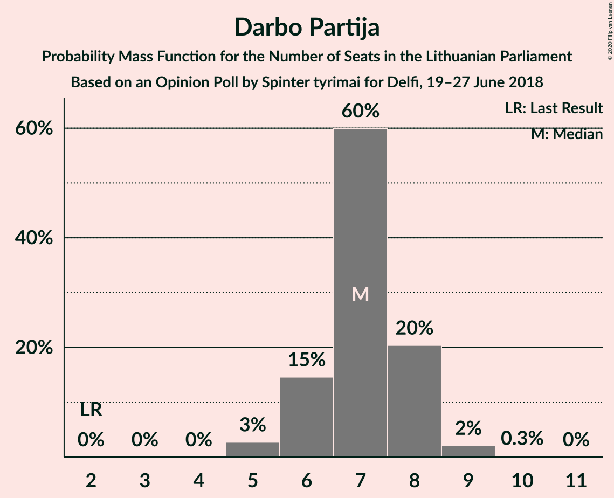

| Number of Seats | Probability | Accumulated | Special Marks |
|:---------------:|:-----------:|:-----------:|:-------------:|
| 2 | 0% | 100% | Last Result |
| 3 | 0% | 100% |  |
| 4 | 0% | 100% |  |
| 5 | 3% | 100% |  |
| 6 | 15% | 97% |  |
| 7 | 60% | 83% | Median |
| 8 | 20% | 23% |  |
| 9 | 2% | 2% |  |
| 10 | 0.3% | 0.3% |  |
| 11 | 0% | 0% |  |

### Liberalų Sąjūdis

*For a full overview of the results for this party, see the [Liberalų Sąjūdis](party-liberalųsąjūdis.html) page.*

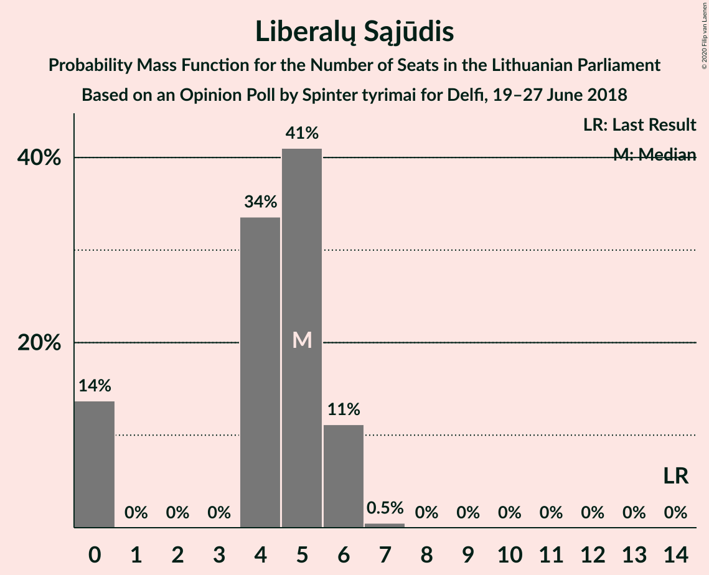

| Number of Seats | Probability | Accumulated | Special Marks |
|:---------------:|:-----------:|:-----------:|:-------------:|
| 0 | 14% | 100% |  |
| 1 | 0% | 86% |  |
| 2 | 0% | 86% |  |
| 3 | 0% | 86% |  |
| 4 | 34% | 86% |  |
| 5 | 41% | 53% | Median |
| 6 | 11% | 12% |  |
| 7 | 0.5% | 0.5% |  |
| 8 | 0% | 0% |  |
| 9 | 0% | 0% |  |
| 10 | 0% | 0% |  |
| 11 | 0% | 0% |  |
| 12 | 0% | 0% |  |
| 13 | 0% | 0% |  |
| 14 | 0% | 0% | Last Result |

### Lietuvos socialdemokratų darbo partija

*For a full overview of the results for this party, see the [Lietuvos socialdemokratų darbo partija](party-lietuvossocialdemokratųdarbopartija.html) page.*

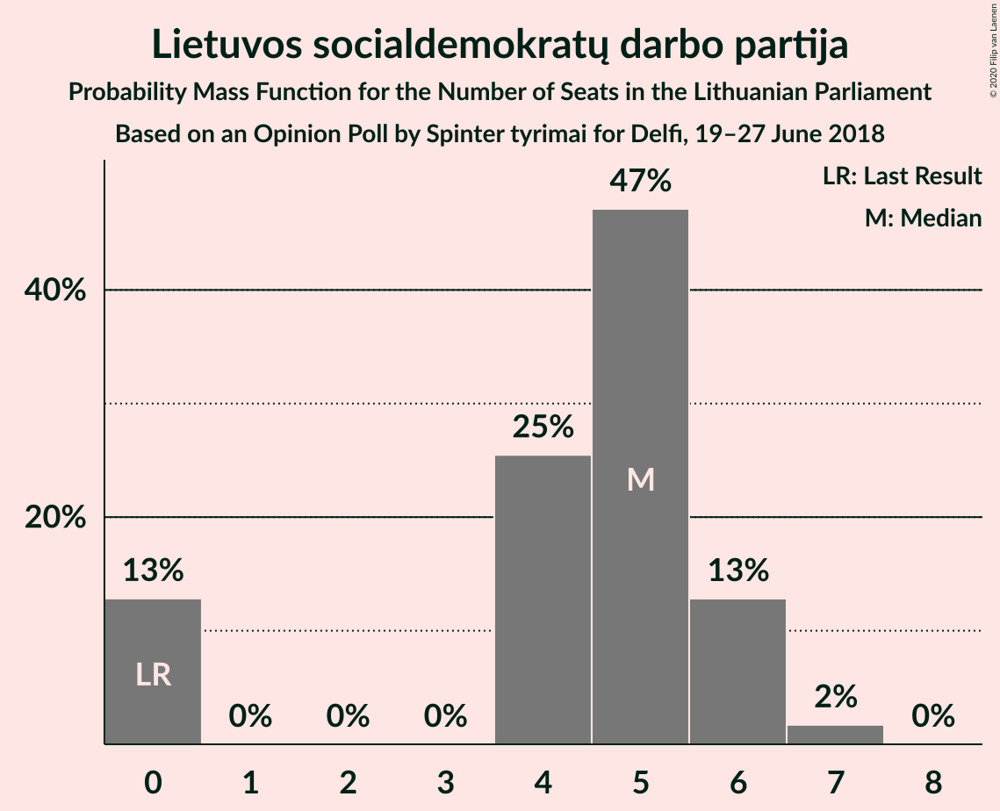

| Number of Seats | Probability | Accumulated | Special Marks |
|:---------------:|:-----------:|:-----------:|:-------------:|
| 0 | 13% | 100% | Last Result |
| 1 | 0% | 87% |  |
| 2 | 0% | 87% |  |
| 3 | 0% | 87% |  |
| 4 | 25% | 87% |  |
| 5 | 47% | 62% | Median |
| 6 | 13% | 15% |  |
| 7 | 2% | 2% |  |
| 8 | 0% | 0% |  |

### Lietuvos lenkų rinkimų akcija

*For a full overview of the results for this party, see the [Lietuvos lenkų rinkimų akcija](party-lietuvoslenkųrinkimųakcija.html) page.*

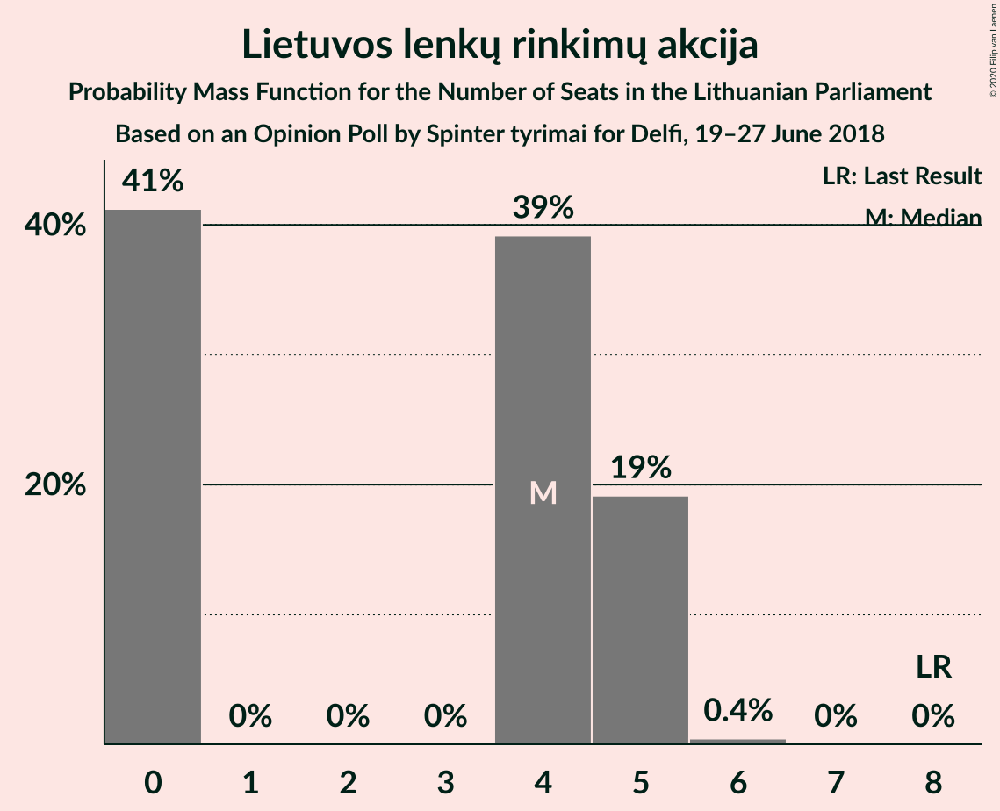

| Number of Seats | Probability | Accumulated | Special Marks |
|:---------------:|:-----------:|:-----------:|:-------------:|
| 0 | 41% | 100% |  |
| 1 | 0% | 59% |  |
| 2 | 0% | 59% |  |
| 3 | 0% | 59% |  |
| 4 | 39% | 59% | Median |
| 5 | 19% | 20% |  |
| 6 | 0.4% | 0.4% |  |
| 7 | 0% | 0% |  |
| 8 | 0% | 0% | Last Result |

### Centro partija „Gerovės Lietuva“

*For a full overview of the results for this party, see the [Centro partija „Gerovės Lietuva“](party-centropartija„gerovėslietuva“.html) page.*

| Number of Seats | Probability | Accumulated | Special Marks |
|:---------------:|:-----------:|:-----------:|:-------------:|
| 0 | 92% | 100% | Last Result, Median |
| 1 | 0% | 8% |  |
| 2 | 0% | 8% |  |
| 3 | 0% | 8% |  |
| 4 | 7% | 8% |  |
| 5 | 1.0% | 1.0% |  |
| 6 | 0% | 0% |  |

## Coalitions

### Confidence Intervals

| Coalition | Last Result | Median | Majority? | 80% Confidence Interval | 90% Confidence Interval | 95% Confidence Interval | 99% Confidence Interval |
|:---------:|:-----------:|:------:|:---------:|:-----------------------:|:-----------------------:|:-----------------------:|:-----------------------:|
| Lietuvos valstiečių ir žaliųjų sąjunga – Lietuvos socialdemokratų partija | 71 | 24 | 0% | 22–26 | 22–27 | 21–27 | 20–29 |

### Lietuvos valstiečių ir žaliųjų sąjunga – Lietuvos socialdemokratų partija

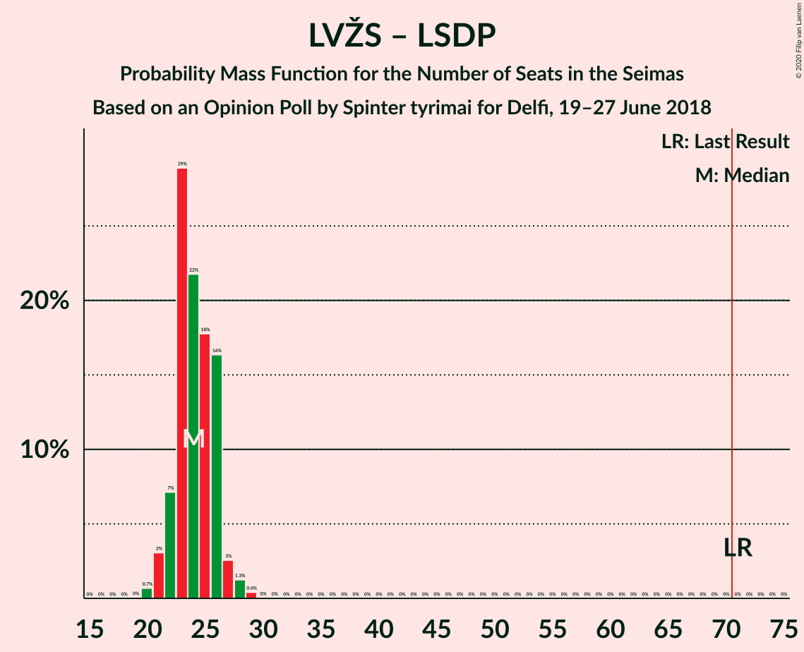

| Number of Seats | Probability | Accumulated | Special Marks |
|:---------------:|:-----------:|:-----------:|:-------------:|
| 19 | 0.1% | 100% |  |
| 20 | 0.6% | 99.9% |  |
| 21 | 4% | 99.3% |  |
| 22 | 6% | 96% |  |
| 23 | 26% | 89% |  |
| 24 | 29% | 63% | Median |
| 25 | 17% | 34% |  |
| 26 | 11% | 17% |  |
| 27 | 4% | 6% |  |
| 28 | 0.7% | 1.3% |  |
| 29 | 0.5% | 0.6% |  |
| 30 | 0% | 0.1% |  |
| 31 | 0% | 0% |  |
| 32 | 0% | 0% |  |
| 33 | 0% | 0% |  |
| 34 | 0% | 0% |  |
| 35 | 0% | 0% |  |
| 36 | 0% | 0% |  |
| 37 | 0% | 0% |  |
| 38 | 0% | 0% |  |
| 39 | 0% | 0% |  |
| 40 | 0% | 0% |  |
| 41 | 0% | 0% |  |
| 42 | 0% | 0% |  |
| 43 | 0% | 0% |  |
| 44 | 0% | 0% |  |
| 45 | 0% | 0% |  |
| 46 | 0% | 0% |  |
| 47 | 0% | 0% |  |
| 48 | 0% | 0% |  |
| 49 | 0% | 0% |  |
| 50 | 0% | 0% |  |
| 51 | 0% | 0% |  |
| 52 | 0% | 0% |  |
| 53 | 0% | 0% |  |
| 54 | 0% | 0% |  |
| 55 | 0% | 0% |  |
| 56 | 0% | 0% |  |
| 57 | 0% | 0% |  |
| 58 | 0% | 0% |  |
| 59 | 0% | 0% |  |
| 60 | 0% | 0% |  |
| 61 | 0% | 0% |  |
| 62 | 0% | 0% |  |
| 63 | 0% | 0% |  |
| 64 | 0% | 0% |  |
| 65 | 0% | 0% |  |
| 66 | 0% | 0% |  |
| 67 | 0% | 0% |  |
| 68 | 0% | 0% |  |
| 69 | 0% | 0% |  |
| 70 | 0% | 0% |  |
| 71 | 0% | 0% | Last Result, Majority |

## Technical Information

### Opinion Poll

+ **Polling firm:** Spinter tyrimai
+ **Commissioner(s):** Delfi
+ **Fieldwork period:** 19–27 June 2018

### Calculations

+ **Sample size:** 1003
+ **Simulations done:** 131,072
+ **Error estimate:** 3.34%

