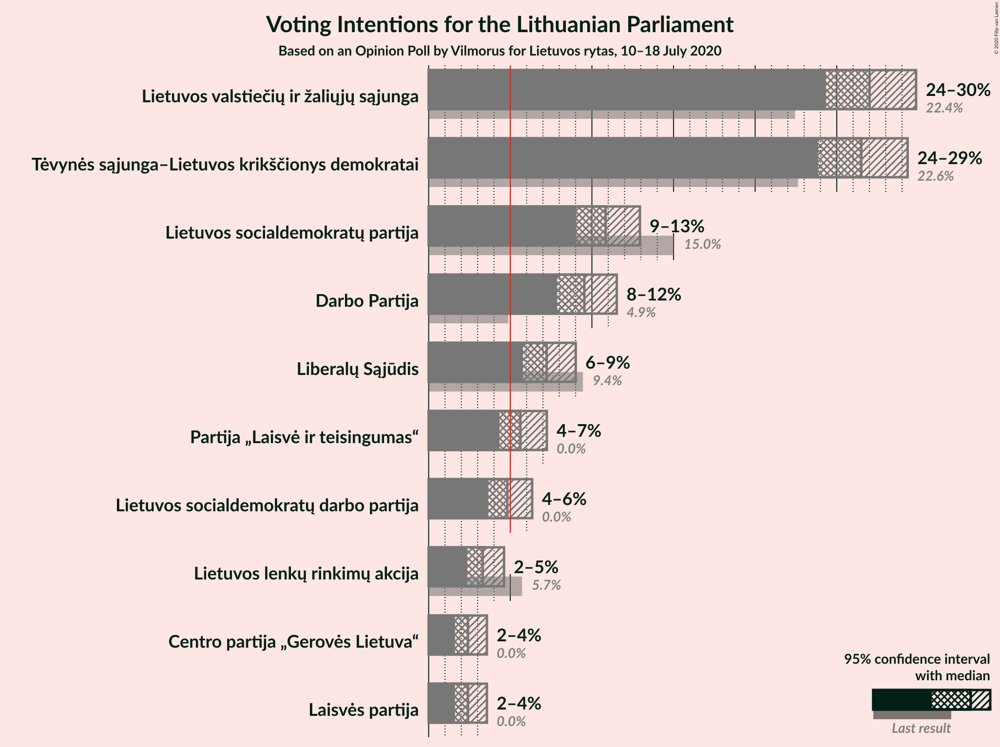
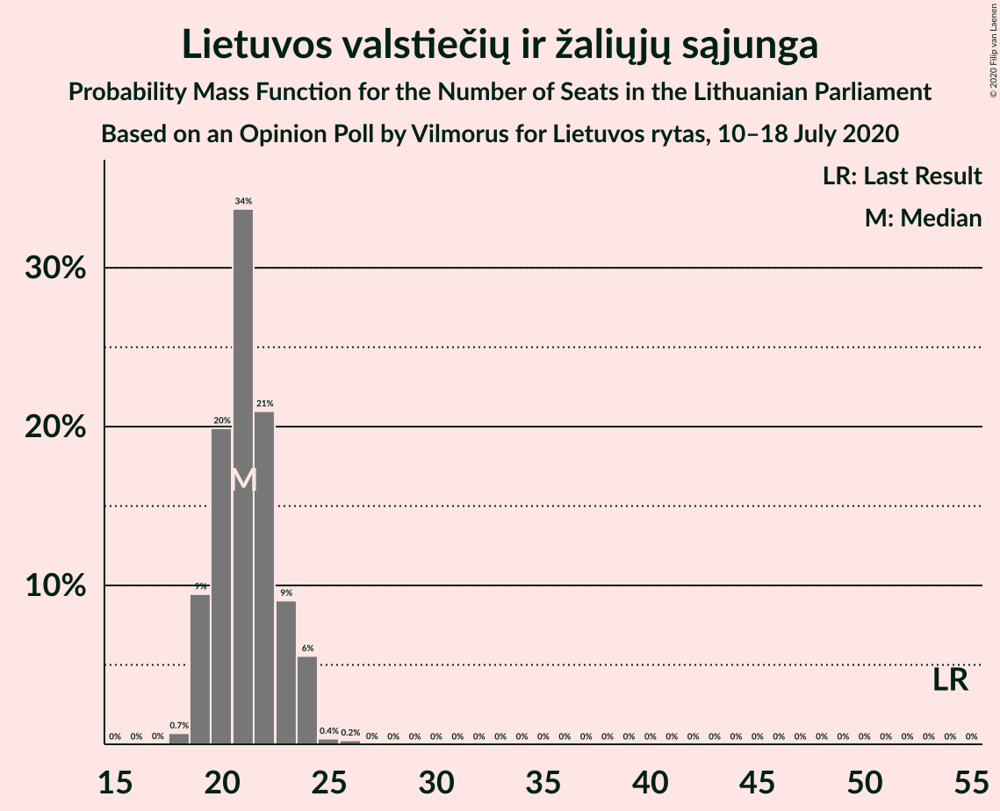

# Opinion Poll by Vilmorus for Lietuvos rytas, 10–18 July 2020

<a href="#voting-intentions">Voting Intentions</a> | <a href="#seats">Seats</a> | <a href="#coalitions">Coalitions</a> | <a href="#technical-information">Technical Information</a>

## Voting Intentions

### Confidence Intervals

| Party | Last Result | Poll Result | 80% Confidence Interval | 90% Confidence Interval | 95% Confidence Interval | 99% Confidence Interval |
|:-----:|:-----------:|:-----------:|:-----------------------:|:-----------------------:|:-----------------------:|:-----------------------:|
| Lietuvos valstiečių ir žaliųjų sąjunga | 0.0% | 27.0% | 24.1–27.6% |23.6–28.1% |23.2–28.5% |22.4–29.4% |
| Tėvynės sąjunga–Lietuvos krikščionys demokratai | 0.0% | 26.5% | 23.6–27.1% |23.1–27.6% |22.7–28.0% |21.9–28.9% |
| Lietuvos socialdemokratų partija | 0.0% | 10.8% | 9.2–11.7% |8.9–12.1% |8.7–12.4% |8.1–13.1% |
| Darbo Partija | 0.0% | 9.5% | 8.0–10.4% |7.7–10.7% |7.5–11.0% |7.0–11.7% |
| Liberalų Sąjūdis | 0.0% | 7.2% | 5.9–8.0% |5.7–8.3% |5.5–8.6% |5.0–9.1% |
| Partija „Laisvė ir teisingumas“ | 0.0% | 5.6% | 4.6–6.4% |4.3–6.7% |4.2–7.0% |3.8–7.5% |
| Lietuvos socialdemokratų darbo partija | 0.0% | 4.8% | 3.9–5.6% |3.7–5.8% |3.5–6.1% |3.2–6.6% |
| Lietuvos lenkų rinkimų akcija | 0.0% | 3.3% | 2.6–4.1% |2.5–4.3% |2.3–4.5% |2.0–4.9% |
| Centro partija „Gerovės Lietuva“ | 0.0% | 2.4% | 1.8–3.0% |1.6–3.2% |1.5–3.4% |1.3–3.7% |
| Laisvės partija | 0.0% | 2.4% | 1.8–3.0% |1.6–3.2% |1.5–3.4% |1.3–3.7% |

*Note:* The poll result column reflects the actual value used in the calculations. Published results may vary slightly, and in addition be rounded to fewer digits.

## Seats

### Confidence Intervals

| Party | Last Result | Median | 80% Confidence Interval | 90% Confidence Interval | 95% Confidence Interval | 99% Confidence Interval |
|:-----:|:-----------:|:------:|:-----------------------:|:-----------------------:|:-----------------------:|:-----------------------:|
| <a href="#lietuvos-valstiečių-ir-žaliųjų-sąjunga">Lietuvos valstiečių ir žaliųjų sąjunga</a> | 0 | 21 | 20–24 |19–24 |18–25 |18–26 |
| <a href="#tėvynės-sąjunga–lietuvos-krikščionys-demokratai">Tėvynės sąjunga–Lietuvos krikščionys demokratai</a> | 0 | 21 | 19–23 |19–24 |18–24 |18–25 |
| <a href="#lietuvos-socialdemokratų-partija">Lietuvos socialdemokratų partija</a> | 0 | 9 | 8–10 |7–11 |7–11 |7–11 |
| <a href="#darbo-partija">Darbo Partija</a> | 0 | 8 | 7–9 |7–9 |6–10 |6–10 |
| <a href="#liberalų-sąjūdis">Liberalų Sąjūdis</a> | 0 | 6 | 5–7 |5–7 |5–7 |0–8 |
| <a href="#partija-„laisvė-ir-teisingumas“">Partija „Laisvė ir teisingumas“</a> | 0 | 4 | 0–5 |0–5 |0–6 |0–6 |
| <a href="#lietuvos-socialdemokratų-darbo-partija">Lietuvos socialdemokratų darbo partija</a> | 0 | 0 | 0–5 |0–5 |0–5 |0–5 |
| <a href="#lietuvos-lenkų-rinkimų-akcija">Lietuvos lenkų rinkimų akcija</a> | 0 | 0 | 0 |0 |0 |0 |
| <a href="#centro-partija-„gerovės-lietuva“">Centro partija „Gerovės Lietuva“</a> | 0 | 0 | 0 |0 |0 |0 |
| <a href="#laisvės-partija">Laisvės partija</a> | 0 | 0 | 0 |0 |0 |0 |

### Lietuvos valstiečių ir žaliųjų sąjunga

*For a full overview of the results for this party, see the [Lietuvos valstiečių ir žaliųjų sąjunga](party-lietuvosvalstiečiųiržaliųjųsąjunga.html) page.*

| Number of Seats | Probability | Accumulated | Special Marks |
|:---------------:|:-----------:|:-----------:|:-------------:|
| 0 | 0% | 100% | Last Result |
| 1 | 0% | 100% |  |
| 2 | 0% | 100% |  |
| 3 | 0% | 100% |  |
| 4 | 0% | 100% |  |
| 5 | 0% | 100% |  |
| 6 | 0% | 100% |  |
| 7 | 0% | 100% |  |
| 8 | 0% | 100% |  |
| 9 | 0% | 100% |  |
| 10 | 0% | 100% |  |
| 11 | 0% | 100% |  |
| 12 | 0% | 100% |  |
| 13 | 0% | 100% |  |
| 14 | 0% | 100% |  |
| 15 | 0% | 100% |  |
| 16 | 0% | 100% |  |
| 17 | 0.1% | 100% |  |
| 18 | 2% | 99.9% |  |
| 19 | 7% | 97% |  |
| 20 | 17% | 91% |  |
| 21 | 26% | 73% | Median |
| 22 | 23% | 48% |  |
| 23 | 13% | 25% |  |
| 24 | 8% | 12% |  |
| 25 | 3% | 4% |  |
| 26 | 0.7% | 0.8% |  |
| 27 | 0% | 0% |  |

### Tėvynės sąjunga–Lietuvos krikščionys demokratai

*For a full overview of the results for this party, see the [Tėvynės sąjunga–Lietuvos krikščionys demokratai](party-tėvynėssąjunga–lietuvoskrikščionysdemokratai.html) page.*

| Number of Seats | Probability | Accumulated | Special Marks |
|:---------------:|:-----------:|:-----------:|:-------------:|
| 0 | 0% | 100% | Last Result |
| 1 | 0% | 100% |  |
| 2 | 0% | 100% |  |
| 3 | 0% | 100% |  |
| 4 | 0% | 100% |  |
| 5 | 0% | 100% |  |
| 6 | 0% | 100% |  |
| 7 | 0% | 100% |  |
| 8 | 0% | 100% |  |
| 9 | 0% | 100% |  |
| 10 | 0% | 100% |  |
| 11 | 0% | 100% |  |
| 12 | 0% | 100% |  |
| 13 | 0% | 100% |  |
| 14 | 0% | 100% |  |
| 15 | 0% | 100% |  |
| 16 | 0% | 100% |  |
| 17 | 0.1% | 100% |  |
| 18 | 3% | 99.9% |  |
| 19 | 12% | 97% |  |
| 20 | 15% | 85% |  |
| 21 | 25% | 70% | Median |
| 22 | 28% | 45% |  |
| 23 | 8% | 17% |  |
| 24 | 8% | 9% |  |
| 25 | 1.4% | 2% |  |
| 26 | 0.1% | 0.2% |  |
| 27 | 0% | 0% |  |

### Lietuvos socialdemokratų partija

*For a full overview of the results for this party, see the [Lietuvos socialdemokratų partija](party-lietuvossocialdemokratųpartija.html) page.*

| Number of Seats | Probability | Accumulated | Special Marks |
|:---------------:|:-----------:|:-----------:|:-------------:|
| 0 | 0% | 100% | Last Result |
| 1 | 0% | 100% |  |
| 2 | 0% | 100% |  |
| 3 | 0% | 100% |  |
| 4 | 0% | 100% |  |
| 5 | 0% | 100% |  |
| 6 | 0.1% | 100% |  |
| 7 | 9% | 99.9% |  |
| 8 | 25% | 91% |  |
| 9 | 49% | 66% | Median |
| 10 | 11% | 16% |  |
| 11 | 5% | 6% |  |
| 12 | 0.2% | 0.2% |  |
| 13 | 0% | 0% |  |

### Darbo Partija

*For a full overview of the results for this party, see the [Darbo Partija](party-darbopartija.html) page.*

| Number of Seats | Probability | Accumulated | Special Marks |
|:---------------:|:-----------:|:-----------:|:-------------:|
| 0 | 0% | 100% | Last Result |
| 1 | 0% | 100% |  |
| 2 | 0% | 100% |  |
| 3 | 0% | 100% |  |
| 4 | 0% | 100% |  |
| 5 | 0.1% | 100% |  |
| 6 | 5% | 99.9% |  |
| 7 | 38% | 95% |  |
| 8 | 43% | 57% | Median |
| 9 | 11% | 14% |  |
| 10 | 3% | 3% |  |
| 11 | 0.2% | 0.2% |  |
| 12 | 0% | 0% |  |

### Liberalų Sąjūdis

*For a full overview of the results for this party, see the [Liberalų Sąjūdis](party-liberalųsąjūdis.html) page.*

| Number of Seats | Probability | Accumulated | Special Marks |
|:---------------:|:-----------:|:-----------:|:-------------:|
| 0 | 0.7% | 100% | Last Result |
| 1 | 0% | 99.3% |  |
| 2 | 0% | 99.3% |  |
| 3 | 0% | 99.3% |  |
| 4 | 1.2% | 99.3% |  |
| 5 | 34% | 98% |  |
| 6 | 43% | 64% | Median |
| 7 | 20% | 21% |  |
| 8 | 0.7% | 0.8% |  |
| 9 | 0% | 0% |  |

### Partija „Laisvė ir teisingumas“

*For a full overview of the results for this party, see the [Partija „Laisvė ir teisingumas“](party-partija„laisvėirteisingumas“.html) page.*

| Number of Seats | Probability | Accumulated | Special Marks |
|:---------------:|:-----------:|:-----------:|:-------------:|
| 0 | 29% | 100% | Last Result |
| 1 | 0% | 71% |  |
| 2 | 0% | 71% |  |
| 3 | 0% | 71% |  |
| 4 | 27% | 71% | Median |
| 5 | 40% | 44% |  |
| 6 | 3% | 4% |  |
| 7 | 0.2% | 0.2% |  |
| 8 | 0% | 0% |  |

### Lietuvos socialdemokratų darbo partija

*For a full overview of the results for this party, see the [Lietuvos socialdemokratų darbo partija](party-lietuvossocialdemokratųdarbopartija.html) page.*

| Number of Seats | Probability | Accumulated | Special Marks |
|:---------------:|:-----------:|:-----------:|:-------------:|
| 0 | 63% | 100% | Last Result, Median |
| 1 | 0% | 37% |  |
| 2 | 0% | 37% |  |
| 3 | 0% | 37% |  |
| 4 | 21% | 37% |  |
| 5 | 16% | 16% |  |
| 6 | 0.4% | 0.4% |  |
| 7 | 0% | 0% |  |

### Lietuvos lenkų rinkimų akcija

*For a full overview of the results for this party, see the [Lietuvos lenkų rinkimų akcija](party-lietuvoslenkųrinkimųakcija.html) page.*

| Number of Seats | Probability | Accumulated | Special Marks |
|:---------------:|:-----------:|:-----------:|:-------------:|
| 0 | 99.7% | 100% | Last Result, Median |
| 1 | 0% | 0.3% |  |
| 2 | 0% | 0.3% |  |
| 3 | 0% | 0.3% |  |
| 4 | 0.2% | 0.3% |  |
| 5 | 0% | 0% |  |

### Centro partija „Gerovės Lietuva“

*For a full overview of the results for this party, see the [Centro partija „Gerovės Lietuva“](party-centropartija„gerovėslietuva“.html) page.*

| Number of Seats | Probability | Accumulated | Special Marks |
|:---------------:|:-----------:|:-----------:|:-------------:|
| 0 | 100% | 100% | Last Result, Median |

### Laisvės partija

*For a full overview of the results for this party, see the [Laisvės partija](party-laisvėspartija.html) page.*

| Number of Seats | Probability | Accumulated | Special Marks |
|:---------------:|:-----------:|:-----------:|:-------------:|
| 0 | 100% | 100% | Last Result, Median |

## Coalitions

## Technical Information

### Opinion Poll

+ **Polling firm:** Vilmorus
+ **Commissioner(s):** Lietuvos rytas
+ **Fieldwork period:** 10–18 July 2020

### Calculations

+ **Sample size:** 996
+ **Simulations done:** 1,048,576
+ **Error estimate:** 2.04%

