# Poll Average

<a href="#voting-intentions">Voting Intentions</a> | <a href="#seats">Seats</a> | <a href="#coalitions">Coalitions</a> | <a href="#technical-information">Technical Information</a>

## Summary

The table below lists the polls on which the average is based. They are the most recent polls (less than 90 days old) registered and analyzed so far.

| Period     | Polling firm/Commissioner(s) | LVŽS | TS-LKD | LSDP | LRLS | TT | LLRA | DP | LŽP | LCP | LS | LSDDP | LP | LT | SMC |
|:----------:|:----------------------------:|:--:|:--:|:--:|:--:|:--:|:--:|:--:|:--:|:--:|:--:|:--:|:--:|:--:|:--:|
| 27 March 2017 | General Election | 22.4%   54 | 22.6%   31 | 15.0%   17 | 9.4%   14 | 7.8%   8 | 5.7%   8 | 4.9%   2 | 2.0%   0 | 6.3%   1 | 0.0%   0 | 0.0%   0 | 0.0%   0 | 2.2%   0 | 0.0%   71 |
| N/A | Poll Average | 14–25%   12–21 | 16–35%   13–31 | 10–16%   9–13 | 5–10%   0–9 | N/A   N/A | 1–7%   0–5 | 7–13%   6–12 | 0–2%   0 | 1–4%   0 | 0–1%   0 | 2–5%   0–5 | 3–8%   0–7 | 3–9%   0–7 | N/A   71 |
| [17–27 September 2020](2020-09-27-Baltijostyrimai.html) | Baltijos tyrimai   ELTA | 21–26%   17–21 | 15–20%   12–16 | 12–16%   10–13 | 7–11%   6–9 | N/A   N/A | 4–7%   0–6 | 7–11%   6–9 | 0–1%   0 | 2–4%   0 | N/A   N/A | 2–4%   0 | 2–5%   0 | 6–10%   5–8 | N/A   71 |
| [4–12 September 2020](2020-09-12-Vilmorus.html) | Vilmorus   Lietuvos rytas | 19–24%   16–22 | 18–23%   16–22 | 10–14%   9–13 | 6–9%   6–9 | N/A   N/A | 2–5%   0 | 10–14%   9–13 | 1–3%   0 | 2–4%   0 | N/A   N/A | 3–6%   0–5 | 2–5%   0 | 4–7%   0–6 | N/A   71 |
| [26 August–4 September 2020](2020-09-04-Spintertyrimai.html) | Spinter tyrimai   Delfi | 17–22%   15–21 | 19–24%   17–23 | 11–15%   9–14 | 5–8%   0–7 | N/A   N/A | 3–6%   0–5 | 7–11%   6–10 | N/A   N/A | 2–5%   0 | N/A   N/A | 3–5%   0 | 5–9%   5–8 | 3–6%   0–5 | N/A   71 |
| [29 July–31 August 2020](2020-08-31-Norstat.html) | Norstat   LRT | 13–18%   11–16 | 30–36%   25–31 | 11–15%   10–13 | 5–8%   0–7 | N/A   N/A | 1–2%   0 | 6–9%   5–8 | 1–2%   0 | 1–2%   0 | 0–1%   0 | 3–5%   0–4 | 5–8%   0–7 | 2–5%   0 | N/A   71 |
| 27 March 2017 | General Election | 22.4%   54 | 22.6%   31 | 15.0%   17 | 9.4%   14 | 7.8%   8 | 5.7%   8 | 4.9%   2 | 2.0%   0 | 6.3%   1 | 0.0%   0 | 0.0%   0 | 0.0%   0 | 2.2%   0 | 0.0%   71 |

Only polls for which at least the sample size has been published are included in the table above.

**Legend:**
+ **Top half of each row:** Voting intentions (95% confidence interval)
+ **Bottom half of each row:** Seat projections for the Seimas (95% confidence interval)
+ **LVŽS:** Lietuvos valstiečių ir žaliųjų sąjunga
+ **TS-LKD:** Tėvynės sąjunga–Lietuvos krikščionys demokratai
+ **LSDP:** Lietuvos socialdemokratų partija
+ **LRLS:** Liberalų Sąjūdis
+ **TT:** Partija tvarka ir teisingumas
+ **LLRA:** Lietuvos lenkų rinkimų akcija
+ **DP:** Darbo Partija
+ **LŽP:** Lietuvos Žaliųjų Partija
+ **LCP:** Centro partija „Gerovės Lietuva“
+ **LS:** Politinė partija “Lietuvos sąrašas”
+ **LSDDP:** Lietuvos socialdemokratų darbo partija
+ **LP:** Laisvės partija
+ **LT:** Partija „Laisvė ir teisingumas“
+ **SMC:** Single-member constituencies
+ **N/A (single party):** Party not included the published results
+ **N/A (entire row):** Calculation for this opinion poll not started yet

## Voting Intentions

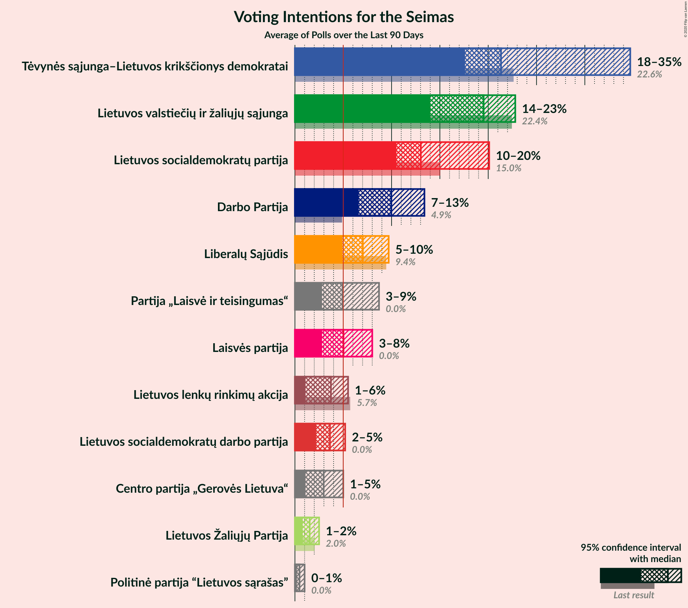

### Confidence Intervals

| Party | Last Result | Median | 80% Confidence Interval | 90% Confidence Interval | 95% Confidence Interval | 99% Confidence Interval |
|:-----:|:-----------:|:------:|:-----------------------:|:-----------------------:|:-----------------------:|:-----------------------:|
| <a href="#tėvynės-sąjunga–lietuvos-krikščionys-demokratai">Tėvynės sąjunga–Lietuvos krikščionys demokratai</a> | 22.6% | 21.3% | 17.4–33.2% |16.7–34.1% | 16.2–34.7% | 15.4–35.9% |
| <a href="#lietuvos-valstiečių-ir-žaliųjų-sąjunga">Lietuvos valstiečių ir žaliųjų sąjunga</a> | 22.4% | 20.2% | 15.2–23.6% |14.5–24.3% | 14.0–24.9% | 13.2–26.0% |
| <a href="#lietuvos-socialdemokratų-partija">Lietuvos socialdemokratų partija</a> | 15.0% | 12.9% | 11.3–14.6% |10.8–15.1% | 10.5–15.5% | 9.8–16.4% |
| <a href="#liberalų-sąjūdis">Liberalų Sąjūdis</a> | 9.4% | 7.0% | 5.5–9.4% |5.2–9.9% | 4.9–10.3% | 4.5–11.1% |
| <a href="#partija-tvarka-ir-teisingumas">Partija tvarka ir teisingumas</a> | 7.8% | N/A | N/A |N/A | N/A | N/A |
| <a href="#centro-partija-„gerovės-lietuva“">Centro partija „Gerovės Lietuva“</a> | 6.3% | 2.8% | 1.5–3.7% |1.3–4.0% | 1.1–4.2% | 0.9–4.7% |
| <a href="#lietuvos-lenkų-rinkimų-akcija">Lietuvos lenkų rinkimų akcija</a> | 5.7% | 4.0% | 1.5–6.0% |1.3–6.5% | 1.1–6.8% | 0.9–7.5% |
| <a href="#darbo-partija">Darbo Partija</a> | 4.9% | 8.9% | 7.3–12.0% |6.9–12.6% | 6.6–13.1% | 6.0–13.9% |
| <a href="#partija-„laisvė-ir-teisingumas“">Partija „Laisvė ir teisingumas“</a> | 2.2% | 4.9% | 3.3–8.2% |3.0–8.7% | 2.8–9.2% | 2.4–9.9% |
| <a href="#lietuvos-žaliųjų-partija">Lietuvos Žaliųjų Partija</a> | 2.0% | 1.3% | 0.6–2.0% |0.5–2.3% | 0.4–2.4% | 0.3–2.8% |
| <a href="#politinė-partija-“lietuvos-sąrašas”">Politinė partija “Lietuvos sąrašas”</a> | 0.0% | 0.5% | 0.2–0.8% |0.2–0.9% | 0.2–1.0% | 0.1–1.3% |
| <a href="#lietuvos-socialdemokratų-darbo-partija">Lietuvos socialdemokratų darbo partija</a> | 0.0% | 3.7% | 2.9–4.7% |2.7–4.9% | 2.5–5.2% | 2.2–5.7% |
| <a href="#laisvės-partija">Laisvės partija</a> | 0.0% | 4.8% | 3.0–7.2% |2.8–7.6% | 2.6–8.0% | 2.3–8.7% |
| <a href="#single-member-constituencies">Single-member constituencies</a> | 0.0% | N/A | N/A |N/A | N/A | N/A |

### Tėvynės sąjunga–Lietuvos krikščionys demokratai

*For a full overview of the results for this party, see the [Tėvynės sąjunga–Lietuvos krikščionys demokratai](party-tėvynėssąjunga–lietuvoskrikščionysdemokratai.html) page.*

| Voting Intentions | Probability | Accumulated | Special Marks |
|:-----------------:|:-----------:|:-----------:|:-------------:|
| 13.5–14.5% | 0.1% | 100% |  |
| 14.5–15.5% | 0.7% | 99.9% |  |
| 15.5–16.5% | 3% | 99.3% |  |
| 16.5–17.5% | 7% | 96% |  |
| 17.5–18.5% | 9% | 89% |  |
| 18.5–19.5% | 9% | 80% |  |
| 19.5–20.5% | 11% | 72% |  |
| 20.5–21.5% | 14% | 60% | Median |
| 21.5–22.5% | 12% | 46% |  |
| 22.5–23.5% | 6% | 34% | Last Result |
| 23.5–24.5% | 2% | 28% |  |
| 24.5–25.5% | 0.4% | 26% |  |
| 25.5–26.5% | 0.1% | 25% |  |
| 26.5–27.5% | 0% | 25% |  |
| 27.5–28.5% | 0% | 25% |  |
| 28.5–29.5% | 0.3% | 25% |  |
| 29.5–30.5% | 1.2% | 25% |  |
| 30.5–31.5% | 3% | 24% |  |
| 31.5–32.5% | 6% | 20% |  |
| 32.5–33.5% | 6% | 14% |  |
| 33.5–34.5% | 5% | 8% |  |
| 34.5–35.5% | 2% | 3% |  |
| 35.5–36.5% | 0.7% | 0.9% |  |
| 36.5–37.5% | 0.1% | 0.2% |  |
| 37.5–38.5% | 0% | 0% |  |

### Lietuvos valstiečių ir žaliųjų sąjunga

*For a full overview of the results for this party, see the [Lietuvos valstiečių ir žaliųjų sąjunga](party-lietuvosvalstiečiųiržaliųjųsąjunga.html) page.*

| Voting Intentions | Probability | Accumulated | Special Marks |
|:-----------------:|:-----------:|:-----------:|:-------------:|
| 10.5–11.5% | 0% | 100% |  |
| 11.5–12.5% | 0.1% | 100% |  |
| 12.5–13.5% | 1.0% | 99.9% |  |
| 13.5–14.5% | 4% | 98.9% |  |
| 14.5–15.5% | 8% | 95% |  |
| 15.5–16.5% | 8% | 87% |  |
| 16.5–17.5% | 5% | 79% |  |
| 17.5–18.5% | 6% | 75% |  |
| 18.5–19.5% | 10% | 69% |  |
| 19.5–20.5% | 13% | 59% | Median |
| 20.5–21.5% | 13% | 45% |  |
| 21.5–22.5% | 12% | 32% | Last Result |
| 22.5–23.5% | 10% | 20% |  |
| 23.5–24.5% | 7% | 11% |  |
| 24.5–25.5% | 3% | 4% |  |
| 25.5–26.5% | 0.9% | 1.1% |  |
| 26.5–27.5% | 0.2% | 0.2% |  |
| 27.5–28.5% | 0% | 0% |  |

### Lietuvos socialdemokratų partija

*For a full overview of the results for this party, see the [Lietuvos socialdemokratų partija](party-lietuvossocialdemokratųpartija.html) page.*

| Voting Intentions | Probability | Accumulated | Special Marks |
|:-----------------:|:-----------:|:-----------:|:-------------:|
| 7.5–8.5% | 0% | 100% |  |
| 8.5–9.5% | 0.2% | 100% |  |
| 9.5–10.5% | 3% | 99.8% |  |
| 10.5–11.5% | 12% | 97% |  |
| 11.5–12.5% | 25% | 85% |  |
| 12.5–13.5% | 29% | 60% | Median |
| 13.5–14.5% | 20% | 31% |  |
| 14.5–15.5% | 8% | 11% | Last Result |
| 15.5–16.5% | 2% | 2% |  |
| 16.5–17.5% | 0.3% | 0.3% |  |
| 17.5–18.5% | 0% | 0% |  |

### Liberalų Sąjūdis

*For a full overview of the results for this party, see the [Liberalų Sąjūdis](party-liberalųsąjūdis.html) page.*

| Voting Intentions | Probability | Accumulated | Special Marks |
|:-----------------:|:-----------:|:-----------:|:-------------:|
| 2.5–3.5% | 0% | 100% |  |
| 3.5–4.5% | 0.7% | 100% |  |
| 4.5–5.5% | 11% | 99.3% |  |
| 5.5–6.5% | 27% | 88% |  |
| 6.5–7.5% | 21% | 62% | Median |
| 7.5–8.5% | 18% | 40% |  |
| 8.5–9.5% | 14% | 22% | Last Result |
| 9.5–10.5% | 7% | 8% |  |
| 10.5–11.5% | 1.5% | 2% |  |
| 11.5–12.5% | 0.1% | 0.1% |  |
| 12.5–13.5% | 0% | 0% |  |

### Centro partija „Gerovės Lietuva“

*For a full overview of the results for this party, see the [Centro partija „Gerovės Lietuva“](party-centropartija„gerovėslietuva“.html) page.*

| Voting Intentions | Probability | Accumulated | Special Marks |
|:-----------------:|:-----------:|:-----------:|:-------------:|
| 0.0–0.5% | 0% | 100% |  |
| 0.5–1.5% | 12% | 100% |  |
| 1.5–2.5% | 28% | 88% |  |
| 2.5–3.5% | 44% | 59% | Median |
| 3.5–4.5% | 14% | 15% |  |
| 4.5–5.5% | 0.8% | 0.8% |  |
| 5.5–6.5% | 0% | 0% | Last Result |

### Lietuvos lenkų rinkimų akcija

*For a full overview of the results for this party, see the [Lietuvos lenkų rinkimų akcija](party-lietuvoslenkųrinkimųakcija.html) page.*

| Voting Intentions | Probability | Accumulated | Special Marks |
|:-----------------:|:-----------:|:-----------:|:-------------:|
| 0.0–0.5% | 0% | 100% |  |
| 0.5–1.5% | 12% | 100% |  |
| 1.5–2.5% | 13% | 88% |  |
| 2.5–3.5% | 14% | 75% |  |
| 3.5–4.5% | 23% | 61% | Median |
| 4.5–5.5% | 19% | 38% |  |
| 5.5–6.5% | 14% | 18% | Last Result |
| 6.5–7.5% | 4% | 4% |  |
| 7.5–8.5% | 0.4% | 0.4% |  |
| 8.5–9.5% | 0% | 0% |  |

### Darbo Partija

*For a full overview of the results for this party, see the [Darbo Partija](party-darbopartija.html) page.*

| Voting Intentions | Probability | Accumulated | Special Marks |
|:-----------------:|:-----------:|:-----------:|:-------------:|
| 4.5–5.5% | 0.1% | 100% | Last Result |
| 5.5–6.5% | 2% | 99.9% |  |
| 6.5–7.5% | 13% | 98% |  |
| 7.5–8.5% | 26% | 85% |  |
| 8.5–9.5% | 24% | 59% | Median |
| 9.5–10.5% | 11% | 35% |  |
| 10.5–11.5% | 9% | 24% |  |
| 11.5–12.5% | 9% | 15% |  |
| 12.5–13.5% | 4% | 6% |  |
| 13.5–14.5% | 1.0% | 1.1% |  |
| 14.5–15.5% | 0.1% | 0.1% |  |
| 15.5–16.5% | 0% | 0% |  |

### Partija „Laisvė ir teisingumas“

*For a full overview of the results for this party, see the [Partija „Laisvė ir teisingumas“](party-partija„laisvėirteisingumas“.html) page.*

| Voting Intentions | Probability | Accumulated | Special Marks |
|:-----------------:|:-----------:|:-----------:|:-------------:|
| 0.5–1.5% | 0% | 100% |  |
| 1.5–2.5% | 1.0% | 100% | Last Result |
| 2.5–3.5% | 14% | 99.0% |  |
| 3.5–4.5% | 25% | 85% |  |
| 4.5–5.5% | 24% | 60% | Median |
| 5.5–6.5% | 11% | 36% |  |
| 6.5–7.5% | 8% | 25% |  |
| 7.5–8.5% | 11% | 18% |  |
| 8.5–9.5% | 6% | 7% |  |
| 9.5–10.5% | 1.0% | 1.1% |  |
| 10.5–11.5% | 0.1% | 0.1% |  |
| 11.5–12.5% | 0% | 0% |  |

### Lietuvos Žaliųjų Partija

*For a full overview of the results for this party, see the [Lietuvos Žaliųjų Partija](party-lietuvosžaliųjųpartija.html) page.*

| Voting Intentions | Probability | Accumulated | Special Marks |
|:-----------------:|:-----------:|:-----------:|:-------------:|
| 0.0–0.5% | 6% | 100% |  |
| 0.5–1.5% | 60% | 94% | Median |
| 1.5–2.5% | 32% | 34% | Last Result |
| 2.5–3.5% | 2% | 2% |  |
| 3.5–4.5% | 0% | 0% |  |

### Lietuvos socialdemokratų darbo partija

*For a full overview of the results for this party, see the [Lietuvos socialdemokratų darbo partija](party-lietuvossocialdemokratųdarbopartija.html) page.*

| Voting Intentions | Probability | Accumulated | Special Marks |
|:-----------------:|:-----------:|:-----------:|:-------------:|
| 0.0–0.5% | 0% | 100% | Last Result |
| 0.5–1.5% | 0% | 100% |  |
| 1.5–2.5% | 3% | 100% |  |
| 2.5–3.5% | 38% | 97% |  |
| 3.5–4.5% | 47% | 59% | Median |
| 4.5–5.5% | 12% | 12% |  |
| 5.5–6.5% | 0.8% | 0.9% |  |
| 6.5–7.5% | 0% | 0% |  |

### Laisvės partija

*For a full overview of the results for this party, see the [Laisvės partija](party-laisvėspartija.html) page.*

| Voting Intentions | Probability | Accumulated | Special Marks |
|:-----------------:|:-----------:|:-----------:|:-------------:|
| 0.0–0.5% | 0% | 100% | Last Result |
| 0.5–1.5% | 0% | 100% |  |
| 1.5–2.5% | 2% | 100% |  |
| 2.5–3.5% | 25% | 98% |  |
| 3.5–4.5% | 21% | 73% |  |
| 4.5–5.5% | 10% | 52% | Median |
| 5.5–6.5% | 20% | 42% |  |
| 6.5–7.5% | 16% | 22% |  |
| 7.5–8.5% | 5% | 6% |  |
| 8.5–9.5% | 0.7% | 0.7% |  |
| 9.5–10.5% | 0% | 0% |  |

### Politinė partija “Lietuvos sąrašas”

*For a full overview of the results for this party, see the [Politinė partija “Lietuvos sąrašas”](party-politinėpartija“lietuvossąrašas”.html) page.*

| Voting Intentions | Probability | Accumulated | Special Marks |
|:-----------------:|:-----------:|:-----------:|:-------------:|
| 0.0–0.5% | 64% | 100% | Last Result, Median |
| 0.5–1.5% | 36% | 36% |  |
| 1.5–2.5% | 0.1% | 0.1% |  |
| 2.5–3.5% | 0% | 0% |  |

## Seats

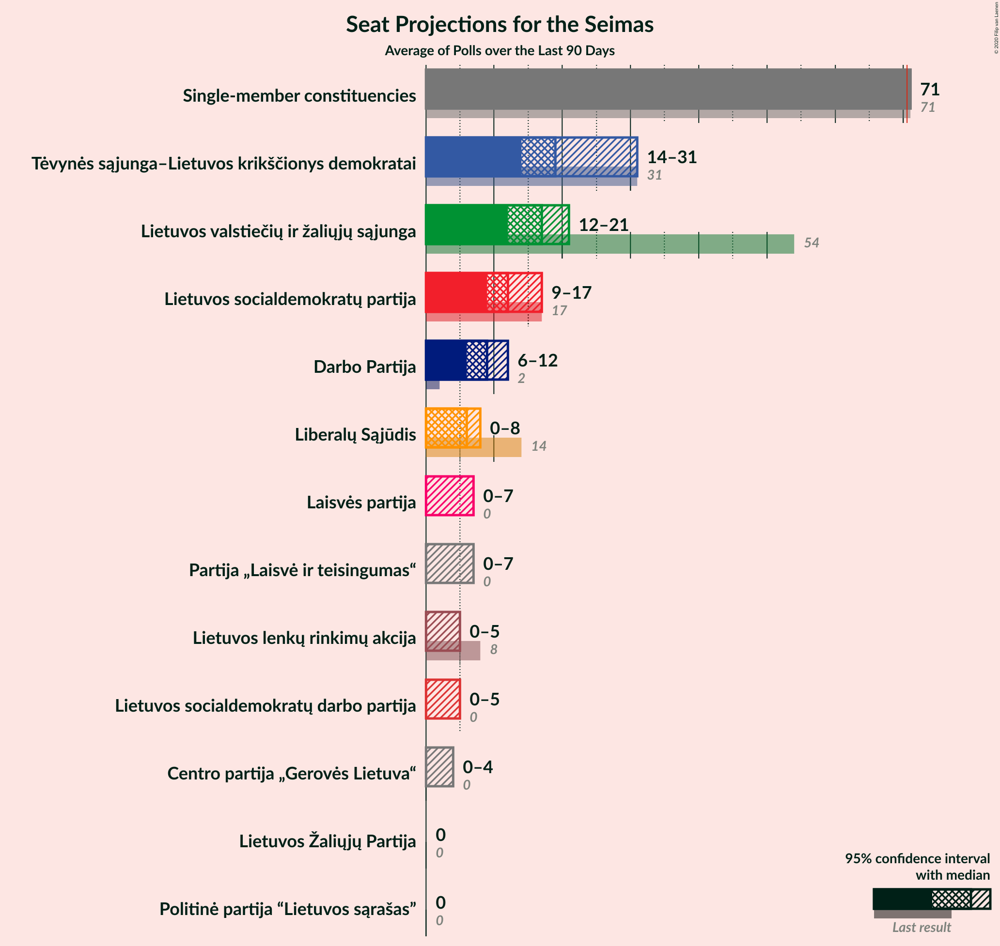

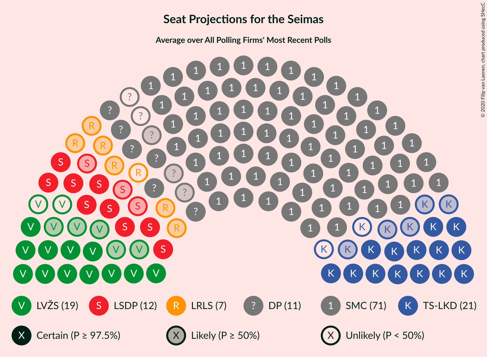

### Confidence Intervals

| Party | Last Result | Median | 80% Confidence Interval | 90% Confidence Interval | 95% Confidence Interval | 99% Confidence Interval |
|:-----:|:-----------:|:------:|:-----------------------:|:-----------------------:|:-----------------------:|:-----------------------:|
| <a href="#tėvynės-sąjunga–lietuvos-krikščionys-demokratai">Tėvynės sąjunga–Lietuvos krikščionys demokratai</a> | 31 | 19 | 15–29 |14–31 | 13–31 | 12–31 |
| <a href="#lietuvos-valstiečių-ir-žaliųjų-sąjunga">Lietuvos valstiečių ir žaliųjų sąjunga</a> | 54 | 18 | 13–21 |13–21 | 12–21 | 11–22 |
| <a href="#lietuvos-socialdemokratų-partija">Lietuvos socialdemokratų partija</a> | 17 | 11 | 10–12 |10–13 | 9–13 | 9–14 |
| <a href="#liberalų-sąjūdis">Liberalų Sąjūdis</a> | 14 | 6 | 5–8 |0–8 | 0–9 | 0–9 |
| <a href="#partija-tvarka-ir-teisingumas">Partija tvarka ir teisingumas</a> | 8 | N/A | N/A |N/A | N/A | N/A |
| <a href="#centro-partija-„gerovės-lietuva“">Centro partija „Gerovės Lietuva“</a> | 1 | 0 | 0 |0 | 0 | 0 |
| <a href="#lietuvos-lenkų-rinkimų-akcija">Lietuvos lenkų rinkimų akcija</a> | 8 | 0 | 0–5 |0–5 | 0–5 | 0–6 |
| <a href="#darbo-partija">Darbo Partija</a> | 2 | 8 | 6–11 |6–12 | 6–12 | 5–13 |
| <a href="#partija-„laisvė-ir-teisingumas“">Partija „Laisvė ir teisingumas“</a> | 0 | 0 | 0–7 |0–7 | 0–7 | 0–8 |
| <a href="#lietuvos-žaliųjų-partija">Lietuvos Žaliųjų Partija</a> | 0 | 0 | 0 |0 | 0 | 0 |
| <a href="#politinė-partija-“lietuvos-sąrašas”">Politinė partija “Lietuvos sąrašas”</a> | 0 | 0 | 0 |0 | 0 | 0 |
| <a href="#lietuvos-socialdemokratų-darbo-partija">Lietuvos socialdemokratų darbo partija</a> | 0 | 0 | 0 |0 | 0–5 | 0–5 |
| <a href="#laisvės-partija">Laisvės partija</a> | 0 | 0 | 0–7 |0–7 | 0–7 | 0–8 |
| <a href="#single-member-constituencies">Single-member constituencies</a> | 71 | 71 | 71 |71 | 71 | 71 |

### Tėvynės sąjunga–Lietuvos krikščionys demokratai

*For a full overview of the results for this party, see the [Tėvynės sąjunga–Lietuvos krikščionys demokratai](party-tėvynėssąjunga–lietuvoskrikščionysdemokratai.html) page.*

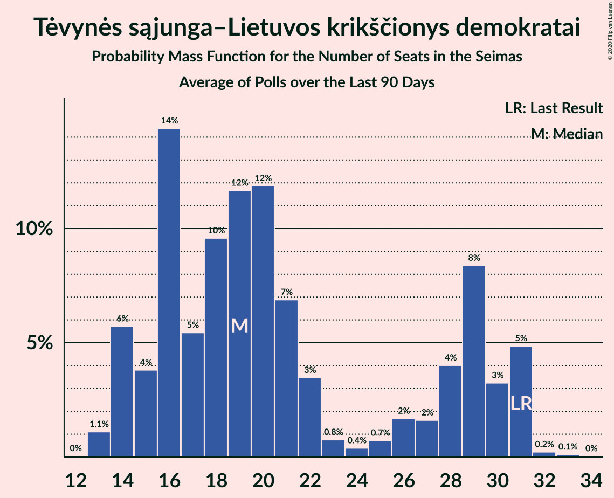

| Number of Seats | Probability | Accumulated | Special Marks |
|:---------------:|:-----------:|:-----------:|:-------------:|
| 12 | 0.9% | 100% |  |
| 13 | 3% | 99.0% |  |
| 14 | 6% | 96% |  |
| 15 | 13% | 90% |  |
| 16 | 3% | 77% |  |
| 17 | 5% | 74% |  |
| 18 | 9% | 69% |  |
| 19 | 12% | 60% | Median |
| 20 | 12% | 48% |  |
| 21 | 7% | 36% |  |
| 22 | 3% | 30% |  |
| 23 | 0.8% | 26% |  |
| 24 | 0.4% | 25% |  |
| 25 | 0.7% | 25% |  |
| 26 | 2% | 24% |  |
| 27 | 2% | 22% |  |
| 28 | 4% | 21% |  |
| 29 | 8% | 17% |  |
| 30 | 3% | 8% |  |
| 31 | 5% | 5% | Last Result |
| 32 | 0.2% | 0.4% |  |
| 33 | 0.1% | 0.2% |  |
| 34 | 0% | 0% |  |

### Lietuvos valstiečių ir žaliųjų sąjunga

*For a full overview of the results for this party, see the [Lietuvos valstiečių ir žaliųjų sąjunga](party-lietuvosvalstiečiųiržaliųjųsąjunga.html) page.*

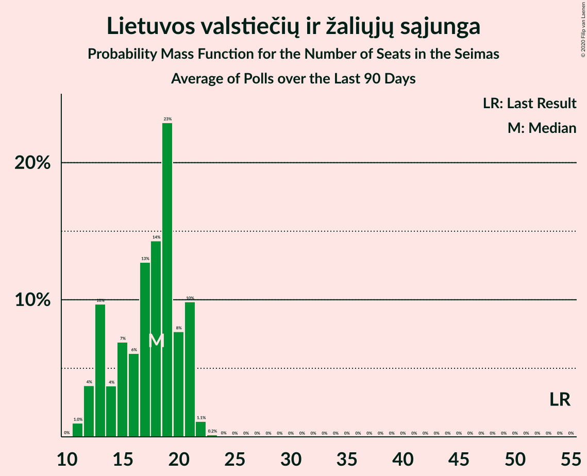

| Number of Seats | Probability | Accumulated | Special Marks |
|:---------------:|:-----------:|:-----------:|:-------------:|
| 11 | 1.0% | 100% |  |
| 12 | 4% | 99.0% |  |
| 13 | 10% | 95% |  |
| 14 | 4% | 86% |  |
| 15 | 7% | 82% |  |
| 16 | 6% | 75% |  |
| 17 | 13% | 69% |  |
| 18 | 14% | 56% | Median |
| 19 | 23% | 42% |  |
| 20 | 8% | 19% |  |
| 21 | 10% | 11% |  |
| 22 | 1.1% | 1.3% |  |
| 23 | 0.2% | 0.2% |  |
| 24 | 0% | 0% |  |
| 25 | 0% | 0% |  |
| 26 | 0% | 0% |  |
| 27 | 0% | 0% |  |
| 28 | 0% | 0% |  |
| 29 | 0% | 0% |  |
| 30 | 0% | 0% |  |
| 31 | 0% | 0% |  |
| 32 | 0% | 0% |  |
| 33 | 0% | 0% |  |
| 34 | 0% | 0% |  |
| 35 | 0% | 0% |  |
| 36 | 0% | 0% |  |
| 37 | 0% | 0% |  |
| 38 | 0% | 0% |  |
| 39 | 0% | 0% |  |
| 40 | 0% | 0% |  |
| 41 | 0% | 0% |  |
| 42 | 0% | 0% |  |
| 43 | 0% | 0% |  |
| 44 | 0% | 0% |  |
| 45 | 0% | 0% |  |
| 46 | 0% | 0% |  |
| 47 | 0% | 0% |  |
| 48 | 0% | 0% |  |
| 49 | 0% | 0% |  |
| 50 | 0% | 0% |  |
| 51 | 0% | 0% |  |
| 52 | 0% | 0% |  |
| 53 | 0% | 0% |  |
| 54 | 0% | 0% | Last Result |

### Lietuvos socialdemokratų partija

*For a full overview of the results for this party, see the [Lietuvos socialdemokratų partija](party-lietuvossocialdemokratųpartija.html) page.*

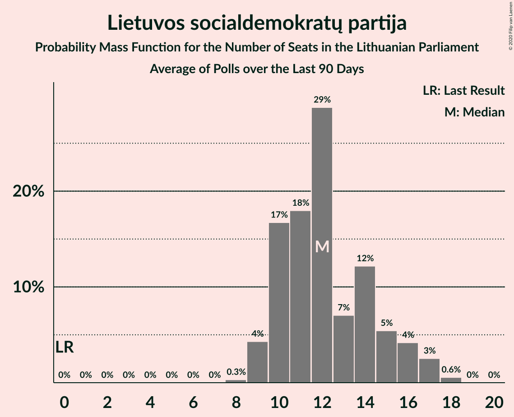

| Number of Seats | Probability | Accumulated | Special Marks |
|:---------------:|:-----------:|:-----------:|:-------------:|
| 8 | 0.3% | 100% |  |
| 9 | 5% | 99.7% |  |
| 10 | 20% | 95% |  |
| 11 | 32% | 75% | Median |
| 12 | 34% | 43% |  |
| 13 | 7% | 9% |  |
| 14 | 1.4% | 2% |  |
| 15 | 0.2% | 0.2% |  |
| 16 | 0% | 0% |  |
| 17 | 0% | 0% | Last Result |

### Liberalų Sąjūdis

*For a full overview of the results for this party, see the [Liberalų Sąjūdis](party-liberalųsąjūdis.html) page.*

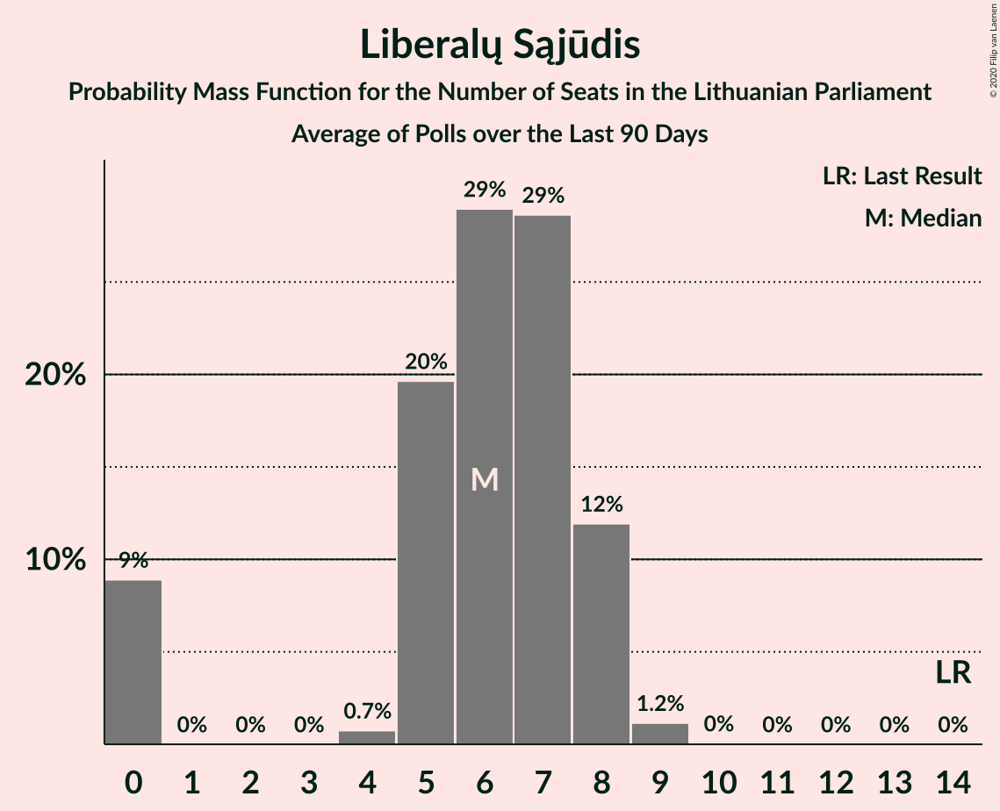

| Number of Seats | Probability | Accumulated | Special Marks |
|:---------------:|:-----------:|:-----------:|:-------------:|
| 0 | 9% | 100% |  |
| 1 | 0% | 91% |  |
| 2 | 0% | 91% |  |
| 3 | 0% | 91% |  |
| 4 | 0.7% | 91% |  |
| 5 | 19% | 90% |  |
| 6 | 22% | 71% | Median |
| 7 | 35% | 49% |  |
| 8 | 11% | 13% |  |
| 9 | 2% | 3% |  |
| 10 | 0.5% | 0.5% |  |
| 11 | 0% | 0% |  |
| 12 | 0% | 0% |  |
| 13 | 0% | 0% |  |
| 14 | 0% | 0% | Last Result |

### Partija tvarka ir teisingumas

*For a full overview of the results for this party, see the [Partija tvarka ir teisingumas](party-partijatvarkairteisingumas.html) page.*

### Centro partija „Gerovės Lietuva“

*For a full overview of the results for this party, see the [Centro partija „Gerovės Lietuva“](party-centropartija„gerovėslietuva“.html) page.*

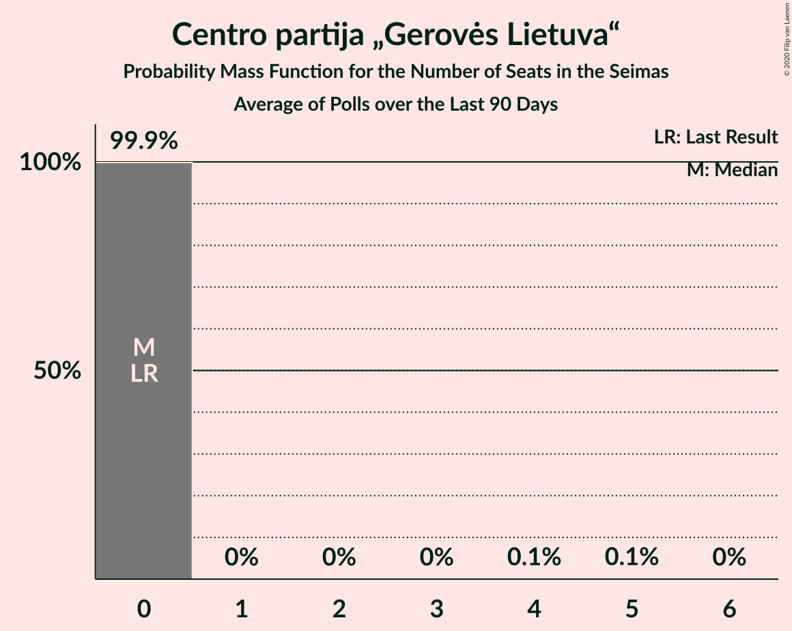

| Number of Seats | Probability | Accumulated | Special Marks |
|:---------------:|:-----------:|:-----------:|:-------------:|
| 0 | 99.9% | 100% | Median |
| 1 | 0% | 0.1% | Last Result |
| 2 | 0% | 0.1% |  |
| 3 | 0% | 0.1% |  |
| 4 | 0.1% | 0.1% |  |
| 5 | 0.1% | 0.1% |  |
| 6 | 0% | 0% |  |

### Lietuvos lenkų rinkimų akcija

*For a full overview of the results for this party, see the [Lietuvos lenkų rinkimų akcija](party-lietuvoslenkųrinkimųakcija.html) page.*

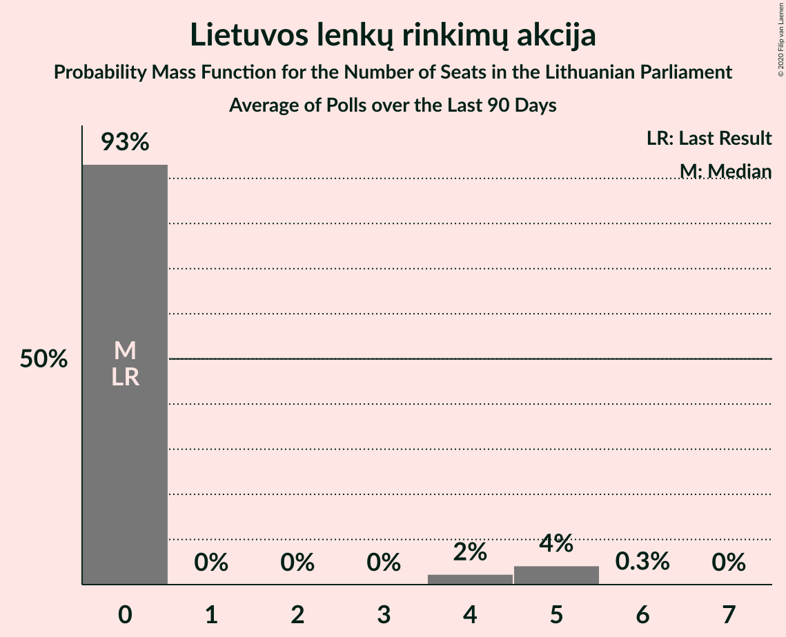

| Number of Seats | Probability | Accumulated | Special Marks |
|:---------------:|:-----------:|:-----------:|:-------------:|
| 0 | 72% | 100% | Median |
| 1 | 0% | 28% |  |
| 2 | 0% | 28% |  |
| 3 | 0% | 28% |  |
| 4 | 5% | 28% |  |
| 5 | 22% | 23% |  |
| 6 | 2% | 2% |  |
| 7 | 0% | 0.1% |  |
| 8 | 0% | 0% | Last Result |

### Darbo Partija

*For a full overview of the results for this party, see the [Darbo Partija](party-darbopartija.html) page.*

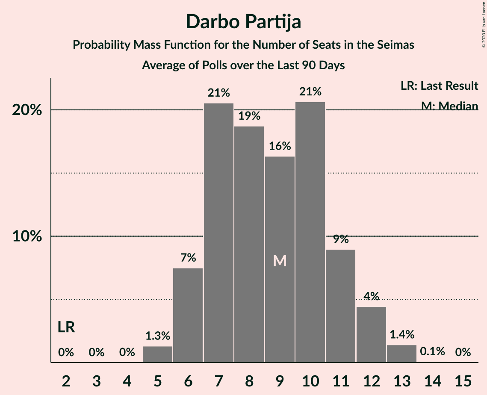

| Number of Seats | Probability | Accumulated | Special Marks |
|:---------------:|:-----------:|:-----------:|:-------------:|
| 2 | 0% | 100% | Last Result |
| 3 | 0% | 100% |  |
| 4 | 0% | 100% |  |
| 5 | 1.5% | 99.9% |  |
| 6 | 20% | 98% |  |
| 7 | 28% | 79% |  |
| 8 | 20% | 51% | Median |
| 9 | 8% | 31% |  |
| 10 | 9% | 22% |  |
| 11 | 8% | 13% |  |
| 12 | 4% | 6% |  |
| 13 | 1.4% | 1.5% |  |
| 14 | 0.1% | 0.1% |  |
| 15 | 0% | 0% |  |

### Partija „Laisvė ir teisingumas“

*For a full overview of the results for this party, see the [Partija „Laisvė ir teisingumas“](party-partija„laisvėirteisingumas“.html) page.*

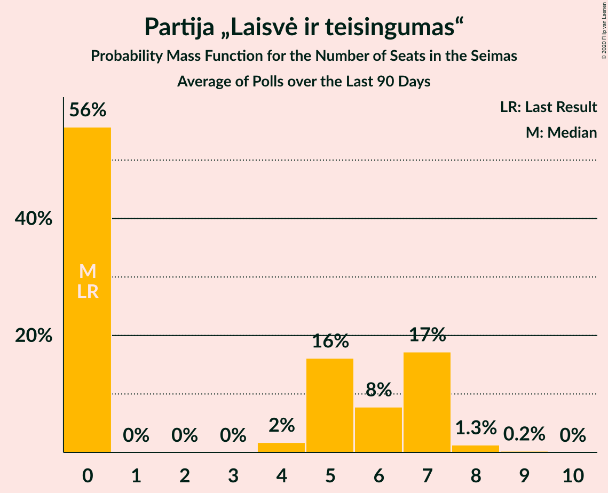

| Number of Seats | Probability | Accumulated | Special Marks |
|:---------------:|:-----------:|:-----------:|:-------------:|
| 0 | 56% | 100% | Last Result, Median |
| 1 | 0% | 44% |  |
| 2 | 0% | 44% |  |
| 3 | 0% | 44% |  |
| 4 | 2% | 44% |  |
| 5 | 16% | 43% |  |
| 6 | 8% | 26% |  |
| 7 | 17% | 19% |  |
| 8 | 1.3% | 2% |  |
| 9 | 0.2% | 0.2% |  |
| 10 | 0% | 0% |  |

### Lietuvos Žaliųjų Partija

*For a full overview of the results for this party, see the [Lietuvos Žaliųjų Partija](party-lietuvosžaliųjųpartija.html) page.*

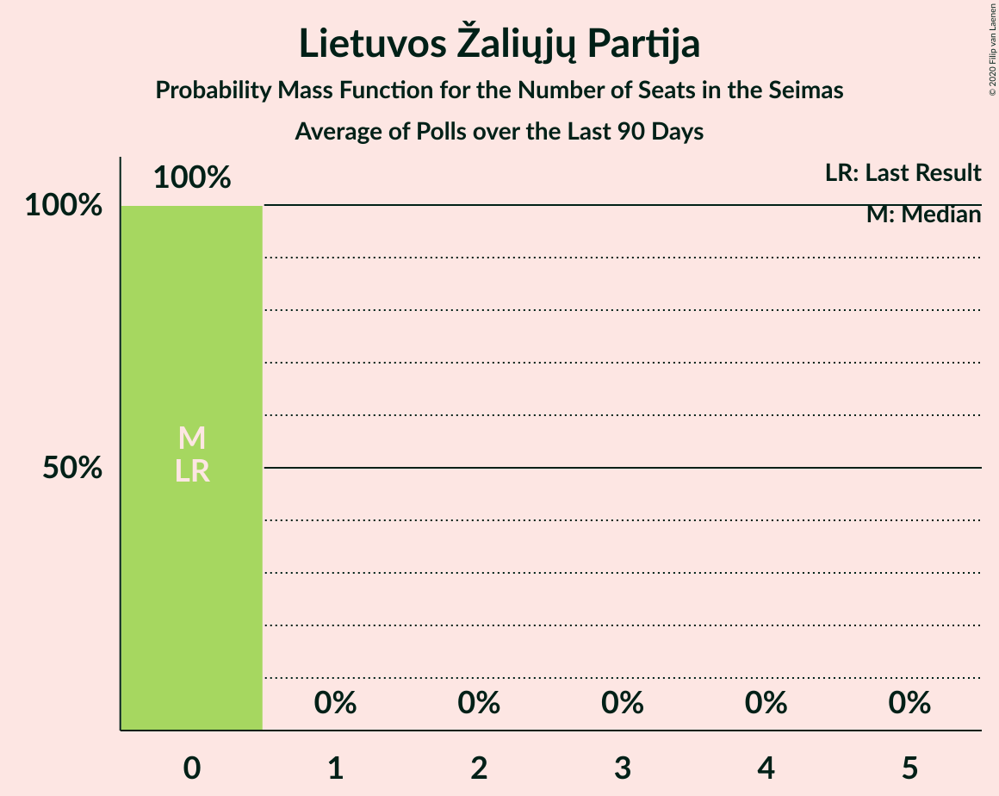

| Number of Seats | Probability | Accumulated | Special Marks |
|:---------------:|:-----------:|:-----------:|:-------------:|
| 0 | 100% | 100% | Last Result, Median |

### Politinė partija “Lietuvos sąrašas”

*For a full overview of the results for this party, see the [Politinė partija “Lietuvos sąrašas”](party-politinėpartija“lietuvossąrašas”.html) page.*

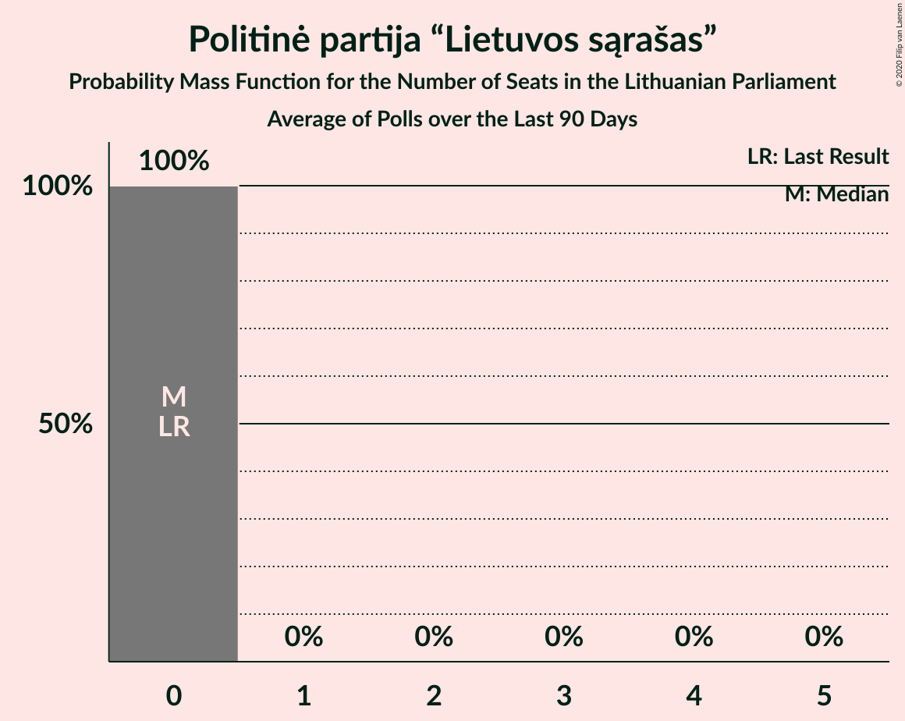

| Number of Seats | Probability | Accumulated | Special Marks |
|:---------------:|:-----------:|:-----------:|:-------------:|
| 0 | 100% | 100% | Last Result, Median |

### Lietuvos socialdemokratų darbo partija

*For a full overview of the results for this party, see the [Lietuvos socialdemokratų darbo partija](party-lietuvossocialdemokratųdarbopartija.html) page.*

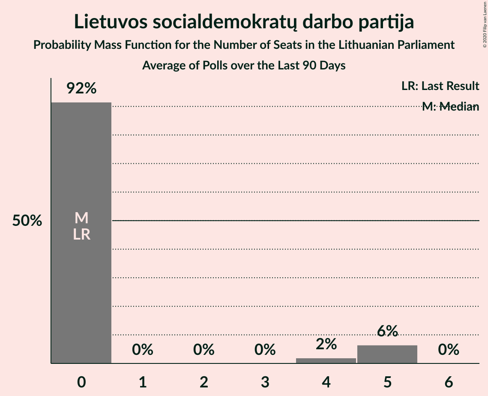

| Number of Seats | Probability | Accumulated | Special Marks |
|:---------------:|:-----------:|:-----------:|:-------------:|
| 0 | 97% | 100% | Last Result, Median |
| 1 | 0% | 3% |  |
| 2 | 0% | 3% |  |
| 3 | 0% | 3% |  |
| 4 | 0.8% | 3% |  |
| 5 | 3% | 3% |  |
| 6 | 0.1% | 0.1% |  |
| 7 | 0% | 0% |  |

### Laisvės partija

*For a full overview of the results for this party, see the [Laisvės partija](party-laisvėspartija.html) page.*

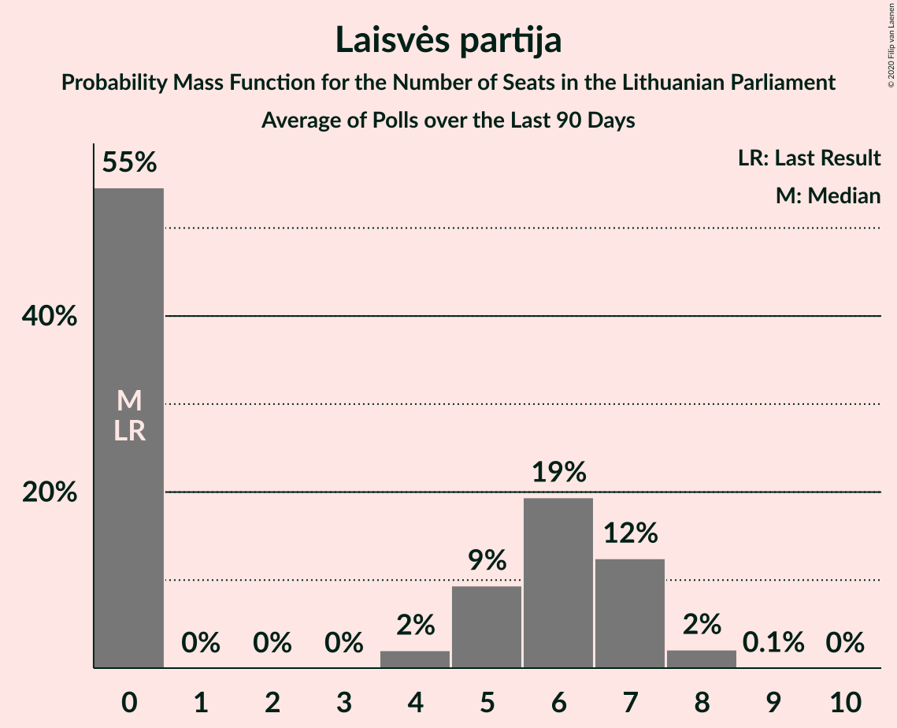

| Number of Seats | Probability | Accumulated | Special Marks |
|:---------------:|:-----------:|:-----------:|:-------------:|
| 0 | 55% | 100% | Last Result, Median |
| 1 | 0% | 45% |  |
| 2 | 0% | 45% |  |
| 3 | 0% | 45% |  |
| 4 | 2% | 45% |  |
| 5 | 9% | 43% |  |
| 6 | 19% | 34% |  |
| 7 | 12% | 15% |  |
| 8 | 2% | 2% |  |
| 9 | 0.1% | 0.1% |  |
| 10 | 0% | 0% |  |

### Single-member constituencies

*For a full overview of the results for this party, see the [Single-member constituencies](party-single-memberconstituencies.html) page.*

| Number of Seats | Probability | Accumulated | Special Marks |
|:---------------:|:-----------:|:-----------:|:-------------:|
| 71 | 100% | 100% | Last Result, Median, Majority |

## Coalitions

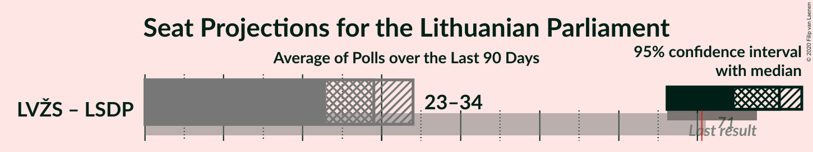

### Confidence Intervals

| Coalition | Last Result | Median | Majority? | 80% Confidence Interval | 90% Confidence Interval | 95% Confidence Interval | 99% Confidence Interval |
|:---------:|:-----------:|:------:|:---------:|:-----------------------:|:-----------------------:|:-----------------------:|:-----------------------:|
| Lietuvos valstiečių ir žaliųjų sąjunga – Lietuvos socialdemokratų partija | 71 | 29 | 0% | 25–32 | 23–33 | 23–33 | 22–34 |

### Lietuvos valstiečių ir žaliųjų sąjunga – Lietuvos socialdemokratų partija

| Number of Seats | Probability | Accumulated | Special Marks |
|:---------------:|:-----------:|:-----------:|:-------------:|
| 21 | 0.2% | 100% |  |
| 22 | 0.8% | 99.8% |  |
| 23 | 4% | 99.0% |  |
| 24 | 5% | 95% |  |
| 25 | 7% | 90% |  |
| 26 | 5% | 83% |  |
| 27 | 9% | 78% |  |
| 28 | 13% | 69% |  |
| 29 | 12% | 56% | Median |
| 30 | 19% | 44% |  |
| 31 | 12% | 24% |  |
| 32 | 6% | 13% |  |
| 33 | 6% | 7% |  |
| 34 | 1.2% | 1.4% |  |
| 35 | 0.1% | 0.2% |  |
| 36 | 0% | 0% |  |
| 37 | 0% | 0% |  |
| 38 | 0% | 0% |  |
| 39 | 0% | 0% |  |
| 40 | 0% | 0% |  |
| 41 | 0% | 0% |  |
| 42 | 0% | 0% |  |
| 43 | 0% | 0% |  |
| 44 | 0% | 0% |  |
| 45 | 0% | 0% |  |
| 46 | 0% | 0% |  |
| 47 | 0% | 0% |  |
| 48 | 0% | 0% |  |
| 49 | 0% | 0% |  |
| 50 | 0% | 0% |  |
| 51 | 0% | 0% |  |
| 52 | 0% | 0% |  |
| 53 | 0% | 0% |  |
| 54 | 0% | 0% |  |
| 55 | 0% | 0% |  |
| 56 | 0% | 0% |  |
| 57 | 0% | 0% |  |
| 58 | 0% | 0% |  |
| 59 | 0% | 0% |  |
| 60 | 0% | 0% |  |
| 61 | 0% | 0% |  |
| 62 | 0% | 0% |  |
| 63 | 0% | 0% |  |
| 64 | 0% | 0% |  |
| 65 | 0% | 0% |  |
| 66 | 0% | 0% |  |
| 67 | 0% | 0% |  |
| 68 | 0% | 0% |  |
| 69 | 0% | 0% |  |
| 70 | 0% | 0% |  |
| 71 | 0% | 0% | Last Result, Majority |

## Technical Information

+ **Number of polls included in this average:** 4
+ **Lowest number of simulations done in a poll included in this average:** 1,048,576
+ **Total number of simulations done in the polls included in this average:** 4,194,304
+ **Error estimate:** 2.87%
