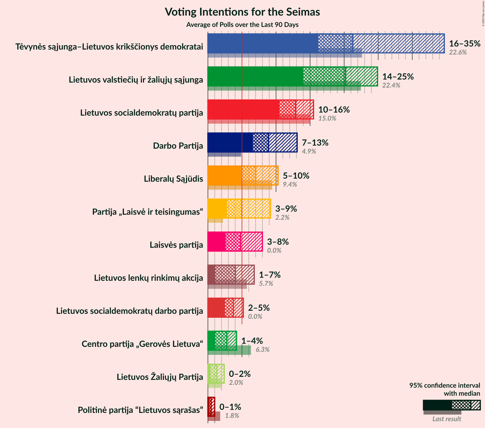

# Overview

The table below lists the most recent polls (less than 90 days old) registered and analyzed so far.

| Period     | Polling firm/Commissioner(s) | LVŽS | TS-LKD | LSDP | LRLS | TT | LLRA | DP | LŽP | LCP | LS | LSDDP | LP | LT | SMC |
|:----------:|:----------------------------:|:--:|:--:|:--:|:--:|:--:|:--:|:--:|:--:|:--:|:--:|:--:|:--:|:--:|:--:|
| 27 March 2017 | General Election | 22.4%   54 | 22.6%   31 | 15.0%   17 | 9.4%   14 | 7.8%   8 | 5.7%   8 | 4.9%   2 | 2.0%   0 | 0.0%   0 | 0.0%   0 | 0.0%   0 | 0.0%   0 | 2.2%   0 | 0.0%   71 |
| N/A | [Poll Average](average.html) | 14–25%   12–21 | 16–35%   13–31 | 10–16%   9–13 | 5–10%   0–9 | N/A   N/A | 1–7%   0–5 | 7–13%   6–12 | 0–2%   0 | 1–4%   0 | 0–1%   0 | 2–5%   0–5 | 3–8%   0–7 | 3–9%   0–7 | N/A   71 |
| [17–27 September 2020](2020-09-27-Baltijostyrimai.html) | Baltijos tyrimai   ELTA | 21–26%   17–21 | 15–20%   12–16 | 12–16%   10–13 | 7–11%   6–9 | N/A   N/A | 4–7%   0–6 | 7–11%   6–9 | 0–1%   0 | 2–4%   0 | N/A   N/A | 2–4%   0 | 2–5%   0 | 6–10%   5–8 | N/A   71 |
| [4–12 September 2020](2020-09-12-Vilmorus.html) | Vilmorus   Lietuvos rytas | 19–24%   16–22 | 18–23%   16–22 | 10–14%   9–13 | 6–9%   6–9 | N/A   N/A | 2–5%   0 | 10–14%   9–13 | 1–3%   0 | 2–4%   0 | N/A   N/A | 3–6%   0–5 | 2–5%   0 | 4–7%   0–6 | N/A   71 |
| [26 August–4 September 2020](2020-09-04-Spintertyrimai.html) | Spinter tyrimai   Delfi | 17–22%   15–21 | 19–24%   17–23 | 11–15%   9–14 | 5–8%   0–7 | N/A   N/A | 3–6%   0–5 | 7–11%   6–10 | N/A   N/A | 2–5%   0 | N/A   N/A | 3–5%   0 | 5–9%   5–8 | 3–6%   0–5 | N/A   71 |
| [29 July–31 August 2020](2020-08-31-Norstat.html) | Norstat   LRT | 13–18%   11–16 | 30–36%   25–31 | 11–15%   10–13 | 5–8%   0–7 | N/A   N/A | 1–2%   0 | 6–9%   5–8 | 1–2%   0 | 1–2%   0 | 0–1%   0 | 3–5%   0–4 | 5–8%   0–7 | 2–5%   0 | N/A   71 |
| 27 March 2017 | General Election | 22.4%   54 | 22.6%   31 | 15.0%   17 | 9.4%   14 | 7.8%   8 | 5.7%   8 | 4.9%   2 | 2.0%   0 | 0.0%   0 | 0.0%   0 | 0.0%   0 | 0.0%   0 | 2.2%   0 | 0.0%   71 |

Only polls for which at least the sample size has been published are included in the table above.

**Legend:**
+ **Top half of each row:** Voting intentions (95% confidence interval)
+ **Bottom half of each row:** Seat projections for the Seimas (95% confidence interval)
+ **LVŽS:** Lietuvos valstiečių ir žaliųjų sąjunga
+ **TS-LKD:** Tėvynės sąjunga–Lietuvos krikščionys demokratai
+ **LSDP:** Lietuvos socialdemokratų partija
+ **LRLS:** Liberalų Sąjūdis
+ **TT:** Partija tvarka ir teisingumas
+ **LLRA:** Lietuvos lenkų rinkimų akcija
+ **DP:** Darbo Partija
+ **LŽP:** Lietuvos Žaliųjų Partija
+ **LCP:** Centro partija „Gerovės Lietuva“
+ **LS:** Politinė partija “Lietuvos sąrašas”
+ **LSDDP:** Lietuvos socialdemokratų darbo partija
+ **LP:** Laisvės partija
+ **LT:** Partija „Laisvė ir teisingumas“
+ **SMC:** Single-member constituencies
+ **N/A (single party):** Party not included the published results
+ **N/A (entire row):** Calculation for this opinion poll not started yet

