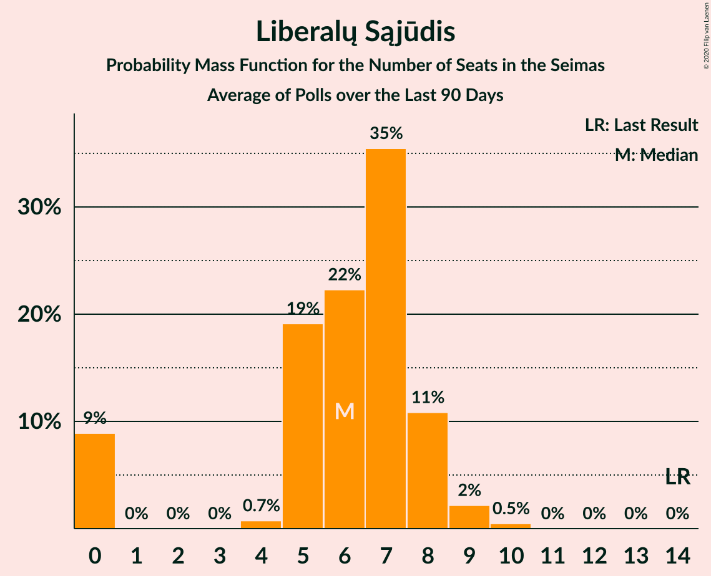

# Liberalų Sąjūdis

<a href="#voting-intentions">Voting Intentions</a> | <a href="#seats">Seats</a>

## Voting Intentions

Last result: **9.4%** (General Election of 27 March 2017)

### Confidence Intervals

| Period     | Polling firm/Commissioner(s) | Median | 80% Confidence Interval | 90% Confidence Interval | 95% Confidence Interval | 99% Confidence Interval |
|:----------:|:----------------:|:-----------:|:-----------------------:|:-----------------------:|:-----------------------:|:-----------------------:|
| N/A | [Poll Average](average.html) | 7.0% | 5.5–8.9% | 5.2–9.3% | 4.9–9.7% | 4.5–10.4% |
| [4–12 September 2020](2020-09-12-Vilmorus.html) | Vilmorus   Lietuvos rytas | 7.6% | 6.7–8.8% | 6.4–9.2% | 6.2–9.4% | 5.7–10.0% |
| [26 August–4 September 2020](2020-09-04-Spintertyrimai.html) | Spinter tyrimai   Delfi | 6.0% | 5.1–7.0% | 4.8–7.3% | 4.6–7.6% | 4.3–8.1% |
| [22 August–4 September 2020](2020-09-04-Baltijostyrimai.html) | Baltijos tyrimai   ELTA | 8.4% | 7.4–9.6% | 7.1–10.0% | 6.9–10.3% | 6.4–10.9% |
| [29 July–31 August 2020](2020-08-31-Norstat.html) | Norstat   LRT | 6.1% | 5.2–7.2% | 5.0–7.5% | 4.8–7.8% | 4.4–8.3% |
| [16–30 July 2020](2020-07-30-Baltijostyrimai.html) | Baltijos tyrimai   ELTA | 8.0% | 7.0–9.2% | 6.7–9.6% | 6.5–9.9% | 6.0–10.5% |
| [16–26 July 2020](2020-07-26-Spintertyrimai.html) | Spinter tyrimai   Delfi | 8.8% | 7.7–10.0% | 7.4–10.4% | 7.2–10.7% | 6.7–11.3% |
| [10–18 July 2020](2020-07-18-Vilmorus.html) | Vilmorus   Lietuvos rytas | 7.2% | 6.3–8.4% | 6.0–8.7% | 5.8–9.0% | 5.3–9.6% |
| [18–26 June 2020](2020-06-26-Spintertyrimai.html) | Spinter tyrimai   Delfi | 7.7% | 6.7–8.9% | 6.4–9.2% | 6.2–9.5% | 5.8–10.1% |
| [15–25 June 2020](2020-06-25-Baltijostyrimai.html) | Baltijos tyrimai   ELTA | 8.8% | 7.7–10.1% | 7.5–10.4% | 7.2–10.7% | 6.7–11.4% |
| [5–13 June 2020](2020-06-13-Vilmorus.html) | Vilmorus   Lietuvos rytas | 7.6% | 6.6–8.7% | 6.3–9.1% | 6.1–9.4% | 5.6–10.0% |
| [20–30 April 2020](2020-04-30-Spintertyrimai.html) | Spinter tyrimai   Delfi | 8.5% | 7.5–9.7% | 7.2–10.1% | 6.9–10.4% | 6.5–11.0% |
| [17–30 March 2020](2020-03-30-Spintertyrimai.html) | Spinter tyrimai   Delfi | 7.3% | 6.4–8.5% | 6.1–8.8% | 5.9–9.1% | 5.5–9.7% |
| [6–13 March 2020](2020-03-13-Vilmorus.html) | Vilmorus   Lietuvos rytas | 6.0% | 5.1–7.1% | 4.9–7.4% | 4.7–7.7% | 4.3–8.2% |
| [13–26 February 2020](2020-02-26-Baltijostyrimai.html) | Baltijos tyrimai   ELTA | 11.6% | 10.4–12.9% | 10.0–13.3% | 9.7–13.7% | 9.2–14.3% |
| [18–25 February 2020](2020-02-25-Spintertyrimai.html) | Spinter tyrimai   Delfi | 10.1% | 8.9–11.4% | 8.6–11.8% | 8.4–12.1% | 7.9–12.8% |
| [7–13 February 2020](2020-02-13-Vilmorus.html) | Vilmorus   Lietuvos rytas | 5.1% | 4.3–6.1% | 4.0–6.4% | 3.9–6.6% | 3.5–7.1% |
| [20–28 January 2020](2020-01-28-Spintertyrimai.html) | Spinter tyrimai   Delfi | 9.1% | 8.0–10.3% | 7.7–10.7% | 7.4–11.0% | 7.0–11.6% |
| [10–18 January 2020](2020-01-18-Vilmorus.html) | Vilmorus   Lietuvos rytas | 5.5% | 4.7–6.6% | 4.5–6.9% | 4.3–7.1% | 3.9–7.7% |
| [10–21 December 2019](2019-12-21-Baltijostyrimai.html) | Baltijos tyrimai   ELTA | 7.6% | 6.7–8.8% | 6.4–9.2% | 6.2–9.4% | 5.7–10.0% |
| [29 November–7 December 2019](2019-12-07-Vilmorus.html) | Vilmorus   Lietuvos rytas | 6.9% | 5.9–8.0% | 5.7–8.3% | 5.5–8.6% | 5.0–9.2% |
| [19–29 November 2019](2019-11-29-Spintertyrimai.html) | Spinter tyrimai   Delfi | 9.5% | 8.4–10.8% | 8.1–11.2% | 7.8–11.5% | 7.3–12.1% |
| [14–27 November 2019](2019-11-27-Baltijostyrimai.html) | Baltijos tyrimai   ELTA | 5.9% | 5.0–7.0% | 4.8–7.3% | 4.6–7.5% | 4.2–8.1% |
| [8–16 November 2019](2019-11-16-Vilmorus.html) | Vilmorus   Lietuvos rytas | 7.8% | 6.8–9.0% | 6.5–9.4% | 6.3–9.7% | 5.9–10.3% |
| [15–29 October 2019](2019-10-29-Baltijostyrimai.html) | Baltijos tyrimai   ELTA | 6.8% | 5.9–7.9% | 5.6–8.3% | 5.4–8.5% | 5.0–9.1% |
| [17–28 October 2019](2019-10-28-Spintertyrimai.html) | Spinter tyrimai   Delfi | 9.1% | 8.0–10.4% | 7.8–10.8% | 7.5–11.1% | 7.0–11.7% |
| [4–13 October 2019](2019-10-13-Vilmorus.html) | Vilmorus   Lietuvos rytas | 7.9% | 6.9–9.1% | 6.6–9.5% | 6.4–9.8% | 5.9–10.4% |
| [21 September–5 October 2019](2019-10-05-Baltijostyrimai.html) | Baltijos tyrimai   ELTA | 5.8% | 4.9–6.9% | 4.7–7.1% | 4.5–7.4% | 4.1–8.0% |
| [18–27 September 2019](2019-09-27-Spintertyrimai.html) | Spinter tyrimai   Delfi | 7.1% | 6.2–8.3% | 5.9–8.6% | 5.7–8.9% | 5.3–9.4% |
| [6–14 September 2019](2019-09-14-Vilmorus.html) | Vilmorus   Lietuvos rytas | 5.2% | 4.4–6.2% | 4.1–6.5% | 3.9–6.8% | 3.6–7.3% |
| [26 August–8 September 2019](2019-09-08-Baltijostyrimai.html) | Baltijos tyrimai   ELTA | 7.7% | 6.7–8.8% | 6.4–9.2% | 6.2–9.5% | 5.7–10.0% |
| [15–29 July 2019](2019-07-29-Baltijostyrimai.html) | Baltijos tyrimai   ELTA | 7.0% | 6.1–8.2% | 5.8–8.5% | 5.6–8.8% | 5.2–9.3% |
| [17–26 July 2019](2019-07-26-Spintertyrimai.html) | Spinter tyrimai   Delfi | 7.2% | 6.3–8.4% | 6.0–8.7% | 5.8–9.0% | 5.4–9.6% |
| [5–13 July 2019](2019-07-13-Vilmorus.html) | Vilmorus   Lietuvos rytas | 4.3% | 3.6–5.2% | 3.4–5.5% | 3.2–5.8% | 2.9–6.2% |
| [14–28 June 2019](2019-06-28-Baltijostyrimai.html) | Baltijos tyrimai   ELTA | 7.8% | 6.8–9.0% | 6.6–9.4% | 6.3–9.6% | 5.9–10.3% |
| [18–27 June 2019](2019-06-27-Spintertyrimai.html) | Spinter tyrimai   Delfi | 6.1% | 5.2–7.2% | 5.0–7.5% | 4.8–7.8% | 4.4–8.3% |
| [7–15 June 2019](2019-06-15-Vilmorus.html) | Vilmorus   Lietuvos rytas | 4.4% | 3.6–5.3% | 3.4–5.6% | 3.3–5.9% | 2.9–6.3% |
| [27 May–9 June 2019](2019-06-09-Baltijostyrimai.html) | Baltijos tyrimai   ELTA | 5.8% | 4.9–6.8% | 4.7–7.1% | 4.5–7.4% | 4.1–7.9% |
| [17–25 May 2019](2019-05-25-Spintertyrimai.html) | Spinter tyrimai   Delfi | 9.3% | 8.2–10.6% | 7.9–11.0% | 7.7–11.3% | 7.2–11.9% |
| [13–18 May 2019](2019-05-18-Vilmorus.html) | Vilmorus   Lietuvos rytas | 4.4% | 3.6–5.3% | 3.4–5.6% | 3.3–5.9% | 2.9–6.3% |
| [20–29 April 2019](2019-04-29-Spintertyrimai.html) | Spinter tyrimai   Delfi | 9.0% | 8.0–10.3% | 7.7–10.6% | 7.4–11.0% | 6.9–11.6% |
| [4–13 April 2019](2019-04-13-Vilmorus.html) | Vilmorus   Lietuvos rytas | 4.0% | 3.3–4.9% | 3.1–5.1% | 2.9–5.3% | 2.6–5.8% |
| [15 March–10 April 2019](2019-04-10-Baltijostyrimai.html) | Baltijos tyrimai   ELTA | 5.0% | 4.2–6.0% | 4.0–6.2% | 3.8–6.5% | 3.4–7.0% |
| [18–28 March 2019](2019-03-28-Spintertyrimai.html) | Spinter tyrimai   Delfi | 8.0% | 7.0–9.2% | 6.7–9.5% | 6.4–9.8% | 6.0–10.4% |
| [7–15 March 2019](2019-03-15-Vilmorus.html) | Vilmorus   Lietuvos rytas | 4.5% | 3.8–5.5% | 3.6–5.7% | 3.4–6.0% | 3.1–6.4% |
| [18–28 February 2019](2019-02-28-Spintertyrimai.html) | Spinter tyrimai   Delfi | 5.3% | 4.5–6.3% | 4.2–6.6% | 4.1–6.8% | 3.7–7.3% |
| [15–26 February 2019](2019-02-26-Baltijostyrimai.html) | Baltijos tyrimai   ELTA | 5.8% | 4.9–6.8% | 4.7–7.1% | 4.5–7.4% | 4.1–7.9% |
| [8–17 February 2019](2019-02-17-Vilmorus.html) | Vilmorus   Lietuvos rytas | 5.8% | 4.9–6.8% | 4.7–7.1% | 4.5–7.4% | 4.1–7.9% |
| [23 January–3 February 2019](2019-02-03-Baltijostyrimai.html) | Baltijos tyrimai   ELTA | 6.3% | 5.4–7.3% | 5.1–7.7% | 4.9–7.9% | 4.5–8.5% |
| [15–26 January 2019](2019-01-26-Spintertyrimai.html) | Spinter tyrimai   Delfi | 4.5% | 3.7–5.4% | 3.5–5.7% | 3.3–5.9% | 3.0–6.4% |
| [11–20 January 2019](2019-01-20-Vilmorus.html) | Vilmorus   Lietuvos rytas | 4.8% | 4.0–5.8% | 3.8–6.0% | 3.6–6.3% | 3.3–6.8% |
| [9 December 2018](2018-12-09-Vilmorus.html) | Vilmorus   Lietuvos rytas | 3.7% | 3.1–4.6% | 2.9–4.8% | 2.7–5.1% | 2.4–5.5% |
| [19–30 November 2018](2018-11-30-Spintertyrimai.html) | Spinter tyrimai   Delfi | 4.0% | 3.4–5.0% | 3.2–5.2% | 3.0–5.5% | 2.7–5.9% |
| [9–26 November 2018](2018-11-26-Baltijostyrimai.html) | Baltijos tyrimai   ELTA | 4.0% | 3.3–4.9% | 3.1–5.1% | 2.9–5.4% | 2.6–5.8% |
| [16–30 October 2018](2018-10-30-Spintertyrimai.html) | Spinter tyrimai   Delfi | 5.0% | 4.2–6.0% | 4.0–6.2% | 3.8–6.5% | 3.4–7.0% |
| [10–26 October 2018](2018-10-26-Baltijostyrimai.html) | Baltijos tyrimai   ELTA | 7.0% | 6.0–8.1% | 5.8–8.4% | 5.5–8.7% | 5.1–9.3% |
| [24 September–7 October 2018](2018-10-07-Baltijostyrimai.html) | Baltijos tyrimai   ELTA | 7.0% | 6.0–8.1% | 5.8–8.4% | 5.5–8.7% | 5.1–9.3% |
| [19–26 September 2018](2018-09-26-Spintertyrimai.html) | Spinter tyrimai   Delfi | 6.0% | 5.2–7.1% | 4.9–7.4% | 4.7–7.7% | 4.3–8.2% |
| [24–31 August 2018](2018-08-31-Spintertyrimai.html) | Spinter tyrimai   Delfi | 5.0% | 4.2–6.0% | 4.0–6.2% | 3.8–6.5% | 3.4–7.0% |
| [21–31 August 2018](2018-08-31-Baltijostyrimai.html) | Baltijos tyrimai   ELTA | 8.0% | 7.0–9.3% | 6.8–9.6% | 6.5–9.9% | 6.1–10.5% |
| [16–31 July 2018](2018-07-31-Baltijostyrimai.html) | Baltijos tyrimai   ELTA | 7.0% | 6.0–8.1% | 5.8–8.4% | 5.5–8.7% | 5.1–9.3% |
| [19–27 June 2018](2018-06-27-Spintertyrimai.html) | Spinter tyrimai   Delfi | 6.0% | 5.1–7.1% | 4.9–7.4% | 4.7–7.6% | 4.3–8.2% |
| [8–17 June 2018](2018-06-17-Vilmorus.html) | Vilmorus   Lietuvos rytas | 3.0% | 2.4–3.8% | 2.3–4.0% | 2.1–4.2% | 1.9–4.6% |
| [4–12 May 2018](2018-05-12-Vilmorus.html) | Vilmorus   Lietuvos rytas | 6.0% | 5.2–7.1% | 4.9–7.4% | 4.7–7.7% | 4.3–8.2% |
| [6–15 April 2018](2018-04-15-Vilmorus.html) | Vilmorus   Lietuvos rytas | 7.5% | 6.6–8.7% | 6.3–9.0% | 6.1–9.3% | 5.6–9.9% |
| [9–18 February 2018](2018-02-18-Vilmorus.html) | Vilmorus   Lietuvos rytas | 8.9% | 7.9–10.2% | 7.6–10.5% | 7.3–10.8% | 6.9–11.4% |
| [12–21 January 2018](2018-01-21-Vilmorus.html) | Vilmorus   Lietuvos rytas | 7.0% | 6.0–8.1% | 5.8–8.4% | 5.6–8.7% | 5.2–9.3% |

### Probability Mass Function

The following table shows the probability mass function per percentage block of voting intentions for the [poll average](average.html) for Liberalų Sąjūdis.

| Voting Intentions | Probability | Accumulated | Special Marks |
|:-----------------:|:-----------:|:-----------:|:-------------:|
| 2.5–3.5% | 0% | 100% |  |
| 3.5–4.5% | 0.7% | 100% |  |
| 4.5–5.5% | 11% | 99.3% |  |
| 5.5–6.5% | 27% | 88% |  |
| 6.5–7.5% | 24% | 61% | Median |
| 7.5–8.5% | 22% | 38% |  |
| 8.5–9.5% | 12% | 16% | Last Result |
| 9.5–10.5% | 3% | 3% |  |
| 10.5–11.5% | 0.3% | 0.3% |  |
| 11.5–12.5% | 0% | 0% |  |

## Seats

Last result: **14** seats (General Election of 27 March 2017)

### Confidence Intervals

| Period     | Polling firm/Commissioner(s) | Median | 80% Confidence Interval | 90% Confidence Interval | 95% Confidence Interval | 99% Confidence Interval |
|:----------:|:----------------:|:------:|:-----------------------:|:-----------------------:|:-----------------------:|:-----------------------:|
| N/A | [Poll Average](average.html) | 6 | 5–8 | 0–8 | 0–8 | 0–9 |
| [4–12 September 2020](2020-09-12-Vilmorus.html) | Vilmorus   Lietuvos rytas | 7 | 6–8 | 6–8 | 6–9 | 5–9 |
| [26 August–4 September 2020](2020-09-04-Spintertyrimai.html) | Spinter tyrimai   Delfi | 5 | 0–6 | 0–7 | 0–7 | 0–8 |
| [22 August–4 September 2020](2020-09-04-Baltijostyrimai.html) | Baltijos tyrimai   ELTA | 7 | 6–8 | 6–8 | 6–8 | 5–8 |
| [29 July–31 August 2020](2020-08-31-Norstat.html) | Norstat   LRT | 5 | 0–7 | 0–7 | 0–7 | 0–8 |
| [16–30 July 2020](2020-07-30-Baltijostyrimai.html) | Baltijos tyrimai   ELTA | 7 | 6–7 | 5–8 | 5–8 | 5–9 |
| [16–26 July 2020](2020-07-26-Spintertyrimai.html) | Spinter tyrimai   Delfi | 7 | 6–9 | 6–9 | 6–9 | 5–9 |
| [10–18 July 2020](2020-07-18-Vilmorus.html) | Vilmorus   Lietuvos rytas | 6 | 5–7 | 5–7 | 4–7 | 4–8 |
| [18–26 June 2020](2020-06-26-Spintertyrimai.html) | Spinter tyrimai   Delfi | 6 | 5–7 | 5–7 | 5–8 | 5–8 |
| [15–25 June 2020](2020-06-25-Baltijostyrimai.html) | Baltijos tyrimai   ELTA | 7 | 6–8 | 6–8 | 6–8 | 5–9 |
| [5–13 June 2020](2020-06-13-Vilmorus.html) | Vilmorus   Lietuvos rytas | 6 | 5–7 | 5–7 | 5–8 | 5–8 |
| [20–30 April 2020](2020-04-30-Spintertyrimai.html) | Spinter tyrimai   Delfi | 7 | 7–9 | 6–9 | 6–9 | 5–10 |
| [17–30 March 2020](2020-03-30-Spintertyrimai.html) | Spinter tyrimai   Delfi | 6 | 5–7 | 5–8 | 5–8 | 5–8 |
| [6–13 March 2020](2020-03-13-Vilmorus.html) | Vilmorus   Lietuvos rytas | 5 | 4–6 | 0–6 | 0–6 | 0–7 |
| [13–26 February 2020](2020-02-26-Baltijostyrimai.html) | Baltijos tyrimai   ELTA | 10 | 8–11 | 8–11 | 8–11 | 7–12 |
| [18–25 February 2020](2020-02-25-Spintertyrimai.html) | Spinter tyrimai   Delfi | 9 | 7–10 | 7–11 | 7–11 | 7–11 |
| [7–13 February 2020](2020-02-13-Vilmorus.html) | Vilmorus   Lietuvos rytas | 4 | 0–4 | 0–5 | 0–5 | 0–5 |
| [20–28 January 2020](2020-01-28-Spintertyrimai.html) | Spinter tyrimai   Delfi | 8 | 7–9 | 6–10 | 6–10 | 6–10 |
| [10–18 January 2020](2020-01-18-Vilmorus.html) | Vilmorus   Lietuvos rytas | 5 | 0–5 | 0–6 | 0–6 | 0–6 |
| [10–21 December 2019](2019-12-21-Baltijostyrimai.html) | Baltijos tyrimai   ELTA | 6 | 5–7 | 5–8 | 5–8 | 5–8 |
| [29 November–7 December 2019](2019-12-07-Vilmorus.html) | Vilmorus   Lietuvos rytas | 5 | 5–6 | 5–6 | 4–7 | 4–7 |
| [19–29 November 2019](2019-11-29-Spintertyrimai.html) | Spinter tyrimai   Delfi | 9 | 8–10 | 8–10 | 7–10 | 7–11 |
| [14–27 November 2019](2019-11-27-Baltijostyrimai.html) | Baltijos tyrimai   ELTA | 5 | 0–5 | 0–6 | 0–6 | 0–6 |
| [8–16 November 2019](2019-11-16-Vilmorus.html) | Vilmorus   Lietuvos rytas | 6 | 5–7 | 5–8 | 5–8 | 5–9 |
| [15–29 October 2019](2019-10-29-Baltijostyrimai.html) | Baltijos tyrimai   ELTA | 5 | 4–7 | 4–7 | 4–7 | 0–7 |
| [17–28 October 2019](2019-10-28-Spintertyrimai.html) | Spinter tyrimai   Delfi | 8 | 7–9 | 7–10 | 6–10 | 6–11 |
| [4–13 October 2019](2019-10-13-Vilmorus.html) | Vilmorus   Lietuvos rytas | 6 | 5–8 | 5–8 | 5–8 | 5–8 |
| [21 September–5 October 2019](2019-10-05-Baltijostyrimai.html) | Baltijos tyrimai   ELTA | 5 | 0–5 | 0–6 | 0–6 | 0–6 |
| [18–27 September 2019](2019-09-27-Spintertyrimai.html) | Spinter tyrimai   Delfi | 7 | 5–8 | 5–8 | 5–8 | 4–9 |
| [6–14 September 2019](2019-09-14-Vilmorus.html) | Vilmorus   Lietuvos rytas | 0 | 0–5 | 0–5 | 0–5 | 0–6 |
| [26 August–8 September 2019](2019-09-08-Baltijostyrimai.html) | Baltijos tyrimai   ELTA | 6 | 5–7 | 5–7 | 4–8 | 4–8 |
| [15–29 July 2019](2019-07-29-Baltijostyrimai.html) | Baltijos tyrimai   ELTA | 6 | 5–6 | 5–7 | 4–7 | 4–7 |
| [17–26 July 2019](2019-07-26-Spintertyrimai.html) | Spinter tyrimai   Delfi | 6 | 5–8 | 5–8 | 5–8 | 4–8 |
| [5–13 July 2019](2019-07-13-Vilmorus.html) | Vilmorus   Lietuvos rytas | 0 | 0–4 | 0–4 | 0–5 | 0–5 |
| [14–28 June 2019](2019-06-28-Baltijostyrimai.html) | Baltijos tyrimai   ELTA | 6 | 5–7 | 5–8 | 5–8 | 5–8 |
| [18–27 June 2019](2019-06-27-Spintertyrimai.html) | Spinter tyrimai   Delfi | 5 | 4–6 | 0–6 | 0–7 | 0–7 |
| [7–15 June 2019](2019-06-15-Vilmorus.html) | Vilmorus   Lietuvos rytas | 0 | 0–4 | 0–5 | 0–5 | 0–5 |
| [27 May–9 June 2019](2019-06-09-Baltijostyrimai.html) | Baltijos tyrimai   ELTA | 5 | 4–5 | 0–6 | 0–6 | 0–6 |
| [17–25 May 2019](2019-05-25-Spintertyrimai.html) | Spinter tyrimai   Delfi | 7 | 7–8 | 6–8 | 6–9 | 6–10 |
| [13–18 May 2019](2019-05-18-Vilmorus.html) | Vilmorus   Lietuvos rytas | 0 | 0–4 | 0–4 | 0–5 | 0–5 |
| [20–29 April 2019](2019-04-29-Spintertyrimai.html) | Spinter tyrimai   Delfi | 7 | 6–8 | 6–8 | 6–8 | 5–9 |
| [4–13 April 2019](2019-04-13-Vilmorus.html) | Vilmorus   Lietuvos rytas | 0 | 0 | 0 | 0–4 | 0–5 |
| [15 March–10 April 2019](2019-04-10-Baltijostyrimai.html) | Baltijos tyrimai   ELTA | 0 | 0–4 | 0–5 | 0–5 | 0–6 |
| [18–28 March 2019](2019-03-28-Spintertyrimai.html) | Spinter tyrimai   Delfi | 6 | 6–8 | 5–8 | 5–8 | 5–9 |
| [7–15 March 2019](2019-03-15-Vilmorus.html) | Vilmorus   Lietuvos rytas | 0 | 0–4 | 0–5 | 0–5 | 0–5 |
| [18–28 February 2019](2019-02-28-Spintertyrimai.html) | Spinter tyrimai   Delfi | 4 | 0–5 | 0–6 | 0–6 | 0–6 |
| [15–26 February 2019](2019-02-26-Baltijostyrimai.html) | Baltijos tyrimai   ELTA | 5 | 0–6 | 0–6 | 0–6 | 0–7 |
| [8–17 February 2019](2019-02-17-Vilmorus.html) | Vilmorus   Lietuvos rytas | 5 | 4–5 | 0–6 | 0–6 | 0–6 |
| [23 January–3 February 2019](2019-02-03-Baltijostyrimai.html) | Baltijos tyrimai   ELTA | 5 | 4–6 | 4–6 | 4–6 | 0–7 |
| [15–26 January 2019](2019-01-26-Spintertyrimai.html) | Spinter tyrimai   Delfi | 0 | 0–4 | 0–5 | 0–5 | 0–5 |
| [11–20 January 2019](2019-01-20-Vilmorus.html) | Vilmorus   Lietuvos rytas | 0 | 0–4 | 0–5 | 0–5 | 0–5 |
| [9 December 2018](2018-12-09-Vilmorus.html) | Vilmorus   Lietuvos rytas | 0 | 0 | 0 | 0 | 0–5 |
| [19–30 November 2018](2018-11-30-Spintertyrimai.html) | Spinter tyrimai   Delfi | 0 | 0–4 | 0–4 | 0–4 | 0–5 |
| [9–26 November 2018](2018-11-26-Baltijostyrimai.html) | Baltijos tyrimai   ELTA | 0 | 0 | 0 | 0–4 | 0–4 |
| [16–30 October 2018](2018-10-30-Spintertyrimai.html) | Spinter tyrimai   Delfi | 4 | 0–5 | 0–5 | 0–5 | 0–6 |
| [10–26 October 2018](2018-10-26-Baltijostyrimai.html) | Baltijos tyrimai   ELTA | 5 | 4–6 | 4–6 | 4–6 | 4–7 |
| [24 September–7 October 2018](2018-10-07-Baltijostyrimai.html) | Baltijos tyrimai   ELTA | 6 | 5–7 | 5–7 | 5–7 | 4–8 |
| [19–26 September 2018](2018-09-26-Spintertyrimai.html) | Spinter tyrimai   Delfi | 5 | 5 | 0–5 | 0–5 | 0–6 |
| [24–31 August 2018](2018-08-31-Spintertyrimai.html) | Spinter tyrimai   Delfi | 4 | 0–5 | 0–5 | 0–5 | 0–5 |
| [21–31 August 2018](2018-08-31-Baltijostyrimai.html) | Baltijos tyrimai   ELTA | 7 | 6–8 | 6–8 | 6–9 | 5–9 |
| [16–31 July 2018](2018-07-31-Baltijostyrimai.html) | Baltijos tyrimai   ELTA | 5 | 5–6 | 4–6 | 4–7 | 4–7 |
| [19–27 June 2018](2018-06-27-Spintertyrimai.html) | Spinter tyrimai   Delfi | 5 | 4–6 | 0–6 | 0–6 | 0–7 |
| [8–17 June 2018](2018-06-17-Vilmorus.html) | Vilmorus   Lietuvos rytas | 0 | 0 | 0 | 0 | 0 |
| [4–12 May 2018](2018-05-12-Vilmorus.html) | Vilmorus   Lietuvos rytas | 4 | 4–5 | 4–5 | 0–6 | 0–6 |
| [6–15 April 2018](2018-04-15-Vilmorus.html) | Vilmorus   Lietuvos rytas | 6 | 5–6 | 5–7 | 4–7 | 4–8 |
| [9–18 February 2018](2018-02-18-Vilmorus.html) | Vilmorus   Lietuvos rytas | 7 | 6–7 | 5–8 | 5–8 | 5–8 |
| [12–21 January 2018](2018-01-21-Vilmorus.html) | Vilmorus   Lietuvos rytas | 6 | 5–6 | 5–7 | 4–7 | 4–7 |

### Probability Mass Function

The following table shows the probability mass function per seat for the [poll average](average.html) for Liberalų Sąjūdis.

| Number of Seats | Probability | Accumulated | Special Marks |
|:---------------:|:-----------:|:-----------:|:-------------:|
| 0 | 9% | 100% |  |
| 1 | 0% | 91% |  |
| 2 | 0% | 91% |  |
| 3 | 0% | 91% |  |
| 4 | 0.7% | 91% |  |
| 5 | 20% | 90% |  |
| 6 | 29% | 71% | Median |
| 7 | 29% | 42% |  |
| 8 | 12% | 13% |  |
| 9 | 1.2% | 1.2% |  |
| 10 | 0% | 0% |  |
| 11 | 0% | 0% |  |
| 12 | 0% | 0% |  |
| 13 | 0% | 0% |  |
| 14 | 0% | 0% | Last Result |

