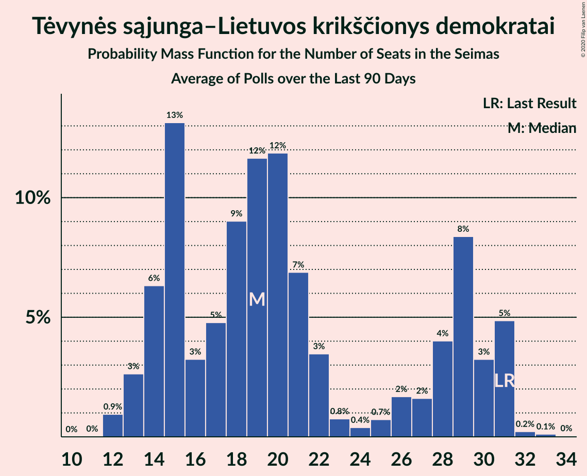

# Tėvynės sąjunga–Lietuvos krikščionys demokratai

<a href="#voting-intentions">Voting Intentions</a> | <a href="#seats">Seats</a>

## Voting Intentions

Last result: **22.6%** (General Election of 27 March 2017)

### Confidence Intervals

| Period     | Polling firm/Commissioner(s) | Median | 80% Confidence Interval | 90% Confidence Interval | 95% Confidence Interval | 99% Confidence Interval |
|:----------:|:----------------:|:-----------:|:-----------------------:|:-----------------------:|:-----------------------:|:-----------------------:|
| N/A | [Poll Average](average.html) | 21.3% | 18.7–33.2% | 18.1–34.1% | 17.6–34.7% | 16.8–35.9% |
| [4–12 September 2020](2020-09-12-Vilmorus.html) | Vilmorus   Lietuvos rytas | 20.7% | 19.2–22.5% | 18.7–22.9% | 18.3–23.4% | 17.6–24.2% |
| [26 August–4 September 2020](2020-09-04-Spintertyrimai.html) | Spinter tyrimai   Delfi | 21.7% | 20.1–23.5% | 19.7–24.0% | 19.3–24.4% | 18.5–25.2% |
| [22 August–4 September 2020](2020-09-04-Baltijostyrimai.html) | Baltijos tyrimai   ELTA | 19.2% | 17.7–20.8% | 17.2–21.3% | 16.9–21.7% | 16.2–22.5% |
| [29 July–31 August 2020](2020-08-31-Norstat.html) | Norstat   LRT | 32.8% | 30.9–34.8% | 30.4–35.3% | 29.9–35.8% | 29.1–36.7% |
| [16–30 July 2020](2020-07-30-Baltijostyrimai.html) | Baltijos tyrimai   ELTA | 19.2% | 17.7–20.9% | 17.2–21.4% | 16.9–21.8% | 16.2–22.6% |
| [16–26 July 2020](2020-07-26-Spintertyrimai.html) | Spinter tyrimai   Delfi | 22.8% | 21.2–24.6% | 20.7–25.1% | 20.3–25.5% | 19.6–26.4% |
| [10–18 July 2020](2020-07-18-Vilmorus.html) | Vilmorus   Lietuvos rytas | 26.5% | 24.8–28.4% | 24.3–28.9% | 23.9–29.3% | 23.0–30.2% |
| [18–26 June 2020](2020-06-26-Spintertyrimai.html) | Spinter tyrimai   Delfi | 25.1% | 23.5–27.0% | 23.0–27.5% | 22.6–27.9% | 21.8–28.8% |
| [15–25 June 2020](2020-06-25-Baltijostyrimai.html) | Baltijos tyrimai   ELTA | 18.2% | 16.7–19.8% | 16.3–20.3% | 15.9–20.7% | 15.2–21.5% |
| [5–13 June 2020](2020-06-13-Vilmorus.html) | Vilmorus   Lietuvos rytas | 25.1% | 23.4–26.9% | 22.9–27.5% | 22.5–27.9% | 21.7–28.8% |
| [20–30 April 2020](2020-04-30-Spintertyrimai.html) | Spinter tyrimai   Delfi | 26.4% | 24.7–28.2% | 24.2–28.8% | 23.8–29.2% | 23.0–30.1% |
| [17–30 March 2020](2020-03-30-Spintertyrimai.html) | Spinter tyrimai   Delfi | 30.1% | 28.3–32.0% | 27.8–32.6% | 27.4–33.0% | 26.5–34.0% |
| [6–13 March 2020](2020-03-13-Vilmorus.html) | Vilmorus   Lietuvos rytas | 29.0% | 27.1–30.9% | 26.6–31.4% | 26.2–31.9% | 25.3–32.8% |
| [13–26 February 2020](2020-02-26-Baltijostyrimai.html) | Baltijos tyrimai   ELTA | 24.3% | 22.6–26.0% | 22.1–26.6% | 21.7–27.0% | 21.0–27.9% |
| [18–25 February 2020](2020-02-25-Spintertyrimai.html) | Spinter tyrimai   Delfi | 27.7% | 25.9–29.5% | 25.4–30.1% | 25.0–30.5% | 24.2–31.4% |
| [7–13 February 2020](2020-02-13-Vilmorus.html) | Vilmorus   Lietuvos rytas | 29.4% | 27.5–31.3% | 27.0–31.8% | 26.6–32.3% | 25.7–33.2% |
| [20–28 January 2020](2020-01-28-Spintertyrimai.html) | Spinter tyrimai   Delfi | 26.7% | 25.0–28.5% | 24.5–29.1% | 24.1–29.5% | 23.3–30.4% |
| [10–18 January 2020](2020-01-18-Vilmorus.html) | Vilmorus   Lietuvos rytas | 28.0% | 26.3–29.9% | 25.8–30.5% | 25.3–30.9% | 24.5–31.8% |
| [10–21 December 2019](2019-12-21-Baltijostyrimai.html) | Baltijos tyrimai   ELTA | 23.8% | 22.2–25.6% | 21.7–26.1% | 21.3–26.5% | 20.5–27.4% |
| [29 November–7 December 2019](2019-12-07-Vilmorus.html) | Vilmorus   Lietuvos rytas | 26.1% | 24.3–27.9% | 23.8–28.4% | 23.4–28.9% | 22.6–29.8% |
| [19–29 November 2019](2019-11-29-Spintertyrimai.html) | Spinter tyrimai   Delfi | 27.5% | 25.8–29.4% | 25.3–29.9% | 24.9–30.4% | 24.0–31.3% |
| [14–27 November 2019](2019-11-27-Baltijostyrimai.html) | Baltijos tyrimai   ELTA | 26.3% | 24.6–28.2% | 24.1–28.7% | 23.7–29.1% | 22.8–30.0% |
| [8–16 November 2019](2019-11-16-Vilmorus.html) | Vilmorus   Lietuvos rytas | 26.9% | 25.1–28.7% | 24.6–29.2% | 24.2–29.7% | 23.4–30.6% |
| [15–29 October 2019](2019-10-29-Baltijostyrimai.html) | Baltijos tyrimai   ELTA | 24.2% | 22.5–26.0% | 22.1–26.5% | 21.6–27.0% | 20.9–27.8% |
| [17–28 October 2019](2019-10-28-Spintertyrimai.html) | Spinter tyrimai   Delfi | 26.0% | 24.3–27.8% | 23.8–28.3% | 23.4–28.8% | 22.6–29.7% |
| [4–13 October 2019](2019-10-13-Vilmorus.html) | Vilmorus   Lietuvos rytas | 26.7% | 25.0–28.6% | 24.5–29.2% | 24.1–29.6% | 23.2–30.5% |
| [21 September–5 October 2019](2019-10-05-Baltijostyrimai.html) | Baltijos tyrimai   ELTA | 26.5% | 24.8–28.4% | 24.3–28.9% | 23.9–29.4% | 23.1–30.3% |
| [18–27 September 2019](2019-09-27-Spintertyrimai.html) | Spinter tyrimai   Delfi | 26.2% | 24.5–28.0% | 24.0–28.5% | 23.6–29.0% | 22.8–29.9% |
| [6–14 September 2019](2019-09-14-Vilmorus.html) | Vilmorus   Lietuvos rytas | 23.2% | 21.6–25.0% | 21.1–25.5% | 20.7–26.0% | 19.9–26.8% |
| [26 August–8 September 2019](2019-09-08-Baltijostyrimai.html) | Baltijos tyrimai   ELTA | 20.0% | 18.5–21.7% | 18.0–22.2% | 17.7–22.6% | 17.0–23.4% |
| [15–29 July 2019](2019-07-29-Baltijostyrimai.html) | Baltijos tyrimai   ELTA | 21.0% | 19.4–22.7% | 19.0–23.2% | 18.6–23.6% | 17.8–24.5% |
| [17–26 July 2019](2019-07-26-Spintertyrimai.html) | Spinter tyrimai   Delfi | 26.2% | 24.5–28.1% | 24.0–28.6% | 23.6–29.0% | 22.8–29.9% |
| [5–13 July 2019](2019-07-13-Vilmorus.html) | Vilmorus   Lietuvos rytas | 25.6% | 23.9–27.5% | 23.4–28.0% | 23.0–28.5% | 22.2–29.4% |
| [14–28 June 2019](2019-06-28-Baltijostyrimai.html) | Baltijos tyrimai   ELTA | 22.1% | 20.5–23.9% | 20.1–24.4% | 19.7–24.8% | 18.9–25.6% |
| [18–27 June 2019](2019-06-27-Spintertyrimai.html) | Spinter tyrimai   Delfi | 26.9% | 25.2–28.8% | 24.7–29.3% | 24.3–29.8% | 23.5–30.6% |
| [7–15 June 2019](2019-06-15-Vilmorus.html) | Vilmorus   Lietuvos rytas | 26.2% | 24.4–28.0% | 23.9–28.6% | 23.5–29.0% | 22.7–29.9% |
| [27 May–9 June 2019](2019-06-09-Baltijostyrimai.html) | Baltijos tyrimai   ELTA | 22.4% | 20.8–24.2% | 20.4–24.7% | 20.0–25.1% | 19.2–26.0% |
| [17–25 May 2019](2019-05-25-Spintertyrimai.html) | Spinter tyrimai   Delfi | 26.1% | 24.4–27.9% | 23.9–28.4% | 23.5–28.9% | 22.7–29.8% |
| [13–18 May 2019](2019-05-18-Vilmorus.html) | Vilmorus   Lietuvos rytas | 30.4% | 28.6–32.4% | 28.1–32.9% | 27.6–33.4% | 26.8–34.3% |
| [20–29 April 2019](2019-04-29-Spintertyrimai.html) | Spinter tyrimai   Delfi | 28.0% | 26.3–29.9% | 25.8–30.5% | 25.4–30.9% | 24.5–31.8% |
| [4–13 April 2019](2019-04-13-Vilmorus.html) | Vilmorus   Lietuvos rytas | 30.7% | 28.9–32.6% | 28.4–33.1% | 28.0–33.6% | 27.1–34.5% |
| [15 March–10 April 2019](2019-04-10-Baltijostyrimai.html) | Baltijos tyrimai   ELTA | 24.0% | 22.4–25.8% | 21.9–26.3% | 21.5–26.8% | 20.7–27.6% |
| [18–28 March 2019](2019-03-28-Spintertyrimai.html) | Spinter tyrimai   Delfi | 25.0% | 23.4–26.9% | 22.9–27.4% | 22.5–27.8% | 21.7–28.7% |
| [7–15 March 2019](2019-03-15-Vilmorus.html) | Vilmorus   Lietuvos rytas | 23.5% | 21.8–25.3% | 21.4–25.7% | 21.0–26.2% | 20.2–27.1% |
| [18–28 February 2019](2019-02-28-Spintertyrimai.html) | Spinter tyrimai   Delfi | 27.8% | 26.1–29.7% | 25.6–30.2% | 25.1–30.7% | 24.3–31.6% |
| [15–26 February 2019](2019-02-26-Baltijostyrimai.html) | Baltijos tyrimai   ELTA | 23.7% | 22.1–25.5% | 21.6–26.0% | 21.2–26.5% | 20.4–27.3% |
| [8–17 February 2019](2019-02-17-Vilmorus.html) | Vilmorus   Lietuvos rytas | 31.1% | 29.3–33.0% | 28.8–33.6% | 28.3–34.0% | 27.5–34.9% |
| [23 January–3 February 2019](2019-02-03-Baltijostyrimai.html) | Baltijos tyrimai   ELTA | 23.9% | 22.3–25.7% | 21.8–26.2% | 21.4–26.7% | 20.6–27.5% |
| [15–26 January 2019](2019-01-26-Spintertyrimai.html) | Spinter tyrimai   Delfi | 26.5% | 24.8–28.3% | 24.3–28.9% | 23.9–29.3% | 23.1–30.2% |
| [11–20 January 2019](2019-01-20-Vilmorus.html) | Vilmorus   Lietuvos rytas | 25.2% | 23.5–27.0% | 23.0–27.5% | 22.6–28.0% | 21.8–28.8% |
| [9 December 2018](2018-12-09-Vilmorus.html) | Vilmorus   Lietuvos rytas | 28.6% | 26.8–30.4% | 26.3–31.0% | 25.9–31.4% | 25.1–32.3% |
| [19–30 November 2018](2018-11-30-Spintertyrimai.html) | Spinter tyrimai   Delfi | 26.0% | 24.2–27.8% | 23.8–28.3% | 23.4–28.8% | 22.6–29.6% |
| [9–26 November 2018](2018-11-26-Baltijostyrimai.html) | Baltijos tyrimai   ELTA | 27.0% | 25.3–28.9% | 24.8–29.4% | 24.4–29.8% | 23.5–30.7% |
| [16–30 October 2018](2018-10-30-Spintertyrimai.html) | Spinter tyrimai   Delfi | 26.0% | 24.2–27.8% | 23.8–28.3% | 23.4–28.8% | 22.5–29.7% |
| [10–26 October 2018](2018-10-26-Baltijostyrimai.html) | Baltijos tyrimai   ELTA | 24.0% | 22.4–25.8% | 21.9–26.3% | 21.5–26.8% | 20.7–27.6% |
| [24 September–7 October 2018](2018-10-07-Baltijostyrimai.html) | Baltijos tyrimai   ELTA | 25.0% | 23.3–26.8% | 22.8–27.4% | 22.4–27.8% | 21.7–28.7% |
| [19–26 September 2018](2018-09-26-Spintertyrimai.html) | Spinter tyrimai   Delfi | 26.0% | 24.3–27.8% | 23.8–28.4% | 23.4–28.8% | 22.6–29.7% |
| [24–31 August 2018](2018-08-31-Spintertyrimai.html) | Spinter tyrimai   Delfi | 24.0% | 22.4–25.8% | 21.9–26.3% | 21.5–26.8% | 20.7–27.6% |
| [21–31 August 2018](2018-08-31-Baltijostyrimai.html) | Baltijos tyrimai   ELTA | 22.0% | 20.4–23.8% | 20.0–24.3% | 19.6–24.7% | 18.8–25.6% |
| [16–31 July 2018](2018-07-31-Baltijostyrimai.html) | Baltijos tyrimai   ELTA | 19.0% | 17.5–20.6% | 17.0–21.1% | 16.7–21.5% | 16.0–22.3% |
| [19–27 June 2018](2018-06-27-Spintertyrimai.html) | Spinter tyrimai   Delfi | 23.0% | 21.4–24.8% | 20.9–25.3% | 20.5–25.7% | 19.8–26.6% |
| [8–17 June 2018](2018-06-17-Vilmorus.html) | Vilmorus   Lietuvos rytas | 26.0% | 24.3–27.8% | 23.8–28.3% | 23.4–28.8% | 22.6–29.7% |
| [4–12 May 2018](2018-05-12-Vilmorus.html) | Vilmorus   Lietuvos rytas | 24.0% | 22.3–25.8% | 21.9–26.2% | 21.5–26.7% | 20.7–27.6% |
| [6–15 April 2018](2018-04-15-Vilmorus.html) | Vilmorus   Lietuvos rytas | 27.9% | 26.2–29.8% | 25.7–30.3% | 25.2–30.8% | 24.4–31.7% |
| [9–18 February 2018](2018-02-18-Vilmorus.html) | Vilmorus   Lietuvos rytas | 27.8% | 26.1–29.6% | 25.6–30.2% | 25.2–30.6% | 24.4–31.5% |
| [12–21 January 2018](2018-01-21-Vilmorus.html) | Vilmorus   Lietuvos rytas | 29.0% | 27.3–30.9% | 26.7–31.4% | 26.3–31.9% | 25.5–32.8% |

### Probability Mass Function

The following table shows the probability mass function per percentage block of voting intentions for the [poll average](average.html) for Tėvynės sąjunga–Lietuvos krikščionys demokratai.

| Voting Intentions | Probability | Accumulated | Special Marks |
|:-----------------:|:-----------:|:-----------:|:-------------:|
| 14.5–15.5% | 0% | 100% |  |
| 15.5–16.5% | 0.3% | 100% |  |
| 16.5–17.5% | 2% | 99.7% |  |
| 17.5–18.5% | 6% | 98% |  |
| 18.5–19.5% | 12% | 92% |  |
| 19.5–20.5% | 16% | 80% |  |
| 20.5–21.5% | 17% | 64% | Median |
| 21.5–22.5% | 13% | 47% |  |
| 22.5–23.5% | 6% | 34% | Last Result |
| 23.5–24.5% | 2% | 28% |  |
| 24.5–25.5% | 0.4% | 26% |  |
| 25.5–26.5% | 0.1% | 25% |  |
| 26.5–27.5% | 0% | 25% |  |
| 27.5–28.5% | 0% | 25% |  |
| 28.5–29.5% | 0.3% | 25% |  |
| 29.5–30.5% | 1.2% | 25% |  |
| 30.5–31.5% | 3% | 24% |  |
| 31.5–32.5% | 6% | 20% |  |
| 32.5–33.5% | 6% | 14% |  |
| 33.5–34.5% | 5% | 8% |  |
| 34.5–35.5% | 2% | 3% |  |
| 35.5–36.5% | 0.7% | 0.9% |  |
| 36.5–37.5% | 0.1% | 0.2% |  |
| 37.5–38.5% | 0% | 0% |  |

## Seats

Last result: **31** seats (General Election of 27 March 2017)

### Confidence Intervals

| Period     | Polling firm/Commissioner(s) | Median | 80% Confidence Interval | 90% Confidence Interval | 95% Confidence Interval | 99% Confidence Interval |
|:----------:|:----------------:|:------:|:-----------------------:|:-----------------------:|:-----------------------:|:-----------------------:|
| N/A | [Poll Average](average.html) | 19 | 15–29 | 14–31 | 14–31 | 13–31 |
| [4–12 September 2020](2020-09-12-Vilmorus.html) | Vilmorus   Lietuvos rytas | 19 | 17–21 | 17–22 | 16–22 | 16–23 |
| [26 August–4 September 2020](2020-09-04-Spintertyrimai.html) | Spinter tyrimai   Delfi | 20 | 18–22 | 17–22 | 17–23 | 16–24 |
| [22 August–4 September 2020](2020-09-04-Baltijostyrimai.html) | Baltijos tyrimai   ELTA | 16 | 14–16 | 14–17 | 13–17 | 13–18 |
| [29 July–31 August 2020](2020-08-31-Norstat.html) | Norstat   LRT | 29 | 26–31 | 26–31 | 25–31 | 24–33 |
| [16–30 July 2020](2020-07-30-Baltijostyrimai.html) | Baltijos tyrimai   ELTA | 15 | 15–17 | 14–18 | 14–18 | 13–18 |
| [16–26 July 2020](2020-07-26-Spintertyrimai.html) | Spinter tyrimai   Delfi | 18 | 17–20 | 16–21 | 16–21 | 15–22 |
| [10–18 July 2020](2020-07-18-Vilmorus.html) | Vilmorus   Lietuvos rytas | 21 | 19–23 | 19–23 | 18–24 | 17–25 |
| [18–26 June 2020](2020-06-26-Spintertyrimai.html) | Spinter tyrimai   Delfi | 20 | 18–22 | 18–22 | 17–23 | 17–24 |
| [15–25 June 2020](2020-06-25-Baltijostyrimai.html) | Baltijos tyrimai   ELTA | 14 | 13–15 | 13–16 | 12–16 | 12–17 |
| [5–13 June 2020](2020-06-13-Vilmorus.html) | Vilmorus   Lietuvos rytas | 21 | 19–22 | 18–22 | 18–23 | 18–24 |
| [20–30 April 2020](2020-04-30-Spintertyrimai.html) | Spinter tyrimai   Delfi | 23 | 21–25 | 21–25 | 20–26 | 19–27 |
| [17–30 March 2020](2020-03-30-Spintertyrimai.html) | Spinter tyrimai   Delfi | 26 | 24–28 | 24–29 | 23–29 | 22–30 |
| [6–13 March 2020](2020-03-13-Vilmorus.html) | Vilmorus   Lietuvos rytas | 24 | 22–25 | 22–26 | 21–26 | 20–27 |
| [13–26 February 2020](2020-02-26-Baltijostyrimai.html) | Baltijos tyrimai   ELTA | 20 | 18–22 | 18–22 | 17–22 | 17–23 |
| [18–25 February 2020](2020-02-25-Spintertyrimai.html) | Spinter tyrimai   Delfi | 23 | 22–26 | 21–27 | 21–27 | 19–28 |
| [7–13 February 2020](2020-02-13-Vilmorus.html) | Vilmorus   Lietuvos rytas | 23 | 22–26 | 22–26 | 21–26 | 21–27 |
| [20–28 January 2020](2020-01-28-Spintertyrimai.html) | Spinter tyrimai   Delfi | 23 | 21–25 | 21–26 | 20–26 | 19–28 |
| [10–18 January 2020](2020-01-18-Vilmorus.html) | Vilmorus   Lietuvos rytas | 22 | 21–24 | 20–25 | 19–25 | 19–27 |
| [10–21 December 2019](2019-12-21-Baltijostyrimai.html) | Baltijos tyrimai   ELTA | 19 | 18–21 | 17–21 | 17–22 | 16–22 |
| [29 November–7 December 2019](2019-12-07-Vilmorus.html) | Vilmorus   Lietuvos rytas | 21 | 19–23 | 19–23 | 19–23 | 18–24 |
| [19–29 November 2019](2019-11-29-Spintertyrimai.html) | Spinter tyrimai   Delfi | 26 | 24–28 | 23–28 | 22–28 | 21–29 |
| [14–27 November 2019](2019-11-27-Baltijostyrimai.html) | Baltijos tyrimai   ELTA | 21 | 19–23 | 19–23 | 19–24 | 18–25 |
| [8–16 November 2019](2019-11-16-Vilmorus.html) | Vilmorus   Lietuvos rytas | 22 | 20–23 | 20–23 | 19–24 | 18–25 |
| [15–29 October 2019](2019-10-29-Baltijostyrimai.html) | Baltijos tyrimai   ELTA | 19 | 17–20 | 17–21 | 17–21 | 16–21 |
| [17–28 October 2019](2019-10-28-Spintertyrimai.html) | Spinter tyrimai   Delfi | 23 | 21–25 | 20–25 | 19–25 | 18–26 |
| [4–13 October 2019](2019-10-13-Vilmorus.html) | Vilmorus   Lietuvos rytas | 22 | 20–22 | 19–22 | 19–23 | 18–24 |
| [21 September–5 October 2019](2019-10-05-Baltijostyrimai.html) | Baltijos tyrimai   ELTA | 22 | 19–23 | 19–24 | 19–24 | 18–25 |
| [18–27 September 2019](2019-09-27-Spintertyrimai.html) | Spinter tyrimai   Delfi | 23 | 21–25 | 21–26 | 20–27 | 20–28 |
| [6–14 September 2019](2019-09-14-Vilmorus.html) | Vilmorus   Lietuvos rytas | 19 | 17–21 | 17–21 | 17–22 | 16–23 |
| [26 August–8 September 2019](2019-09-08-Baltijostyrimai.html) | Baltijos tyrimai   ELTA | 16 | 14–17 | 13–17 | 13–18 | 13–19 |
| [15–29 July 2019](2019-07-29-Baltijostyrimai.html) | Baltijos tyrimai   ELTA | 17 | 16–18 | 15–19 | 15–19 | 14–20 |
| [17–26 July 2019](2019-07-26-Spintertyrimai.html) | Spinter tyrimai   Delfi | 23 | 21–24 | 20–25 | 20–25 | 19–26 |
| [5–13 July 2019](2019-07-13-Vilmorus.html) | Vilmorus   Lietuvos rytas | 22 | 19–23 | 18–24 | 18–25 | 17–26 |
| [14–28 June 2019](2019-06-28-Baltijostyrimai.html) | Baltijos tyrimai   ELTA | 18 | 16–20 | 16–20 | 16–20 | 15–21 |
| [18–27 June 2019](2019-06-27-Spintertyrimai.html) | Spinter tyrimai   Delfi | 23 | 21–25 | 20–26 | 20–26 | 19–27 |
| [7–15 June 2019](2019-06-15-Vilmorus.html) | Vilmorus   Lietuvos rytas | 22 | 20–24 | 20–24 | 19–25 | 18–26 |
| [27 May–9 June 2019](2019-06-09-Baltijostyrimai.html) | Baltijos tyrimai   ELTA | 18 | 16–19 | 16–20 | 15–20 | 15–22 |
| [17–25 May 2019](2019-05-25-Spintertyrimai.html) | Spinter tyrimai   Delfi | 21 | 19–22 | 19–23 | 19–23 | 18–24 |
| [13–18 May 2019](2019-05-18-Vilmorus.html) | Vilmorus   Lietuvos rytas | 25 | 23–27 | 22–27 | 22–28 | 21–29 |
| [20–29 April 2019](2019-04-29-Spintertyrimai.html) | Spinter tyrimai   Delfi | 21 | 20–23 | 19–23 | 19–23 | 18–24 |
| [4–13 April 2019](2019-04-13-Vilmorus.html) | Vilmorus   Lietuvos rytas | 25 | 23–28 | 22–28 | 22–28 | 21–28 |
| [15 March–10 April 2019](2019-04-10-Baltijostyrimai.html) | Baltijos tyrimai   ELTA | 20 | 18–23 | 18–24 | 17–24 | 16–25 |
| [18–28 March 2019](2019-03-28-Spintertyrimai.html) | Spinter tyrimai   Delfi | 20 | 19–22 | 19–23 | 18–23 | 17–24 |
| [7–15 March 2019](2019-03-15-Vilmorus.html) | Vilmorus   Lietuvos rytas | 20 | 18–21 | 18–22 | 17–22 | 17–23 |
| [18–28 February 2019](2019-02-28-Spintertyrimai.html) | Spinter tyrimai   Delfi | 24 | 22–26 | 21–27 | 21–27 | 20–29 |
| [15–26 February 2019](2019-02-26-Baltijostyrimai.html) | Baltijos tyrimai   ELTA | 20 | 18–22 | 18–22 | 17–23 | 17–23 |
| [8–17 February 2019](2019-02-17-Vilmorus.html) | Vilmorus   Lietuvos rytas | 25 | 23–27 | 23–27 | 22–28 | 22–29 |
| [23 January–3 February 2019](2019-02-03-Baltijostyrimai.html) | Baltijos tyrimai   ELTA | 19 | 18–21 | 18–21 | 17–21 | 16–22 |
| [15–26 January 2019](2019-01-26-Spintertyrimai.html) | Spinter tyrimai   Delfi | 22 | 21–24 | 20–25 | 20–25 | 19–26 |
| [11–20 January 2019](2019-01-20-Vilmorus.html) | Vilmorus   Lietuvos rytas | 21 | 19–22 | 18–22 | 18–23 | 17–24 |
| [9 December 2018](2018-12-09-Vilmorus.html) | Vilmorus   Lietuvos rytas | 24 | 23–26 | 22–26 | 22–27 | 21–27 |
| [19–30 November 2018](2018-11-30-Spintertyrimai.html) | Spinter tyrimai   Delfi | 21 | 19–23 | 19–23 | 19–23 | 18–25 |
| [9–26 November 2018](2018-11-26-Baltijostyrimai.html) | Baltijos tyrimai   ELTA | 21 | 19–23 | 19–23 | 18–23 | 18–24 |
| [16–30 October 2018](2018-10-30-Spintertyrimai.html) | Spinter tyrimai   Delfi | 21 | 20–24 | 19–24 | 19–25 | 18–26 |
| [10–26 October 2018](2018-10-26-Baltijostyrimai.html) | Baltijos tyrimai   ELTA | 18 | 16–19 | 16–19 | 15–20 | 15–21 |
| [24 September–7 October 2018](2018-10-07-Baltijostyrimai.html) | Baltijos tyrimai   ELTA | 21 | 19–23 | 19–23 | 18–24 | 17–24 |
| [19–26 September 2018](2018-09-26-Spintertyrimai.html) | Spinter tyrimai   Delfi | 20 | 18–21 | 18–22 | 18–23 | 17–23 |
| [24–31 August 2018](2018-08-31-Spintertyrimai.html) | Spinter tyrimai   Delfi | 19 | 17–21 | 17–21 | 16–21 | 16–22 |
| [21–31 August 2018](2018-08-31-Baltijostyrimai.html) | Baltijos tyrimai   ELTA | 19 | 17–21 | 17–22 | 17–22 | 16–23 |
| [16–31 July 2018](2018-07-31-Baltijostyrimai.html) | Baltijos tyrimai   ELTA | 14 | 13–15 | 13–16 | 13–16 | 12–17 |
| [19–27 June 2018](2018-06-27-Spintertyrimai.html) | Spinter tyrimai   Delfi | 19 | 17–20 | 16–21 | 16–21 | 15–22 |
| [8–17 June 2018](2018-06-17-Vilmorus.html) | Vilmorus   Lietuvos rytas | 20 | 19–22 | 18–22 | 18–23 | 17–24 |
| [4–12 May 2018](2018-05-12-Vilmorus.html) | Vilmorus   Lietuvos rytas | 18 | 17–19 | 16–19 | 16–20 | 15–21 |
| [6–15 April 2018](2018-04-15-Vilmorus.html) | Vilmorus   Lietuvos rytas | 22 | 20–23 | 19–23 | 19–24 | 18–25 |
| [9–18 February 2018](2018-02-18-Vilmorus.html) | Vilmorus   Lietuvos rytas | 20 | 19–21 | 19–22 | 18–22 | 18–24 |
| [12–21 January 2018](2018-01-21-Vilmorus.html) | Vilmorus   Lietuvos rytas | 24 | 22–25 | 21–25 | 21–26 | 20–27 |

### Probability Mass Function

The following table shows the probability mass function per seat for the [poll average](average.html) for Tėvynės sąjunga–Lietuvos krikščionys demokratai.

| Number of Seats | Probability | Accumulated | Special Marks |
|:---------------:|:-----------:|:-----------:|:-------------:|
| 13 | 1.1% | 100% |  |
| 14 | 6% | 98.8% |  |
| 15 | 4% | 93% |  |
| 16 | 14% | 89% |  |
| 17 | 5% | 75% |  |
| 18 | 10% | 69% |  |
| 19 | 12% | 60% | Median |
| 20 | 12% | 48% |  |
| 21 | 7% | 36% |  |
| 22 | 3% | 30% |  |
| 23 | 0.8% | 26% |  |
| 24 | 0.4% | 25% |  |
| 25 | 0.7% | 25% |  |
| 26 | 2% | 24% |  |
| 27 | 2% | 22% |  |
| 28 | 4% | 21% |  |
| 29 | 8% | 17% |  |
| 30 | 3% | 8% |  |
| 31 | 5% | 5% | Last Result |
| 32 | 0.2% | 0.4% |  |
| 33 | 0.1% | 0.2% |  |
| 34 | 0% | 0% |  |

